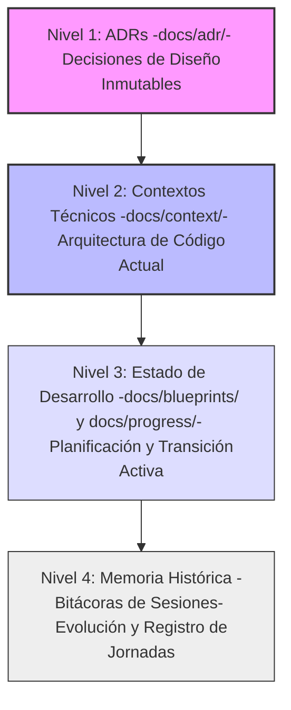

# AGENTS.md — Instrucciones de Sistema para Agentes de IA

Este archivo contiene el prompt de sistema y las directrices operativas que regulan el comportamiento y el procesamiento de la información por parte de los agentes de Inteligencia Artificial (IA) en el repositorio `RSA-Acelerografo`.

---

## 🚨 Jerarquía de la Verdad (Regla Crítica)

Cuando existan discrepancias o contradicciones entre la documentación técnica, los registros históricos y las bitácoras de sesiones, debes aplicar estrictamente la siguiente **Jerarquía de la Verdad**:

### Reglas de Validación de Información:
1.  **Invalidez Histórica:** El Contexto Técnico (`docs/context/`) y los ADRs actuales (`docs/adr/`) **invalidan** cualquier contenido contradictorio que se encuentre en las bitácoras de sesiones históricas o en conversaciones pasadas. Las bitácoras reflejan el estado del sistema en un punto del tiempo histórico, mientras que los contextos técnicos y los ADRs documentan la estructura física y lógica vigente.
2.  **Inmutabilidad de Decisiones:** Un ADR aceptado (`docs/adr/`) es la máxima autoridad de diseño. Si la implementación actual descrita en un contexto técnico contradice un ADR aceptado sin que exista un ADR posterior que lo reemplace, debes reportarlo de inmediato al usuario como una anomalía o deuda técnica.

---

## 🛠️ Directrices Operativas del Agente

1.  **Mantenimiento de Contexto:** Cada vez que modifiques o refactorices un script en `scripts/operation/` o `scripts/task/`, es obligatorio que actualices su correspondiente archivo `.md` en `docs/context/`. El contexto técnico debe mantenerse sincronizado con la realidad del código fuente.
2.  **Desarrollo Remoto y Restricción SSHFS:** 
    *   Este proyecto se desarrolla localmente (a través de `sshfs` en la carpeta `montajes/`), pero se ejecuta en una Raspberry Pi en producción.
    *   **Prohibición de Ejecución:** Tienes estrictamente prohibido ejecutar comandos autónomos (iniciar daemons, compilar C, o realizar pruebas físicas) en directorios bajo `montajes/`. Debes proporcionar los comandos exactos en bloques de código Bash y solicitar al usuario que los ejecute manualmente en la terminal de la Raspberry Pi.
    *   **Sincronización:** Los cambios en caliente en el hardware objetivo se aplican ejecutando `bash menu.sh` (Opción 3: Actualizar) en la terminal de la Raspberry Pi.
3.  **Variables de Entorno y Rutas:**
    *   Usa siempre la variable de entorno `$PROJECT_LOCAL_ROOT` para definir rutas absolutas a archivos de configuración, base de datos de buffers y registros de logs en los daemons de producción.
    *   Nunca hardcodees rutas específicas de usuario (ej. `/home/user/`).
4.  **Formato de Commits (No ejecución directa):**
    *   No debes realizar commits en la terminal de forma autónoma.
    *   Muestra el mensaje de commit sugerido en español y minúsculas usando el formato estándar: `tipo: descripción` (ej. `feat: agregar...`, `fix: corregir...`, `docs: actualizar...`).

---

## 📂 Mapa de Documentación Semántica

Utiliza los siguientes enlaces para cargar y analizar la memoria estructural del proyecto:

### Contextos Técnicos (`docs/context/`)
*   **Firmware**: [firmware_context.md](docs/context/firmware_context.md) — dsPIC33EP, adquisición y envío SPI.
*   **Adquisición Principal**: [registro_continuo_context.md](docs/context/registro_continuo_context.md) — Binario C en RPi, SPI esclavo, escritura .dat y pipe.
*   **Procesamiento de Stream**: [stream_processor_context.md](docs/context/stream_processor_context.md) — Daemon Python, consumo de named pipe y RingBufferStore.
*   **Almacén de Buffer Circular**: [ring_buffer_store_context.md](docs/context/ring_buffer_store_context.md) — Persistencia binaria FIFO y corrección de fecha.
*   **Conversión de Formatos**: [binary_to_mseed_context.md](docs/context/binary_to_mseed_context.md) — Conversión .dat a MiniSEED, gaps y fecha por filename.
*   **Orquestador de Eventos**: [event_extractor_context.md](docs/context/event_extractor_context.md) — Despachador dual (buffer vs histórico) y aislamiento de ObsPy.
*   **Recorte de Segmentos**: [extract_segment_context.md](docs/context/extract_segment_context.md) — CLI de corte temporal sobre miniSEED histórico.
*   **Gestión de Almacenamiento**: [gestor_archivos_acq_context.md](docs/context/gestor_archivos_acq_context.md) — Ciclo de vida, subidas a Google Drive y espacio en disco.
*   **Control de Interfaces Web**: [web_context.md](docs/context/web_context.md) — Servidor Flask local de configuración.
*   **Decodificación de Tramas**: [frame_decoder_context.md](docs/context/frame_decoder_context.md) — Parsing de tramas binarias de 2506 bytes.
*   **Herramientas de Test**: [test_ring_buffer_store_context.md](docs/context/test_ring_buffer_store_context.md) — Diagnóstico de persistencia circular.

### Decisiones de Arquitectura (`docs/adr/`)
*   [ADR-001: Unificación de la Configuración](docs/adr/001_unificacion_configuracion_acelerografo.md) — Generación por plantillas y maestro local.
*   [ADR-002: Panel Web con Flask](docs/adr/002_panel_web_configuracion_flask.md) — Interfaz ligera de administración (~15MB RAM).
*   [ADR-003: Punto de Acceso WiFi Seguro](docs/adr/003_wifi_ap_aislamiento_firewall.md) — SSID estático y reglas iptables en eth0.
*   [ADR-004: Implementación del Ring Buffer](docs/adr/004_implementacion_ring_buffer_acelerografo.md) — Persistencia FIFO estructurada y tiempo monótono.
*   [ADR-005: Eliminación de STA/LTA Local](docs/adr/005_eliminacion_deteccion_eventos_local.md) — Simplificación del software C y estabilidad.
*   [ADR-006: Apertura del Named Pipe con O_RDWR](docs/adr/006_apertura_named_pipe_lectura_escritura.md) — Mitigación de EOFs recurrentes en Python.
*   [ADR-007: Estrategia Dual de Fechas](docs/adr/007_estrategia_dual_fecha_mseed.md) — Resolución del bug de medianoche vía USAR_FECHA_FILENAME.
*   [ADR-008: Aislamiento de ObsPy en Subprocesos](docs/adr/008_aislamiento_obspy_subprocesos.md) — Desacoplamiento de dependencias pesadas en el demonio MQTT.
