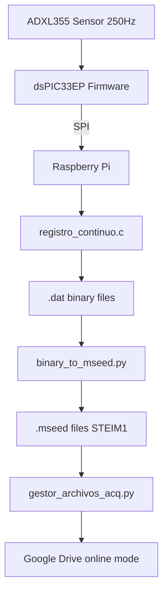
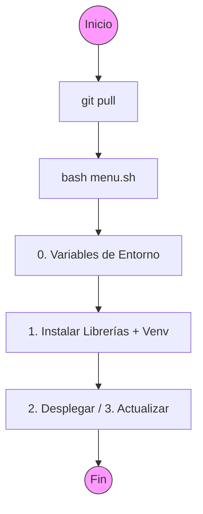
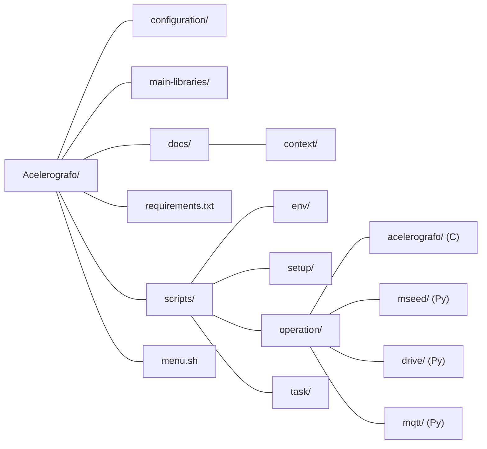

# AGENTS.md

This file provides guidance to AI agents when working with code in this repository.

## Project Overview

This is a **seismograph data acquisition system** designed for continuous seismic monitoring. The system uses a **dsPIC33EP microcontroller** interfaced with an **ADXL355 accelerometer** (250 Hz sampling, 3 axes) to capture acceleration data, which is then transferred to a **Raspberry Pi** via SPI for processing, storage, and optional cloud backup.

### System Architecture



### Key Capabilities
- **Continuous recording**: 24/7 data acquisition with hourly file rotation
- **Event detection**: STA/LTA algorithm for seismic event identification
- **Standard format**: Mini-SEED output with FDSN metadata compliance
- **Dual mode operation**: Online (cloud backup) and offline (local storage)
- **Real-time streaming**: Named pipe (`/tmp/my_pipe`) for live data access
- **Automated orchestration**: Cron-based system management with hourly restarts

### Technical Specifications
- **Sampling rate**: 250 Hz (configurable)
- **Channels**: 3 (Z, N, E for vertical, north, east)
- **Data format**: Binary .dat (proprietary) → Mini-SEED (standard)
- **Compression**: STEIM1 for efficient storage
- **Time synchronization**: GPS + DS3234 RTC on dsPIC


## Detailed Documentation

For in-depth technical information about each component, refer to these context files:

- **[Firmware (dsPIC33EP)](docs/context/firmware_context.md)** - Microcontroller firmware, sensor interface, time synchronization
- **[Main Acquisition (registro_continuo)](docs/context/registro_continuo_context.md)** - C program on RPi, SPI communication, event detection
- **[Format Conversion (binary_to_mseed)](docs/context/binary_to_mseed_context.md)** - Binary to Mini-SEED conversion, 4 operation modes, gap handling
- **[Segment Extraction (extract_segment)](docs/context/extract_segment_context.md)** - Time-windowed extraction from Mini-SEED files
- **[File Management (gestor_archivos_acq)](docs/context/gestor_archivos_acq_context.md)** - Google Drive integration, dual-mode storage management
- **[MQTT Coordinator](docs/context/mqtt_coordinator_context.md)** - Reactive MQTT agent, telemetry, remote commands
- **[System Orchestration (registrocontinuo.sh)](docs/context/orquestador_rc_context.md)** - Service control, cron jobs, boot sequence
- **[Diagnostics (comprobar_registro)](docs/context/comprobar_registro_context.md)** - Status checking, debugging tools
- **[Event Extraction](docs/context/extraer_evento_context.md)** - Extracting event windows from continuous data

## Environment Setup

The project uses two key environment variables defined in `/etc/profile.d/project_paths.sh`:
- `PROJECT_GIT_ROOT`: Path to the Git repository (e.g., `/home/rsa/git/RSA-Acelerografo`)
- `PROJECT_LOCAL_ROOT`: Path to the deployed project (e.g., `/home/rsa/projects/acelerografo`)

**Important**: Paths in `configuracion_dispositivo.json` must match these environment variables. Operational Python scripts must use `PROJECT_LOCAL_ROOT` to resolve absolute paths for configuration and logs.

### Python Virtual Environment

All Python dependencies are managed through a virtual environment located at `$PROJECT_LOCAL_ROOT/.venv/`. The venv is created with `--system-site-packages` to inherit precompiled apt packages (numpy, scipy, matplotlib), while lighter packages (obspy, paho-mqtt, google-api, etc.) are installed via pip inside the venv from `requirements.txt`.

- **Python interpreter**: `$PROJECT_LOCAL_ROOT/.venv/bin/python3`
- **Dependencies file**: `$PROJECT_GIT_ROOT/requirements.txt`
- **Setup script**: `scripts/setup/crear_entorno_virtual.sh`

**Important**: Never install Python packages globally with `sudo pip3 install`. All pip packages must go through the virtual environment.

### Coding Standards
- **Path Resolution**: Use `os.getenv("PROJECT_LOCAL_ROOT")` to define base paths.
  ```python
  project_root = os.getenv("PROJECT_LOCAL_ROOT")
  config_path = os.path.join(project_root, "configuracion", "file.json")
  ```
- **Logging**: Use `StructuredLogger` for all operational scripts to ensure consistent audit trails.
- **MQTT**: New scripts should follow the hierarchical topic structure and use `.env` for credentials.

## Development Workflow (Remote via SSHFS)

Since development is typically done from a PC via `sshfs`, changes in `PROJECT_GIT_ROOT` are not immediately live on the Raspberry Pi's operational system.

1. **Edit**: Modify files in the Git repository folder from your local machine.
2. **Apply Changes**: You MUST run `menu.sh` on the Raspberry Pi.
   - Use **Option 3 (Actualizar)** to sync code changes (Python, C binaries, or config templates).
   - Use **Option 2 (Desplegar)** ONLY for initial setup or clean installs (Warning: overwrites local configurations).
3. **Verify**: Check logs in `$PROJECT_LOCAL_ROOT/log-files/` to ensure everything is running correctly.

**Important**: Never modify files directly in `$PROJECT_LOCAL_ROOT` as they will be overwritten during the next update.

## Initial Setup and Update Commands



```bash
# For a new station setup:
bash menu.sh
# Then select: 0 (environment vars) -> 1 (install libs + create venv) -> 2 (deploy)

# To update an existing installation after pulling changes:
git pull
bash menu.sh  # Select option 3 (Actualizar) - also updates venv if requirements.txt changed

# To clean global pip packages before migrating to venv:
bash menu.sh  # Select option 4 (Desinstalar librerías globales)
```

## Configuration Files

All configuration files are in JSON format in the `configuration/` directory:
- `configuracion_dispositivo.json`: Device ID, directories, operation mode (online/offline), Drive tokens
  - **New parameters** (optional, have defaults):
    - `umbral_espacio_minimo`: Minimum free disk space threshold for file cleanup
    - `max_reintentos`: Maximum retry attempts for Drive uploads (default: 5)
    - `tiempo_espera`: Wait time between retries in seconds (default: 2)
- `configuracion_mseed.json`: Station metadata (coordinates, sampling rate, network code, etc.)
- `configuracion_mqtt.json`: MQTT broker settings for event publishing

**Critical**: Always backup configuration files before updates.

## Architecture

### Data Flow
1. **C program** (`registro_continuo`) acquires data from accelerometer via SPI and writes binary files (`.dat`)
2. **Python converter** (`binary_to_mseed.py`) converts binary to Mini-SEED format (`.mseed`)
3. **File manager** (`gestor_archivos_acq.py`) handles uploads/cleanup based on mode:
   - **Online mode**: Uploads `.mseed` files to Google Drive, manages disk space
   - **Offline mode**: Keeps only most recent binary file, deletes old `.mseed` when disk < 10%

### Key Components

**C Programs** (in `scripts/operation/acelerografo/`):
- `registro_continuo_4.5.0.c`: Main data acquisition loop
- `reset_master.c`: Resets the ADC hardware
- `extraer_evento_binario_2.1.1.c`: Extracts event windows from continuous data
- Custom libraries: `detector_eventos.c`, `lector_json.c`

**Python Scripts**:
- `scripts/operation/mseed/binary_to_mseed.py`: Converts binary to Mini-SEED
  - Handles missing samples (gaps), invalid timestamps, configurable date extraction (binary frame vs filename)
  - Supports 4 modes: `--continuous` (mode 1), `--event` (mode 2), `--file <file>` (mode 3), `--dir <dir>` (mode 4)
- `scripts/operation/mseed/extract_segment.py`: Extracts temporal segments from Mini-SEED files
  - CLI tool: `--start "YYYY-MM-DDZHH:MM:SS.fff" --duration <seconds>`
  - Automatic file discovery by date pattern, auto-detects FLOAT32/STEIM2 encoding
- `scripts/operation/drive/gestor_archivos_acq.py`: File lifecycle manager
  - Dual mode: online (Drive upload + retention + space control) / offline (maximize local storage)
  - 3-level file protection: active file, failed upload, already uploaded
  - Supports `--dry-run` for simulation without changes
- `scripts/operation/mqtt/mqtt_coordinator.py`: Reactive MQTT agent (daemon via Supervisor)
  - Publishes telemetry (state + hardware health every 5 min)
  - Receives remote commands via dispatcher pattern
  - Compatible with paho-mqtt v1.x and v2.x

**Task Scripts** (in `scripts/task/`):
- `registrocontinuo.sh`: Service control script (start/stop/restart)
- See `crontab.txt` for scheduled tasks

### Cron Jobs
- Every 60 minutes: Restart continuous recording
- `@reboot`: Reset hardware, upload pending files, start recording

## Build System

The project includes C programs that need compilation:
```bash
# Compile C programs (done automatically by deploy.sh/update.sh)
cd scripts/setup
make -f makefile
```

Executables are placed in `$PROJECT_LOCAL_ROOT/scripts/acelerografo/ejecutables/`.

## Common Operations

### Manual file conversion
```bash
# Single file
$PROJECT_LOCAL_ROOT/.venv/bin/python3 scripts/operation/mseed/binary_to_mseed.py --file <filename.dat>

# Batch convert entire directory
$PROJECT_LOCAL_ROOT/.venv/bin/python3 scripts/operation/mseed/binary_to_mseed.py --dir /path/to/dat/files
```

### Extract temporal segments from Mini-SEED files
```bash
$PROJECT_LOCAL_ROOT/.venv/bin/python3 scripts/operation/mseed/extract_segment.py --start "2024-01-15Z14:30:45.250" --duration 60
# Extracts 60 seconds starting from the specified UTC time
# Note: Time format must use UTC (Z) format: YYYY-MM-DDZHH:MM:SS.fff
```

### Control continuous recording
```bash
/usr/local/bin/registrocontinuo start|stop|restart
```

### Upload files to Drive
```bash
# Upload by type flag
$PROJECT_LOCAL_ROOT/.venv/bin/python3 scripts/operation/drive/subir_archivo.py --continuous <filename.dat>
$PROJECT_LOCAL_ROOT/.venv/bin/python3 scripts/operation/drive/subir_archivo.py --mseed <filename.mseed>
$PROJECT_LOCAL_ROOT/.venv/bin/python3 scripts/operation/drive/subir_archivo.py --event <filename.dat>
```

## Project Structure



- `configuration/`: JSON config files
- `main-libraries/`: bcm2835 and wiringPi for Raspberry Pi GPIO/SPI
- `requirements.txt`: Python pip dependencies for the virtual environment
- `scripts/`:
  - `env/`: Environment variable definitions
  - `setup/`: `deploy.sh`, `update.sh`, `makefile`, `crear_entorno_virtual.sh`, `desinstalar_librerias.sh`, `instalar_librerias.sh`
  - `operation/`: Core operational scripts (acelerografo C code, Python converters)
  - `task/`: Cron-scheduled task scripts
  - `dev-tests/`: Development/testing scripts
- `docs/`: Scripts context files
- `menu.sh`: Interactive setup menu (options 0-5)

## Logging

All logs are in `$PROJECT_LOCAL_ROOT/log-files/`:
- `drive.log`, `gestor_acq.log`, `mqtt_coordinator.log`, `mseed.log`, `registro_continuo.log`

Each logger is identified by station ID from `configuracion_dispositivo.json`.

## Important Notes

- The system expects bcm2835 library for SPI communication with the ADC
- Binary data format: 2506-byte frames (2500 bytes data + 6 bytes timestamp)
- Sampling rate typically 250 Hz, 3 channels (X, Y, Z)
- Mini-SEED uses STEIM1 compression, record length 512 bytes


