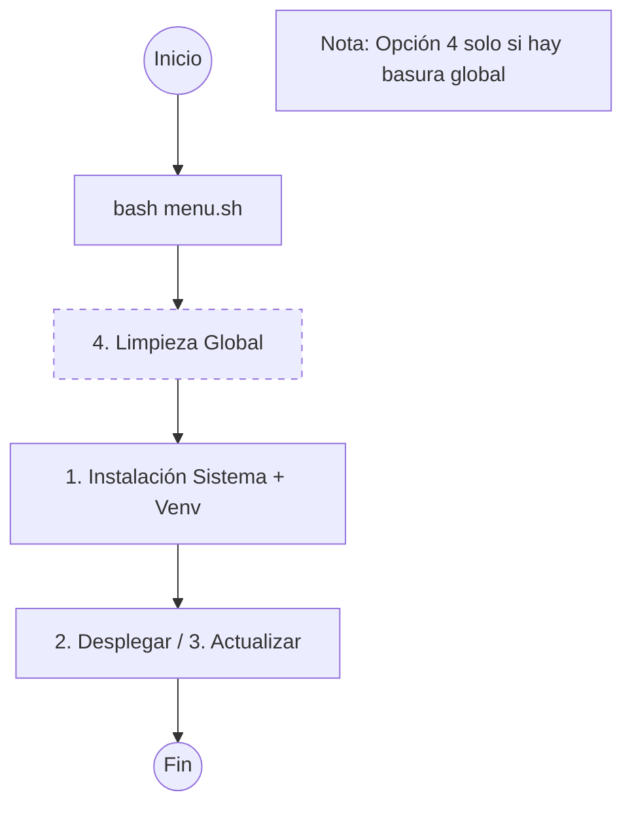

## Flujo de Trabajo

## Configurar una Nueva Estación
Para configurar una estación por primera vez, siga los siguientes pasos:

1. Ejecute el menú con el comando `bash menu.sh`.
2. Seleccione la opción 0 para establecer las variables de entorno.
3. Seleccione la opción 1 para instalar las librerías del sistema y crear el entorno virtual de Python.
4. Seleccione la opción 2 para desplegar el proyecto.

## Actualizar el Proyecto a la Última Versión Disponible
Para actualizar el proyecto, siga los siguientes pasos:

1. Obtenga la última versión del repositorio mediante el comando `git pull`.
2. Ejecute el menú y seleccione la opción 3. Esto sincroniza los scripts, recompila los programas en C y actualiza el entorno virtual si `requirements.txt` ha cambiado.

## Migrar de Instalación Global a Entorno Virtual
Si el equipo tiene librerías de Python instaladas globalmente con `pip3`, es necesario desinstalarlas antes de usar el entorno virtual:

1. Ejecute el menú y seleccione la opción 4 para desinstalar las librerías globales de Python.
2. Seleccione la opción 1 para reinstalar las librerías del sistema y crear el entorno virtual.

## Opciones del Menú

| Opción | Descripción |
|--------|-------------|
| 0 | Establecer variables de entorno |
| 1 | Instalar librerías del sistema y crear entorno virtual de Python |
| 2 | Desplegar el proyecto (solo configuración inicial) |
| 3 | Actualizar el proyecto |
| 4 | Desinstalar librerías globales de Python |
| 5 | Salir |

# Importante

## Entorno Virtual de Python
Los scripts de Python se ejecutan desde un entorno virtual ubicado en `$PROJECT_LOCAL_ROOT/.venv/`. Las dependencias se definen en `requirements.txt`. No instale paquetes de Python globalmente con `sudo pip3 install`.

## Rutas de los Directorios del Proyecto
Es muy importante que las rutas definidas en el archivo de configuración `configuracion_dispositivo.json` coincidan con las variables de entorno definidas en el archivo `/scripts/env/project_paths.sh`.

## Backups de Archivos de Configuración
Antes de realizar una actualización, respalde el directorio de configuración con todos sus archivos.
