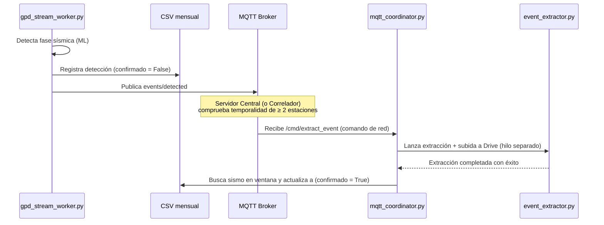
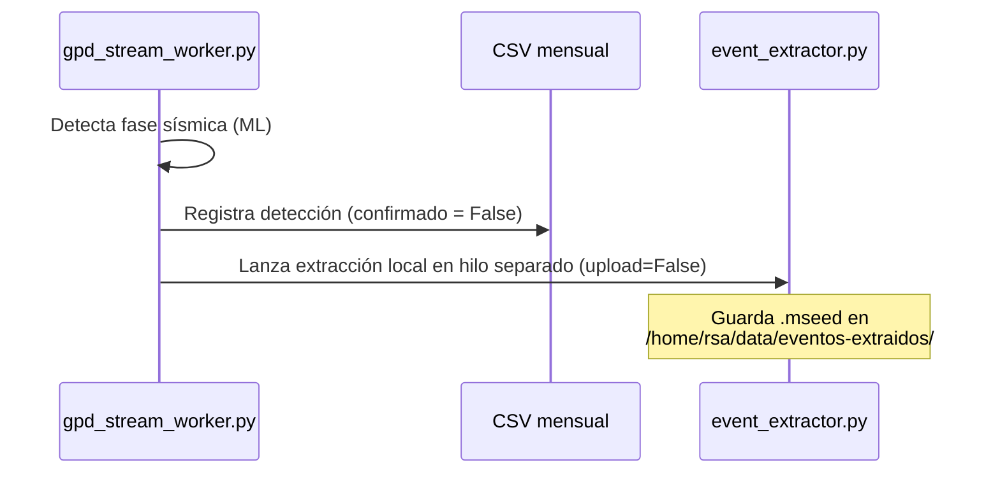

# Arquitectura de Flujo GPD: Modos Online y Offline

Este documento detalla la arquitectura de flujo de la inferencia GPD (Generalized Phase Detection) en tiempo real para las estaciones de la Red Sísmica del Austro (RSA), abordando tanto el comportamiento cooperativo en modo **online** como el comportamiento autónomo en modo **offline**, así como el diseño del registro mensual de eventos en formato CSV.

---

## 🛰️ Arquitectura de Flujo por Modo de Adquisición

### 1. Modo ONLINE (Cooperativo)
Las estaciones en modo online colaboran regionalmente para validar eventos antes de realizar extracciones permanentes en disco y cargas a Google Drive. Esto minimiza el ruido local y las falsas alarmas individuales.



* **Detección Local:** El worker GPD detecta fases pero **no** extrae localmente de forma automática. En su lugar, registra la detección en el CSV mensual como `confirmado = False` y la publica en el tópico MQTT `<station_id>/events/detected`.
* **Validación Regional:** Cuando dos o más estaciones registran detecciones cercanas en el tiempo (e.g., ventana de ~10 segundos), el sistema regional confirma la presencia de un sismo real.
* **Comando de Red:** Se envía un comando `/cmd/extract_event` a todas las estaciones involucradas (e inclusive no involucradas si así se decide).
* **Extracción y Confirmación:** Al recibir el comando, `mqtt_coordinator.py` invoca la extracción asíncrona. Si tiene éxito:
  * Si la estación detectó el evento localmente, actualiza el registro en el CSV a `confirmado = True`.
  * Si no lo detectó localmente pero recibió la orden, agrega un registro en el CSV con `confirmado = True` y `fase = "EXTERNAL"` o `"N/A"`, con método `network_cmd`.

---

### 2. Modo OFFLINE (Autónomo)
Las estaciones en modo offline operan de forma totalmente aislada, por lo que deben extraer de forma automática y local cualquier sismo detectado por el modelo GPD para garantizar que no se pierdan datos importantes.



* **Extracción Autónoma:** Cuando el worker GPD detecta una fase, inmediatamente registra el evento en el CSV mensual y lanza un hilo separado que invoca a `extraer_y_subir_evento()` con `upload=False` y `delete_after_upload=False`.
* **Inmutabilidad y Espacio:** Los archivos MiniSEED extraídos se almacenan en `/home/rsa/data/eventos-extraidos/`. Dado que el script de limpieza `gestor_archivos_acq.py` solo gestiona los directorios de datos continuos (`/home/rsa/data/mseed/` y `/home/rsa/data/registro-continuo/`), los archivos de eventos extraídos permanecen seguros y nunca son eliminados automáticamente por el control de espacio.

---

## 📊 Diseño del Registro CSV (`/home/rsa/data/eventos-detectados/`)

Ambos modos de estación mantienen un archivo CSV mensual con la ruta `/home/rsa/data/eventos-detectados/YYYY-MM_detecciones.csv`.

### Columnas del CSV

| Columna | Tipo | Descripción |
| :--- | :--- | :--- |
| `timestamp_centro` | `str` (ISO8601 UTC) | El centro de la ventana de 4s evaluada por GPD (o de la orden externa). |
| `fase` | `str` | Tipo de fase detectada (`P`, `S` o `EXTERNAL` / `N/A`). |
| `probabilidad` | `float` | Probabilidad asignada por el modelo (de 0.0 a 1.0). En eventos externos es `0.0`. |
| `timestamp_local` | `str` (ISO8601 UTC/Local) | Timestamp del momento en que se grabó el registro en el sistema local. |
| `confirmado` | `bool` | `True` si fue validado por correlación (online) o extraído (offline); `False` si fue huérfano. |
| `archivo_mseed` | `str` | Nombre del archivo MiniSEED generado tras la extracción (si aplica). |
| `metodo` | `str` | Método de disparo: `local_gpd` (detección local) o `network_cmd` (comando regional). |

### Ejemplo de Contenido (`2026-07_detecciones.csv`)
```csv
timestamp_centro,fase,probabilidad,timestamp_local,confirmado,archivo_mseed,metodo
2026-07-06T15:30:00.000Z,P,0.9854,2026-07-06T15:30:02.123Z,True,NOM00_260706-153000.mseed,local_gpd
2026-07-06T16:45:12.000Z,N/A,0.0000,2026-07-06T16:45:30.450Z,True,NOM00_260706-164512.mseed,network_cmd
2026-07-06T18:10:05.000Z,S,0.9610,2026-07-06T18:10:07.890Z,False,,local_gpd
```

---

## 🛠️ Decisiones de Diseño Derivadas

1. **Parámetro del Modo en el Worker:** Se añadirá `modo_adquisicion` a la configuración inicializada en `GPDStreamWorker`. Si es `"offline"`, se habilita la llamada automática al extractor en hilo secundario.
2. **Módulo de Logging Común:** Se implementará `scripts/operation/core/event_logger.py` para unificar la escritura del CSV y evitar condiciones de carrera si ambos procesos (`gpd_stream_worker.py` y `mqtt_coordinator.py`) acceden al archivo al mismo tiempo.
