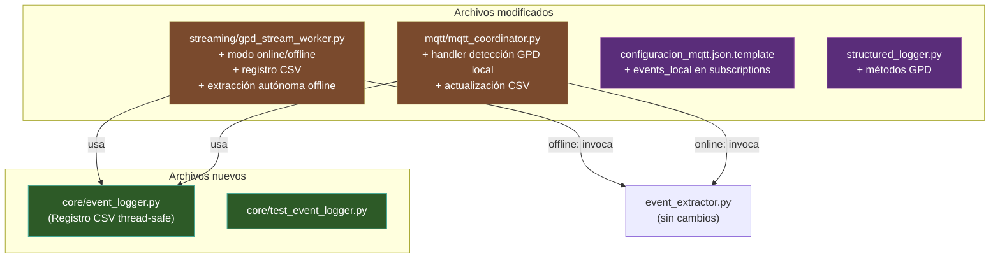
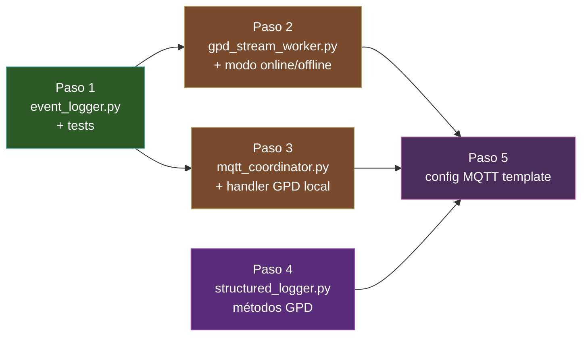

# Plan de Implementación — Fase 4: Extracción Automática y Registro de Detecciones GPD

**Fecha**: 2026-07-06  
**Repositorio**: `acelerografo-DEV00`  
**Base**: [Plan general de inferencia GPD](file:///home/rsa/git/montajes/acelerografo-DEV00/docs/blueprints/2026-06-18_plan_inferencia_gpd_tiempo_real.md) + [Arquitectura online/offline](file:///home/rsa/git/montajes/acelerografo-DEV00/docs/blueprints/2026-07-06_arquitectura_flujo_gpd_online_offline.md)

---

## Resumen Ejecutivo

La Fase 4 conecta la detección GPD (Fase 3, ya implementada) con la extracción automática de eventos y su registro persistente. Las nuevas directrices del blueprint `2026-07-06` introducen dos cambios arquitectónicos importantes respecto al plan original:

1. **Bifurcación por modo de adquisición (online/offline):** El comportamiento post-detección difiere según el modo de la estación.
2. **Registro CSV mensual de detecciones:** Ambos modos mantienen un CSV en `/home/rsa/data/eventos-detectados/` con estado de confirmación.

> [!IMPORTANT]
> La Fase 4 original contemplaba solo la modificación de `mqtt_coordinator.py`. Con las nuevas directrices, el alcance se amplía a 4 componentes: un módulo nuevo (`event_logger.py`), modificaciones en `gpd_stream_worker.py`, modificaciones en `mqtt_coordinator.py`, y actualizaciones de configuración y logger.

---

## Estado Actual del Código

| Componente | Estado | Archivo |
|---|---|---|
| `gpd_stream_worker.py` | ✅ Fase 3 implementada — publica MQTT pero **no** registra CSV ni extrae | [gpd_stream_worker.py](file:///home/rsa/git/montajes/acelerografo-DEV00/scripts/operation/streaming/gpd_stream_worker.py) |
| `mqtt_coordinator.py` | ✅ Producción — maneja comandos y eventos regionales, **no** detecciones locales GPD | [mqtt_coordinator.py](file:///home/rsa/git/montajes/acelerografo-DEV00/scripts/operation/mqtt/mqtt_coordinator.py) |
| `event_extractor.py` | ✅ Producción — `extraer_y_subir_evento()` funcional con ring buffer y mseed | [event_extractor.py](file:///home/rsa/git/montajes/acelerografo-DEV00/scripts/operation/mqtt/event_extractor.py) |
| `structured_logger.py` | ✅ Producción — **sin** métodos GPD específicos | [structured_logger.py](file:///home/rsa/git/montajes/acelerografo-DEV00/scripts/operation/structured_logger.py) |
| `configuracion_dispositivo.json.template` | ✅ Sección `streaming.gpd` ya existe — **falta** `modo_adquisicion` usado por worker | [template](file:///home/rsa/git/montajes/acelerografo-DEV00/configuration/configuracion_dispositivo.json.template) |
| `configuracion_mqtt.json.template` | ✅ Tiene `events_local` definido en topics, **no** está en `subscriptions` | [template](file:///home/rsa/git/montajes/acelerografo-DEV00/configuration/configuracion_mqtt.json.template) |

---

## Diagrama de Componentes Impactados



---

## Estructura de Archivos Resultante

```
scripts/operation/
├── core/
│   ├── event_logger.py               [NUEVO]  — Paso 1
│   ├── test_event_logger.py           [NUEVO]  — Paso 1
│   └── ...
├── streaming/
│   ├── gpd_stream_worker.py          [MODIFICADO] — Paso 2
│   └── ...
├── mqtt/
│   ├── mqtt_coordinator.py           [MODIFICADO] — Paso 3
│   └── ...
└── structured_logger.py              [MODIFICADO] — Paso 4

configuration/
├── configuracion_mqtt.json.template  [MODIFICADO] — Paso 5
└── configuracion_dispositivo.json.template  (sin cambios, ya tiene modo_adquisicion)
```

---

## Paso 1: Crear `core/event_logger.py` — Registro CSV Thread-Safe

> **Justificación**: Tanto `gpd_stream_worker.py` (al detectar) como `mqtt_coordinator.py` (al confirmar) necesitan escribir/actualizar el mismo CSV mensual. Un módulo compartido con locking evita condiciones de carrera (decisión de diseño #2 del blueprint).

### Archivo nuevo: `scripts/operation/core/event_logger.py`

**Dependencias**: `csv`, `os`, `threading`, `datetime` (stdlib únicamente).

**Diseño**:

```python
import csv
import os
import threading
from datetime import datetime, timezone
from typing import Optional

# Directorio de almacenamiento por defecto
DEFAULT_CSV_DIR = "/home/rsa/data/eventos-detectados"

# Encabezados del CSV
CSV_HEADERS = [
    "timestamp_centro",
    "fase",
    "probabilidad",
    "timestamp_local",
    "confirmado",
    "archivo_mseed",
    "metodo",
]


class EventLogger:
    """
    Registra detecciones sísmicas GPD en un CSV mensual thread-safe.

    Cada estación mantiene un archivo CSV por mes:
        /home/rsa/data/eventos-detectados/YYYY-MM_detecciones.csv

    Thread-safe: usa un threading.Lock para serializar escrituras
    desde múltiples hilos (worker GPD y mqtt_coordinator).
    """

    def __init__(self, csv_dir: str = DEFAULT_CSV_DIR, logger=None):
        """
        Args:
            csv_dir: Directorio donde se almacenan los CSVs mensuales.
            logger:  Logger opcional para registrar operaciones.
        """
        self._csv_dir = csv_dir
        self._logger = logger
        self._lock = threading.Lock()

    def _csv_path(self, dt: Optional[datetime] = None) -> str:
        """Retorna la ruta del CSV mensual para la fecha dada (o la actual)."""
        if dt is None:
            dt = datetime.now(timezone.utc)
        filename = f"{dt.strftime('%Y-%m')}_detecciones.csv"
        return os.path.join(self._csv_dir, filename)

    def registrar_deteccion(
        self,
        timestamp_centro: str,
        fase: str,
        probabilidad: float,
        confirmado: bool = False,
        archivo_mseed: str = "",
        metodo: str = "local_gpd",
    ) -> None:
        """
        Agrega una fila al CSV mensual.

        Args:
            timestamp_centro: ISO8601 UTC del centro de la ventana evaluada.
            fase:             "P", "S", "EXTERNAL" o "N/A".
            probabilidad:     Probabilidad del modelo (0.0-1.0).
            confirmado:       True si fue validado/extraído.
            archivo_mseed:    Nombre del archivo generado (vacío si pendiente).
            metodo:           "local_gpd" o "network_cmd".
        """

    def actualizar_confirmacion(
        self,
        timestamp_centro: str,
        confirmado: bool = True,
        archivo_mseed: str = "",
    ) -> bool:
        """
        Busca un registro por timestamp_centro en el CSV del mes correspondiente
        y actualiza los campos 'confirmado' y 'archivo_mseed'.

        Usado por mqtt_coordinator cuando un comando de red confirma una detección
        que el worker ya había registrado como confirmado=False.

        Args:
            timestamp_centro: ISO8601 UTC a buscar.
            confirmado:       Nuevo valor (normalmente True).
            archivo_mseed:    Nombre del archivo extraído.

        Returns:
            True si se encontró y actualizó el registro, False si no se encontró.
        """

    def registrar_evento_externo(
        self,
        timestamp_centro: str,
        archivo_mseed: str = "",
    ) -> None:
        """
        Registra un evento de red (comando externo) que no fue detectado localmente.

        Crea un registro con fase="EXTERNAL", probabilidad=0.0,
        confirmado=True, metodo="network_cmd".
        """
```

### Mecanismo de concurrencia

```
Hilo GPD Worker              Hilo MQTT Coordinator
      │                              │
      ├─ registrar_deteccion()       │
      │  └─ acquire(lock)            │
      │  └─ append CSV               │
      │  └─ release(lock)            │
      │                              ├─ actualizar_confirmacion()
      │                              │  └─ acquire(lock)
      │                              │  └─ leer → modificar → reescribir CSV
      │                              │  └─ release(lock)
```

> [!NOTE]
> `actualizar_confirmacion()` opera sobre el CSV completo del mes (lectura → búsqueda → reescritura). Dado que el volumen es bajo (decenas a cientos de registros/mes), el impacto de rendimiento es despreciable.

### Test: `scripts/operation/core/test_event_logger.py`

| Test | Descripción |
|---|---|
| `test_crear_csv_nuevo` | Verifica que se crea el archivo y los headers al registrar la primera detección |
| `test_registrar_deteccion` | Verifica que la fila se escribe con los campos correctos |
| `test_registrar_multiples` | Verifica que múltiples registros se acumulan sin sobrescribir |
| `test_actualizar_confirmacion` | Registra con `confirmado=False`, actualiza a `True` y verifica |
| `test_actualizar_no_encontrado` | `actualizar_confirmacion()` retorna `False` cuando no hay match |
| `test_registrar_evento_externo` | Verifica campos de un evento de red (`EXTERNAL`, `network_cmd`) |
| `test_concurrencia` | 10 hilos escriben simultáneamente — no hay corrupción ni excepciones |
| `test_rotacion_mensual` | Registros de meses distintos van a archivos separados |

---

## Paso 2: Modificar `gpd_stream_worker.py` — Modo Online/Offline + CSV

### Cambios requeridos

#### 2.1 Importar `EventLogger` y `extraer_y_subir_evento`

```diff
 from streaming.shared_memory_publisher import SharedMemoryReader, SHM_PATH
 from core.signal_preprocessor import SignalPreprocessor
+from core.event_logger import EventLogger
+
+# Importación condicional del extractor (solo necesario en modo offline)
+try:
+    from mqtt.event_extractor import extraer_y_subir_evento
+    _EXTRACTOR_AVAILABLE = True
+except ImportError:
+    _EXTRACTOR_AVAILABLE = False
```

#### 2.2 Leer `modo_adquisicion` en `__init__`

```diff
     def __init__(self, config: dict, logger: logging.Logger, project_root: str = ""):
         ...
+        # --- Modo de adquisición (online/offline) ---
+        self._modo_adquisicion: str = config.get("modo_adquisicion", "online")
+
+        # --- Logger de eventos CSV ---
+        csv_dir = config.get("csv_dir", "/home/rsa/data/eventos-detectados")
+        self._event_logger = EventLogger(csv_dir=csv_dir, logger=logger)
```

#### 2.3 Modificar `_publicar_deteccion` para bifurcar por modo

```diff
     def _publicar_deteccion(self, deteccion: dict) -> None:
-        """Publica la detección en el tópico MQTT ..."""
-        payload = json.dumps(deteccion, ensure_ascii=False)
-        topic = f"{self._station_id}/events/detected"
-
-        if self._mqtt is not None:
-            try:
-                result = self._mqtt.publish(topic, payload, qos=1, retain=False)
-                ...
+        """
+        Procesa una detección según el modo de adquisición:
+        - ONLINE:  Registra en CSV (confirmado=False) + publica MQTT.
+        - OFFLINE: Registra en CSV (confirmado=False) + lanza extracción local en hilo.
+        """
+        # 1. Registrar en CSV (ambos modos)
+        self._event_logger.registrar_deteccion(
+            timestamp_centro=deteccion["timestamp"],
+            fase=deteccion["type"],
+            probabilidad=deteccion["probability"],
+            confirmado=False,
+            metodo="local_gpd",
+        )
+
+        if self._modo_adquisicion == "offline":
+            # Modo OFFLINE: extracción autónoma local
+            self._lanzar_extraccion_offline(deteccion)
+        else:
+            # Modo ONLINE: publicar en MQTT para validación regional
+            self._publicar_mqtt(deteccion)
```

#### 2.4 Nuevo método `_lanzar_extraccion_offline`

```python
def _lanzar_extraccion_offline(self, deteccion: dict) -> None:
    """
    Lanza la extracción del evento en un hilo separado (modo offline).

    Calcula la ventana de extracción usando ventana_pre_evento_s y
    ventana_post_evento_s de la configuración.
    """
    if not _EXTRACTOR_AVAILABLE:
        self._logger.warning(
            "[GPD_OFFLINE] Módulo event_extractor no disponible. "
            "No se puede extraer automáticamente."
        )
        return

    ventana_pre = self._config.get("ventana_pre_evento_s", 60)
    ventana_post = self._config.get("ventana_post_evento_s", 60)
    ts_centro = deteccion["timestamp"]  # ISO8601

    # Calcular start como ts_centro - ventana_pre
    from datetime import datetime, timedelta, timezone
    dt_centro = datetime.fromisoformat(ts_centro.replace("Z", "+00:00"))
    dt_start = dt_centro - timedelta(seconds=ventana_pre)
    start_str = dt_start.strftime("%Y-%m-%dT%H:%M:%S.%f")[:-3] + "Z"
    duration = ventana_pre + ventana_post

    self._logger.info(
        f"[GPD_OFFLINE_EXTRACT] Lanzando extracción autónoma — "
        f"start={start_str} duration={duration}s"
    )

    hilo = threading.Thread(
        target=self._run_extraccion_offline,
        args=(deteccion, start_str, duration),
        daemon=True,
    )
    hilo.start()


def _run_extraccion_offline(self, deteccion: dict, start: str, duration: float) -> None:
    """Pipeline de extracción offline ejecutado en hilo separado."""
    try:
        resultado = extraer_y_subir_evento(
            start=start,
            duration=duration,
            upload=False,           # Offline no sube a Drive
            delete_after_upload=False,
            logger=self._logger,
        )
        if resultado.get("status") == "completed":
            archivo = resultado.get("output_file", "")
            self._event_logger.actualizar_confirmacion(
                timestamp_centro=deteccion["timestamp"],
                confirmado=True,
                archivo_mseed=archivo,
            )
            self._logger.info(
                f"[GPD_OFFLINE_OK] Extracción completada → {archivo}"
            )
        else:
            self._logger.warning(
                f"[GPD_OFFLINE_FAIL] Extracción fallida: {resultado.get('message')}"
            )
    except Exception as exc:
        self._logger.error(f"[GPD_OFFLINE_ERROR] Error en extracción offline: {exc}")
```

#### 2.5 Refactorizar publicación MQTT a método separado

```python
def _publicar_mqtt(self, deteccion: dict) -> None:
    """Publica la detección en MQTT (modo online)."""
    payload = json.dumps(deteccion, ensure_ascii=False)
    topic = f"{self._station_id}/events/detected"

    if self._mqtt is not None:
        try:
            result = self._mqtt.publish(topic, payload, qos=1, retain=False)
            if result.rc == 0:
                self._logger.debug(f"[GPD_MQTT_PUB] Publicado en '{topic}'")
            else:
                self._logger.warning(
                    f"[GPD_MQTT_PUB_WARN] rc={result.rc} en '{topic}'"
                )
        except Exception as exc:
            self._logger.warning(f"[GPD_MQTT_PUB_ERROR] {exc}")
    else:
        self._logger.info(
            f"[GPD_DETECTION_LOG] (sin MQTT) topic={topic} payload={payload}"
        )
```

#### 2.6 Propagar `modo_adquisicion` desde `main()`

En la función `main()`:

```diff
     gpd_config["station_id"] = station_id
+    gpd_config["modo_adquisicion"] = full_config.get("dispositivo", {}).get("modo_adquisicion", "online")
     mqtt_cfg = full_config.get("mqtt", {})
```

---

## Paso 3: Modificar `mqtt_coordinator.py` — Handler de Detección GPD Local

### Cambios requeridos

#### 3.1 Importar `EventLogger`

```diff
 from structured_logger import StructuredLogger
 from event_extractor import extraer_y_subir_evento
+from core.event_logger import EventLogger
```

#### 3.2 Añadir `EventLogger` al userdata

En la función `main()`:

```diff
+    # Inicializar EventLogger para registro CSV de detecciones
+    event_logger = EventLogger(logger=logger)
+
     userdata = {
         "config": config,
         "logger": logger,
+        "event_logger": event_logger,
         "state_file_path": state_file,
```

Además, cargar la configuración del dispositivo para acceder a la sección `gpd`:

```diff
+    # Cargar configuración del dispositivo para parámetros GPD
+    device_config_path = os.path.join(project_local_root, "configuracion", "configuracion_dispositivo.json")
+    device_config = {}
+    try:
+        with open(device_config_path, 'r') as f:
+            device_config = json.load(f)
+    except Exception as e:
+        logger.warning(f"[CONFIG] No se pudo cargar configuracion_dispositivo.json: {e}")
+
     userdata = {
         "config": config,
+        "device_config": device_config,
         "logger": logger,
+        "event_logger": event_logger,
```

#### 3.3 Añadir rama en `on_message()` para detecciones GPD locales

```diff
     elif "/events/detected" in topic and config["id"] not in topic:
         # Evento de otra estación (correlación regional)
         station_id = topic.split("/")[3]
         correlator.on_regional_event(station_id, payload)
+
+    elif "/events/detected" in topic and config["id"] in topic:
+        # ¡Detección GPD local! Evaluar extracción automática
+        _manejar_deteccion_gpd_local(client, userdata, payload)

     elif "/config/set" in topic:
```

#### 3.4 Nueva función `_manejar_deteccion_gpd_local`

```python
def _manejar_deteccion_gpd_local(client, userdata: dict, payload: dict) -> None:
    """
    Maneja una detección GPD local publicada por gpd_stream_worker.

    Solo actúa en modo ONLINE. En modo offline, el worker ya extrajo directamente.

    Flujo:
    1. Validar el payload (type, timestamp, probability).
    2. Verificar que auto_extract está habilitado.
    3. Calcular el rango de extracción.
    4. Invocar extraer_y_subir_evento() en hilo separado.
    5. Actualizar el CSV de detecciones con confirmado=True y nombre del archivo.
    """
    # ... (ver implementación completa en el artefacto del agente)
```

#### 3.5 Actualizar `_run_extraction_pipeline` para comandos de red

Modificar `_run_extraction_pipeline` en `CommandDispatcher` para que actualice el CSV tras una extracción exitosa disparada por un comando de red (registrar como `EXTERNAL` si no había detección local previa).

---

## Paso 4: Agregar métodos GPD a `structured_logger.py`

```diff
+    # --- Métodos específicos para Inferencia GPD ---
+
+    def gpd_load(self, model_path: str, load_time_s: float): ...
+    def gpd_inference(self, prob_noise: float, prob_p: float, prob_s: float): ...
+    def gpd_detection(self, phase_type: str, probability: float, timestamp: str): ...
+    def gpd_cooldown(self, remaining_s: float): ...
+    def gpd_error(self, operation: str, error: str): ...
+    def gpd_csv_write(self, csv_file: str, registro: str): ...
+    def gpd_csv_update(self, csv_file: str, timestamp_centro: str, confirmado: bool): ...
```

---

## Paso 5: Actualizar `configuracion_mqtt.json.template`

```diff
     "subscriptions": [
         "events_regional",
         "cmd_execute",
         "cmd_broadcast",
-        "config_set"
+        "config_set",
+        "events_local"
     ],
```

---

## Orden de Implementación



> Los pasos 2, 3 y 4 pueden implementarse en paralelo después de completar el paso 1. El paso 5 es simplemente una línea de configuración.

---

## Criterios de Aceptación Globales — Fase 4

### Registro CSV (`event_logger.py`)
- [ ] Se crea el CSV mensual automáticamente con headers al primer registro
- [ ] `registrar_deteccion()` añade una fila correcta al CSV
- [ ] `actualizar_confirmacion()` modifica `confirmado` y `archivo_mseed` de un registro existente
- [ ] `registrar_evento_externo()` crea un registro con `fase=EXTERNAL` y `metodo=network_cmd`
- [ ] Escritura thread-safe: 10 hilos concurrentes no corrompen el CSV
- [ ] Rotación mensual: registros de julio van a `2026-07_detecciones.csv`, agosto a `2026-08_detecciones.csv`

### Modo Online (`gpd_stream_worker.py` + `mqtt_coordinator.py`)
- [ ] Detección GPD → registro CSV con `confirmado=False` → publicación MQTT
- [ ] `mqtt_coordinator` recibe la detección local y dispara `extraer_y_subir_evento()` en hilo
- [ ] Tras extracción exitosa, el CSV se actualiza a `confirmado=True` con nombre del archivo
- [ ] Si `auto_extract=false`, la detección se loguea pero no se extrae
- [ ] Si `auto_upload=false`, la extracción es local sin subir a Drive
- [ ] La respuesta MQTT incluye `request_id` con prefijo `"gpd-auto-"` y `source: "gpd_auto"`
- [ ] No se bloquea el loop MQTT durante la extracción (hilo separado)

### Modo Offline (`gpd_stream_worker.py`)
- [ ] Detección GPD → registro CSV con `confirmado=False` → extracción local en hilo (sin MQTT)
- [ ] `extraer_y_subir_evento()` se invoca con `upload=False`
- [ ] Tras extracción exitosa, el CSV se actualiza a `confirmado=True`
- [ ] El archivo .mseed se guarda en `/home/rsa/data/eventos-extraidos/`

### Comando de red (`mqtt_coordinator.py`)
- [ ] Un comando `/cmd/extract_event` externo exitoso busca una detección local cercana en el CSV y la confirma
- [ ] Si no hay detección local, se registra como `fase=EXTERNAL` con `metodo=network_cmd`

### Validación y robustez
- [ ] Payload de detección inválido (sin `timestamp` o `type`) se rechaza con log warning
- [ ] El worker GPD sin `event_extractor` disponible (ImportError) no crashea en modo offline
- [ ] Tests unitarios de todos los componentes pasan en verde

---

## Riesgos y Mitigaciones

| Riesgo | Impacto | Mitigación |
|---|---|---|
| Condición de carrera CSV: worker registra mientras coordinator actualiza | Datos corruptos | `threading.Lock` en `EventLogger` |
| CSV crece demasiado (miles de falsos positivos) | Lentitud en `actualizar_confirmacion()` | Cooldown de 30 s limita a ~2880 registros/día máx.; umbral alto reduce FP |
| `extraer_y_subir_evento()` bloqueado (ring buffer corrupto) | Hilo zombie | Timeout de 180 s en subprocess ya existente |
| Modo offline con disco lleno | Extracción falla | `gestor_archivos_acq.py` no toca `eventos-extraidos/`; añadir alerta de disco |
| Importación circular `gpd_stream_worker ↔ event_extractor` | Crash al importar | Importación condicional con try/except |
