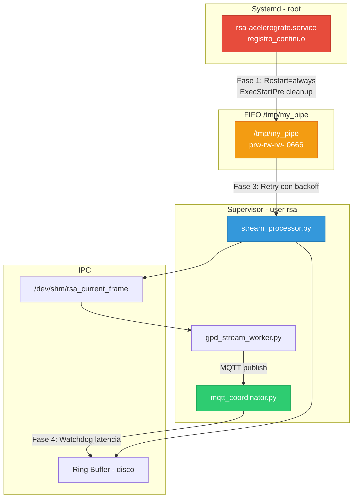
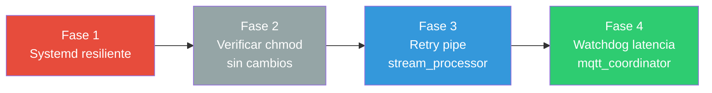

# Plan de Implementación: Resiliencia del Pipeline de Adquisición Post-Incidente CHA01

**Fecha**: 2026-09-02  
**Proyecto**: `acelerografo-DEV00`  
**Origen**: [Diagnóstico técnico 2026-09-01 — Parada de adquisición CHA01](file:///home/rsa/git/montajes/acelerografo-DEV00/docs/analysis/2026-09-01_diagnostico_parada_adquisicion_cha01.md)  

**Objetivo**: Implementar las 4 mejoras del backlog documentado en el diagnóstico para inmunizar la flota de 6 estaciones acelerográficas ante la cascada de fallos provocada por la parada del proceso de adquisición base (`registro_continuo`). Las mejoras cubren: auto-recuperación del servicio systemd, defensa en profundidad de permisos del FIFO, reintentos resilientes en `stream_processor.py`, y monitoreo de latencia en `mqtt_coordinator.py`.

---

## Diagrama de Arquitectura y Puntos de Intervención



> Los nodos coloreados indican los componentes modificados en cada fase.

---

## Prerequisitos

| Requisito | Estado | Verificación |
|---|---|---|
| Toolchain de compilación en RPi (`gcc`, `libbcm2835-dev`, `wiringpi`, `libjansson-dev`) | ✅ Disponible | `which gcc && dpkg -l libbcm2835-dev` |
| Acceso SSH a las estaciones de la flota | ✅ Disponible | Validado en diagnóstico previo |
| Permisos de `sudo` en estaciones | ✅ Disponible | Requerido para systemd y Supervisor |
| Repositorio `acelerografo-DEV00` en rama `develop` | ✅ | `git branch --show-current` |
| No se introducen dependencias Python nuevas | ✅ | Solo se usan `os`, `time`, `logging` (stdlib) |

---

## Protocolo Operativo de Despliegue y Validación en Estaciones

Para todas las fases del plan, las pruebas y despliegues en los nodos de campo se ejecutan bajo el siguiente flujo estandarizado:

1. **Actualización de Código, Binarios y Servicios**:
   - Navegar a la raíz del repositorio Git en la estación:
     ```bash
     cd /home/rsa/git/RSA-Acelerografo
     ```
   - Ejecutar el menú de gestión interactivo y seleccionar la opción **`3`** (*Actualizar el proyecto*):
     ```bash
     ./menu.sh
     # Seleccionar opción: 3
     ```
   - Esto invoca `scripts/setup/update.sh`, que sincroniza scripts, ejecuta `make` si hubo cambios en C, actualiza el servicio systemd (`rsa-acelerografo.service`), Supervisor, crontab y permisos.

2. **Control del Daemon de Adquisición Continua**:
   - Detener adquisición y resetear hardware:
     ```bash
     registrocontinuo stop
     ```
   - Iniciar adquisición delegada en systemd:
     ```bash
     registrocontinuo start
     ```
   - Reiniciar adquisición:
     ```bash
     registrocontinuo restart
     ```

3. **Auditoría de Lectura y Estado en Caliente**:
   - Comprobar la lectura instantánea de aceleraciones (3 ejes), sincronización temporal y el archivo `.dat` activo:
     ```bash
     comprobar
     ```
   - Inspeccionar el estado de los daemons en Supervisor:
     ```bash
     sudo supervisorctl status
     ```

---

## Fase 1: Servicio Systemd Resiliente para `registro_continuo` con Reseteo de dsPIC

**Objetivo**: Garantizar que el proceso de adquisición en C se reinicie automáticamente tras cualquier fallo o reinicio del sistema, asegurando el reseteo por hardware del microcontrolador dsPIC33 y la limpieza del FIFO `/tmp/my_pipe` antes de cada arranque.

### Contexto de la Decisión

Actualmente **no existe una plantilla del servicio systemd en el repositorio**. El servicio `rsa-acelerografo.service` se configuró manualmente en cada estación sin directivas de auto-reinicio. El `crontab.txt` contenía llamadas `@reboot` desacopladas (`sleep 30 && resetmaster` y `sleep 180 && registrocontinuo start`), lo cual introducía una condición de carrera y carecía de auto-recuperación ante caídas en tiempo de ejecución.

Conforme al diagnóstico del incidente en CHA01, una de las causas del fallo fue que la Raspberry Pi se reinició sin que el microcontrolador dsPIC33 fuera reseteado en frío, dejando el bus SPI en un estado inconsistente. Al integrar el ejecutable `reset_master` directamente como `ExecStartPre` en systemd, se garantiza que **siempre** que el proceso de adquisición vaya a arrancar (tanto al encender el equipo como tras cualquier crash o reinicio automático), el microcontrolador dsPIC reciba el pulso físico de reset en el pin MCLR antes de iniciar la comunicación SPI.

Se adopta el **Enfoque Híbrido (Opción C)** del diagnóstico complementado con reseteo de hardware:
1. Limpieza de FIFO residual en `ExecStartPre`.
2. Reseteo por hardware del dsPIC33 con `reset_master` en `ExecStartPre`.
3. `chmod(PIPE_NAME, 0666)` ya implementado en el código C (línea 194 de [`registro_continuo_4.5.0.c`](file:///home/rsa/git/montajes/acelerografo-DEV00/scripts/operation/acelerografo/registro_continuo_4.5.0.c#L193-L194)).

### Acciones

#### 1.1 — Crear plantilla del servicio systemd

**Archivo**: `scripts/task/rsa-acelerografo.service.template`

```ini
[Unit]
Description=RSA Acelerógrafo - Registro Continuo (Adquisición SPI)
Documentation=https://github.com/RSA-Acelerografo
After=network.target
StartLimitIntervalSec=300
StartLimitBurst=10

[Service]
Type=simple
User=root
WorkingDirectory={{PROJECT_LOCAL_ROOT}}/scripts/acelerografo/

# 1. Limpieza del FIFO residual antes de cada arranque
ExecStartPre=/bin/rm -f /tmp/my_pipe

# 2. Reseteo por hardware del microcontrolador dsPIC33 (pulso MCLR y TEST)
ExecStartPre={{PROJECT_LOCAL_ROOT}}/scripts/acelerografo/ejecutables/reset_master

# Ejecutable compilado de adquisición continua
ExecStart={{PROJECT_LOCAL_ROOT}}/scripts/acelerografo/ejecutables/registro_continuo

# Auto-reinicio ante cualquier código de salida
Restart=always
RestartSec=5

# Limpieza del FIFO al detenerse
ExecStopPost=/bin/rm -f /tmp/my_pipe

# Variables de entorno
Environment=PROJECT_LOCAL_ROOT={{PROJECT_LOCAL_ROOT}}

# Timeout y señal de terminación
TimeoutStopSec=10
KillSignal=SIGTERM

[Install]
WantedBy=multi-user.target
```

**Justificaciones clave**:
- `User=root`: el binario C requiere acceso directo a SPI/GPIO vía `bcm2835` y manipulación del pin MCLR en `reset_master`.
- `ExecStartPre=/bin/rm -f /tmp/my_pipe`: elimina pipes residuales con permisos restrictivos antes de que el binario C recree el pipe con `mkfifo()` + `chmod(0666)`.
- `ExecStartPre={{PROJECT_LOCAL_ROOT}}/scripts/acelerografo/ejecutables/reset_master`: invoca directamente el binario compilado de reset sin la sobrecarga de un subshell bash ni dependencias intermedias de rutas en `/usr/local/bin`. Aplica el pulso bajo en MCLR (100 ms) y en TEST (1000 ms), dejando al dsPIC33 en estado limpio y sincronizado para el handshake SPI.
- `ExecStopPost=/bin/rm -f /tmp/my_pipe`: limpieza al detener, evitando que un reinicio posterior herede un descriptor o FIFO huérfano.
- `Restart=always` + `RestartSec=5`: reinicio automático en 5 segundos ante cualquier fallo; en cada reintento se vuelve a ejecutar `ExecStartPre`, re-reseteando el dsPIC si este se colgó.
- `StartLimitIntervalSec=300` + `StartLimitBurst=10`: si el proceso crashea más de 10 veces en 5 minutos, systemd detiene los reintentos para evitar desgaste de la tarjeta SD.

#### 1.2 — Integrar despliegue de la plantilla en `deploy.sh`

**Archivo**: [`scripts/setup/deploy.sh`](file:///home/rsa/git/montajes/acelerografo-DEV00/scripts/setup/deploy.sh)

Agregar **después** de la sección de compilación con `make` (después de la línea 94) y **antes** de la creación de logs (línea 96):

```bash
# Instalar servicio systemd para registro_continuo
echo "Configurando servicio systemd rsa-acelerografo..."
sed "s|{{PROJECT_LOCAL_ROOT}}|$PROJECT_LOCAL_ROOT|g" \
    "$PROJECT_GIT_ROOT/scripts/task/rsa-acelerografo.service.template" \
    > "$PROJECT_LOCAL_ROOT/tmp-files/rsa-acelerografo.service"
sudo cp "$PROJECT_LOCAL_ROOT/tmp-files/rsa-acelerografo.service" \
    /etc/systemd/system/rsa-acelerografo.service
sudo systemctl daemon-reload
sudo systemctl enable rsa-acelerografo.service
```

#### 1.3 — Integrar actualización de la plantilla en `update.sh`

**Archivo**: [`scripts/setup/update.sh`](file:///home/rsa/git/montajes/acelerografo-DEV00/scripts/setup/update.sh)

Agregar una función `update_systemd_service` dentro de `update.sh`, invocada **después** del bloque de compilación con `make` (después de la línea 133):

```bash
# Función para actualizar servicio systemd de registro_continuo
function update_systemd_service {
    local src="$PROJECT_GIT_ROOT/scripts/task/rsa-acelerografo.service.template"
    local temp="$PROJECT_LOCAL_ROOT/tmp-files/rsa-acelerografo.service.tmp"
    local dest="/etc/systemd/system/rsa-acelerografo.service"

    if [ ! -f "$src" ]; then
        echo "Advertencia: No se encontró la plantilla del servicio systemd."
        return
    fi

    sed "s|{{PROJECT_LOCAL_ROOT}}|$PROJECT_LOCAL_ROOT|g" "$src" > "$temp"

    if [ ! -f "$dest" ] || ! cmp -s "$temp" "$dest"; then
        echo "Actualizando servicio systemd: rsa-acelerografo.service"
        sudo cp "$temp" "$dest"
        sudo systemctl daemon-reload
        sudo systemctl restart rsa-acelerografo.service
    else
        echo "No se detectaron cambios en el servicio systemd (rsa-acelerografo)."
    fi
}

update_systemd_service
```

#### 1.4 — Migrar del crontab `@reboot` al servicio systemd

**Archivo**: [`scripts/task/crontab.txt`](file:///home/rsa/git/montajes/acelerografo-DEV00/scripts/task/crontab.txt)

Se eliminan **ambas** tareas de arranque al boot en crontab:
1. `@reboot sleep 180 && /usr/local/bin/registrocontinuo start`: ya no es necesaria porque `rsa-acelerografo.service` (habilitado con `multi-user.target`) gestiona el arranque inmediato al boot y el auto-reinicio continuo.
2. `@reboot sleep 30 && /usr/local/bin/resetmaster`: **se elimina para evitar colisiones de hardware**. Al estar `reset_master` integrado en el `ExecStartPre` de systemd, el pulso a MCLR se aplica siempre de forma determinista y secuencial justo antes de iniciar `registro_continuo`. Si se mantuviera la entrada en crontab a los 30 segundos, enviaría un pulso de reset mientras `registro_continuo` ya se encuentra adquiriendo por SPI, provocando corrupción de tramas o desincronización del bus.

Se mantiene únicamente la línea del cron horario (línea 2) para el ciclo de conversión y subida de archivos MiniSEED a Google Drive.

El crontab resultante:

```text
# Inicia la conversion horaria y subida de archivos (verifica registro_continuo via systemd):
0 * * * * sleep 30 && /usr/local/bin/registrocontinuo start

# Reseteo de hardware y arranque de registro continuo unificados en:
# /etc/systemd/system/rsa-acelerografo.service (ExecStartPre y Restart=always)

# Copia esta configuracion unicamente en el equipo CHA02:
#@reboot sleep 60 && sudo /etc/network/rutasEstaticas.sh
```

#### 1.5 — Actualizar `registrocontinuo.sh` para integración con systemd

**Archivo**: [`scripts/task/registrocontinuo.sh`](file:///home/rsa/git/montajes/acelerografo-DEV00/scripts/task/registrocontinuo.sh)

Reemplazar el bloque `start)` para que la verificación y arranque del proceso C deleguen en systemd en lugar de lanzar el binario directamente:

```bash
  start)
    # 1. Verificar/iniciar registro_continuo via systemd
    if systemctl is-active --quiet rsa-acelerografo.service; then
      echo "registro_continuo ya está ejecutándose (systemd)"
    else
      echo "Iniciando registro_continuo via systemd..."
      sudo systemctl start rsa-acelerografo.service
      sleep 3
    fi
    
    # 2. Ejecutar conversión binary_to_mseed (esperar a que termine)
    echo "Ejecutando conversión a miniSEED..."
    "$VENV_PYTHON" "$PROJECT_LOCAL_ROOT/scripts/mseed/binary_to_mseed.py" 1
    
    # 3. Ejecutar gestor de archivos
    echo "Ejecutando gestor de archivos..."
    "$VENV_PYTHON" "$PROJECT_LOCAL_ROOT/scripts/drive/gestor_archivos_acq.py" &
    ;;
```

Y el bloque `stop)`:

```bash
  stop)
    echo "Deteniendo sistema de registro continuo..."
    sudo systemctl stop rsa-acelerografo.service
    pkill -f binary_to_mseed.py 2>/dev/null
    pkill -f gestor_archivos_acq.py 2>/dev/null
    sudo "$PROJECT_LOCAL_ROOT/scripts/acelerografo/ejecutables/reset_master"
    ;;
```

### Comprobación (Checkpoint Fase 1)

> **⚠️ RESTRICCIÓN SSHFS**: Los comandos de validación a continuación deben ser ejecutados por el usuario directamente en la estación vía SSH, no por el agente.

```bash
# 0. Actualizar el proyecto en la estación desde Git
cd /home/rsa/git/RSA-Acelerografo
./menu.sh  # Seleccionar opción: 3

# CP-1.1: Verificar que el servicio está instalado y habilitado en systemd
sudo systemctl is-enabled rsa-acelerografo.service
# Esperado: enabled

# CP-1.2: Control manual del servicio y arranque con reseteo previo (ExecStartPre)
registrocontinuo stop
registrocontinuo start
systemctl is-active rsa-acelerografo.service
# Esperado: active
journalctl -u rsa-acelerografo.service -n 25 --no-pager
# Esperado: ExecStartPre completó exitosamente (código 0) antes de arrancar registro_continuo

# CP-1.3: Verificar auto-reinicio y re-ejecución de reset_master tras fallo forzado
sudo kill -9 $(pgrep -f "ejecutables/registro_continuo")
sleep 7
systemctl is-active rsa-acelerografo.service
# Esperado: active (reiniciado automáticamente, con nuevo ciclo de reset al dsPIC)

# CP-1.4: Verificar permisos del FIFO y flujo continuo de datos
ls -la /tmp/my_pipe
# Esperado: prw-rw-rw- 1 root root ... /tmp/my_pipe

comprobar
# Esperado: archivo .dat activo, tamaño creciente y aceleraciones triaxiales válidas
```

---

## Fase 2: Defensa en Profundidad de Permisos del FIFO (Código C)

**Objetivo**: Confirmar que el código C ya aplica `chmod(0666)` y documentar que no se requiere cambio adicional.

### Análisis del Código Actual

La revisión de [`registro_continuo_4.5.0.c`](file:///home/rsa/git/montajes/acelerografo-DEV00/scripts/operation/acelerografo/registro_continuo_4.5.0.c#L174-L194) confirma que **la mejora de permisos ya está implementada**:

```c
// Línea 175: Crear el named pipe
if (mkfifo(PIPE_NAME, 0666) == -1) {
    if (errno != EEXIST) {
        // ... error fatal ...
    } 
    else {
        write_log("INFO", "Estado del pipe: Existente");
    } 
}
else {
    write_log("INFO", "Estado del pipe: Creado con exito");
} 

// Línea 194: Asegurar permisos explícitos
chmod(PIPE_NAME, 0666);
```

El `chmod(PIPE_NAME, 0666)` en la línea 194 se ejecuta **incondicionalmente** (tanto si el pipe fue creado como si ya existía), lo que garantiza permisos `prw-rw-rw-` independientemente del `umask` del proceso root.

### Acciones

No se requieren modificaciones en el código C. El `chmod` ya está implementado.

La defensa complementaria a nivel de sistema operativo se logra con `ExecStartPre=/bin/rm -f /tmp/my_pipe` de la Fase 1, que elimina pipes residuales con permisos incorrectos antes de que el binario los recree.

### Comprobación (Checkpoint Fase 2)

```bash
# CP-2.1: Verificar chmod en el código fuente (no se ejecuta en estación)
grep -n "chmod(PIPE_NAME" scripts/operation/acelerografo/registro_continuo_4.5.0.c
# Esperado: 194:    chmod(PIPE_NAME, 0666);

# CP-2.2: Verificar ExecStartPre en la plantilla
grep "ExecStartPre" scripts/task/rsa-acelerografo.service.template
# Esperado: ExecStartPre=/bin/rm -f /tmp/my_pipe
```

---

## Fase 3: Reintentos Resilientes en `stream_processor.py`

**Objetivo**: Reemplazar la excepción fatal inmediata de `_abrir_pipe()` por un bucle de reintento con backoff exponencial, permitiendo que `stream_processor` sobreviva a reinicios temporales de `registro_continuo` sin requerir un reinicio manual de Supervisor.

### Análisis del Código Actual

El método [`_abrir_pipe()`](file:///home/rsa/git/montajes/acelerografo-DEV00/scripts/operation/streaming/stream_processor.py#L270-L300) tiene un comportamiento **fail-fast**: si el pipe no existe o tiene permisos incorrectos, lanza una excepción que propaga hasta `run()` y termina el proceso con `[STREAM_FATAL]`.

El método [`run()`](file:///home/rsa/git/montajes/acelerografo-DEV00/scripts/operation/streaming/stream_processor.py#L190-L240) (línea 231) invoca `self._abrir_pipe()` sin reintentos. Cualquier excepción cae en el `except Exception` de la línea 236 y se propaga como error fatal.

### Diseño de la Solución

Reemplazar `_abrir_pipe()` por `_abrir_pipe_con_retry()`, con la misma semántica que `_abrir_shm_con_retry()` en `gpd_stream_worker.py` (patrón ya establecido en el proyecto):

- **Timeout máximo**: 120 segundos (2 minutos). Este valor da margen suficiente para que systemd reinicie `registro_continuo` (5 s de `RestartSec` + tiempo de inicialización SPI ~10 s) sin alcanzar el límite de reintentos de Supervisor (`startretries=3`).
- **Backoff exponencial**: 0.5 s → 1 s → 2 s → 4 s → 8 s → 8 s → ... (techo de 8 s, consistente con `gpd_stream_worker.py`).
- **Condición de salida**: `self._running == False` (señal de parada recibida).

### Acciones

#### 3.1 — Agregar constante de retry

**Archivo**: [`scripts/operation/streaming/stream_processor.py`](file:///home/rsa/git/montajes/acelerografo-DEV00/scripts/operation/streaming/stream_processor.py)

Agregar junto a las constantes existentes (cerca de la línea 56):

```python
DEFAULT_PIPE_RETRY_MAX_S = 120  # Segundos máximos de espera para el pipe al arrancar
```

#### 3.2 — Reemplazar `_abrir_pipe()` por `_abrir_pipe_con_retry()`

**Archivo**: [`scripts/operation/streaming/stream_processor.py`](file:///home/rsa/git/montajes/acelerografo-DEV00/scripts/operation/streaming/stream_processor.py)

Reemplazar el método `_abrir_pipe()` (líneas 270-300) con:

```python
    def _abrir_pipe_con_retry(self) -> None:
        """
        Intenta abrir el named pipe con backoff exponencial.

        Espera hasta DEFAULT_PIPE_RETRY_MAX_S segundos a que el pipe aparezca
        y sea accesible. Esto permite que stream_processor sobreviva a reinicios
        temporales de registro_continuo sin caer en un error fatal inmediato.

        - O_RDWR: evita el EOF en el lado lector cuando no hay escritor activo
          (ver ADR-006).
        - O_NONBLOCK: os.read() levanta BlockingIOError (EAGAIN) en lugar de
          bloquearse, permitiendo que el bucle responda a stop().

        Raises:
            RuntimeError: Si el pipe no aparece tras el timeout.
        """
        wait = 0.5
        elapsed = 0.0

        while self._running:
            # Caso 1: El pipe no existe todavía
            if not os.path.exists(self._pipe_path):
                self._logger.warning(
                    f"[PIPE_WAIT] Pipe no encontrado: {self._pipe_path}. "
                    f"Reintentando en {wait:.1f}s... "
                    f"({elapsed:.0f}/{DEFAULT_PIPE_RETRY_MAX_S}s)"
                )
                time.sleep(wait)
                elapsed += wait
                wait = min(wait * 2, 8.0)

                if elapsed >= DEFAULT_PIPE_RETRY_MAX_S:
                    raise RuntimeError(
                        f"Named pipe no disponible tras {DEFAULT_PIPE_RETRY_MAX_S}s "
                        f"de espera: {self._pipe_path}. "
                        f"¿Está corriendo registro_continuo?"
                    )
                continue

            # Caso 2: El pipe existe, intentar abrir
            try:
                self._fd = os.open(self._pipe_path, os.O_RDWR | os.O_NONBLOCK)
                self._logger.info(
                    f"[PIPE_OPEN] Pipe abierto: {self._pipe_path} "
                    f"(fd={self._fd}, O_RDWR|O_NONBLOCK)"
                )
                return

            except PermissionError as e:
                self._logger.warning(
                    f"[PIPE_PERMISSION_RETRY] Permisos denegados en "
                    f"{self._pipe_path}: {e}. "
                    f"Reintentando en {wait:.1f}s... "
                    f"({elapsed:.0f}/{DEFAULT_PIPE_RETRY_MAX_S}s)"
                )
                time.sleep(wait)
                elapsed += wait
                wait = min(wait * 2, 8.0)

                if elapsed >= DEFAULT_PIPE_RETRY_MAX_S:
                    raise RuntimeError(
                        f"Pipe inaccesible por permisos tras "
                        f"{DEFAULT_PIPE_RETRY_MAX_S}s: {self._pipe_path}. "
                        f"Ejecute: sudo chmod 666 {self._pipe_path}"
                    )

        raise RuntimeError("Procesador detenido antes de abrir el pipe.")
```

#### 3.3 — Actualizar invocación en `run()`

**Archivo**: [`scripts/operation/streaming/stream_processor.py`](file:///home/rsa/git/montajes/acelerografo-DEV00/scripts/operation/streaming/stream_processor.py)

Reemplazar la línea 231 (`self._abrir_pipe()`) con un bloque try/except análogo al usado en `gpd_stream_worker.py`:

```python
            # Esperar y abrir el pipe con retry.
            # Si el pipe no aparece en el tiempo límite, se registra el error y
            # el procesador termina limpiamente.
            try:
                self._abrir_pipe_con_retry()
            except RuntimeError as exc:
                self._logger.error(
                    f"[STREAM_PIPE_FAIL] No se pudo abrir el pipe al arrancar: "
                    f"{exc}. Terminando."
                )
                return
```

#### 3.4 — Agregar `import time` si no existe

Verificar que `import time` esté presente en los imports del archivo. Agregar si es necesario.

### Comprobación (Checkpoint Fase 3)

```bash
# 0. Actualizar el proyecto en la estación desde Git
cd /home/rsa/git/RSA-Acelerografo
./menu.sh  # Seleccionar opción: 3

# CP-3.1: Verificar que el módulo carga sin errores de sintaxis
cd /home/rsa/projects/acelerografo/scripts/streaming/
python3 -c "from stream_processor import StreamProcessor; print('OK')"
# Esperado: OK

# CP-3.2: Test de resiliencia — arrancar stream_processor SIN registro_continuo activo
registrocontinuo stop
sudo rm -f /tmp/my_pipe

# Iniciar o reiniciar stream_processor en Supervisor y observar logs:
sudo supervisorctl restart stream_processor
tail -f /home/rsa/projects/acelerografo/log-files/supervisor_stream_processor.err &
# Esperado: logs [PIPE_WAIT] con backoff exponencial creciente (hasta 120 s)

# Reanudar adquisición con el flujo estándar de la estación:
registrocontinuo start
# Esperado: [PIPE_OPEN] aparece en logs sin necesidad de reiniciar manualmente stream_processor

# Verificar que los datos fluyen normalmente:
comprobar
# Esperado: tramas activas y Ring Buffer actualizándose en /dev/shm y disco

# CP-3.3: Verificar que la suite de tests unitarios pasa
cd /home/rsa/git/RSA-Acelerografo/scripts/operation/streaming/
python3 -m pytest test_stream_processor.py -v
```

---

## Fase 4: Watchdog de Latencia de Adquisición en `mqtt_coordinator.py`

**Objetivo**: Implementar un chequeo periódico que detecte si la última trama del Ring Buffer tiene más de 5 minutos de antigüedad, publicando una alerta `warning` en el broker MQTT para notificar a la red central de una posible interrupción de adquisición.

### Análisis del Código Actual

El coordinador (`mqtt_coordinator.py`) actualmente se suscribe a tópicos de la estación y gestiona extracciones de eventos. No tiene ningún mecanismo de monitoreo de la frescura de los datos del Ring Buffer.

### Diseño de la Solución

- **Mecanismo**: Un hilo (`threading.Thread`, daemon) que cada 60 segundos lee la última trama del Ring Buffer y compara su timestamp con `datetime.utcnow()`.
- **Umbral**: 5 minutos (300 segundos). Configurable vía `configuracion_maestra.json`.
- **Tópico de alerta**: `rsa/seismic/smart/{station_id}/status/acquisition`
- **Payload JSON de alerta**:

```json
{
    "status": "warning",
    "reason": "stale_data",
    "last_frame_utc": "2026-08-27T19:46:03Z",
    "age_seconds": 432000,
    "threshold_seconds": 300,
    "station_id": "CHA01",
    "timestamp": "2026-09-01T10:48:00Z"
}
```

- **Payload JSON nominal** (cuando los datos son frescos):

```json
{
    "status": "ok",
    "last_frame_utc": "2026-09-02T15:30:01Z",
    "age_seconds": 2,
    "station_id": "CHA01",
    "timestamp": "2026-09-02T15:30:03Z"
}
```

- **Lectura del Ring Buffer**: Utilizar la clase `RingBufferStore` ya existente en [`ring_buffer_store.py`](file:///home/rsa/git/montajes/acelerografo-DEV00/scripts/operation/streaming/ring_buffer_store.py) para leer el timestamp de la última trama sin interferir con la escritura.

### Acciones

#### 4.1 — Verificar API disponible en RingBufferStore

Antes de implementar, se debe confirmar que `RingBufferStore` expone un método para obtener el timestamp de la última trama (ej. `get_latest_timestamp()` o lectura del archivo de índice). Si no existe, se deberá agregar un método auxiliar de lectura read-only.

> **Nota para el ejecutor**: Lee la clase `RingBufferStore` y su archivo de índice para determinar el método exacto de acceso al timestamp de la última trama. No asumas la existencia de un método que no hayas verificado.

#### 4.2 — Crear módulo watchdog

**Archivo nuevo**: `scripts/operation/mqtt/acquisition_watchdog.py`

Este módulo contendrá una clase `AcquisitionWatchdog` con:

- Constructor que recibe: `ring_buffer_dir`, `mqtt_client`, `station_id`, `topic_prefix`, `threshold_seconds=300`, `check_interval_seconds=60`, `logger`.
- Método `start()` que lanza un hilo daemon.
- Método `stop()` que detiene el hilo.
- Método interno `_loop()`:
  1. Cada `check_interval_seconds`, intenta leer el timestamp de la última trama.
  2. Calcula la antigüedad (`age = utcnow() - last_frame_utc`).
  3. Si `age > threshold_seconds`: publica payload `warning` en `{topic_prefix}/{station_id}/status/acquisition`.
  4. Si `age <= threshold_seconds`: publica payload `ok`.
  5. Si no puede leer el Ring Buffer (vacío, corrupto, inexistente): publica payload `error` con `reason: ring_buffer_unavailable`.

#### 4.3 — Integrar watchdog en `mqtt_coordinator.py`

Instanciar `AcquisitionWatchdog` dentro del ciclo de vida del coordinador, arrancándolo tras la conexión MQTT exitosa y deteniéndolo en el cierre limpio.

### Comprobación (Checkpoint Fase 4)

```bash
# 0. Actualizar el proyecto en la estación desde Git
cd /home/rsa/git/RSA-Acelerografo
./menu.sh  # Seleccionar opción: 3

# CP-4.1: Verificar importación del módulo
cd /home/rsa/projects/acelerografo/scripts/mqtt/
python3 -c "from acquisition_watchdog import AcquisitionWatchdog; print('OK')"
# Esperado: OK

# CP-4.2: Suscribirse al tópico de status y verificar publicación
mosquitto_sub -h 174.138.41.251 -u rsa -P <password> \
    -t "rsa/seismic/smart/+/status/acquisition" -v &
# Esperar ~60 segundos
# Esperado: JSON con status "ok" o "warning" según frescura

# CP-4.3: Simular datos estancados usando el comando de parada operativo
registrocontinuo stop
# Esperar 6 minutos (superando el umbral de 300 s)
# Esperado: publicación en MQTT con status "warning" y reason "stale_data"

# Reanudar adquisición y verificar normalización:
registrocontinuo start
comprobar
# Esperado: flujo restablecido y reporte de status vuelve a "ok"
```

---

## Orden de Implementación y Dependencias



| Fase | Depende de | Archivos Modificados | Archivos Creados |
|---|---|---|---|
| 1 | — | `deploy.sh`, `update.sh`, `crontab.txt`, `registrocontinuo.sh` | `rsa-acelerografo.service.template` |
| 2 | — | *(ninguno — ya implementado)* | — |
| 3 | 1 (para validación completa) | `stream_processor.py` | — |
| 4 | 3 (para validación end-to-end) | `mqtt_coordinator.py` | `acquisition_watchdog.py` |

---

## Decisiones Pendientes

| # | Decisión | Opciones | Impacto |
|---|---|---|---|
| D1 | **Frecuencia del watchdog**: ¿60 s es adecuado o se prefiere un intervalo diferente? | 30 s / 60 s / 120 s | Más frecuente = detección más rápida pero más tráfico MQTT |
| D2 | **¿Publicar `ok` periódicamente o solo `warning`?** | Solo warning / Ok + Warning | Solo warning reduce tráfico; Ok + Warning permite confirmar que la estación está viva |
| D3 | **¿El cron horario `registrocontinuo start` (línea 2 del crontab) sigue siendo necesario con systemd?** | Mantener / Eliminar | El cron ejecuta también `binary_to_mseed` y `gestor_archivos_acq`, no solo `registro_continuo`. Se recomienda **mantener** pero actualizar la lógica del `start)` para delegar a systemd (ya cubierto en Fase 1.5) |

---

## Resumen de Archivos Afectados

| Archivo | Acción | Fase |
|---|---|---|
| `scripts/task/rsa-acelerografo.service.template` | **CREAR** | 1 |
| `scripts/setup/deploy.sh` | MODIFICAR (agregar instalación systemd) | 1 |
| `scripts/setup/update.sh` | MODIFICAR (agregar función `update_systemd_service`) | 1 |
| `scripts/task/crontab.txt` | MODIFICAR (eliminar tareas @reboot de registro_continuo y resetmaster) | 1 |
| `scripts/task/registrocontinuo.sh` | MODIFICAR (delegar a systemd) | 1 |
| `scripts/operation/acelerografo/registro_continuo_4.5.0.c` | SIN CAMBIOS (chmod ya implementado) | 2 |
| `scripts/operation/streaming/stream_processor.py` | MODIFICAR (retry con backoff) | 3 |
| `scripts/operation/mqtt/acquisition_watchdog.py` | **CREAR** | 4 |
| `scripts/operation/mqtt/mqtt_coordinator.py` | MODIFICAR (integrar watchdog) | 4 |
