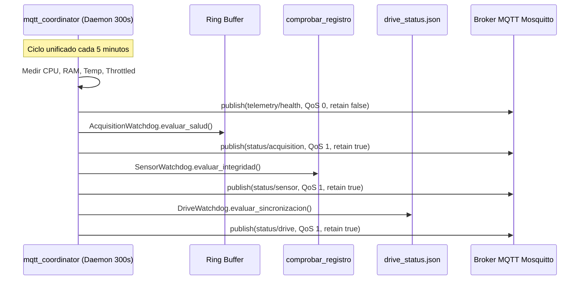

# Plan de Implementación: Telemetría de Adquisición, Sensor y Google Drive con Cadencia Unificada a 5 Minutos en Estaciones

**Fecha**: 2026-09-10  
**Proyecto**: `acelerografo-DEV00` (Software de Estaciones Acelerográficas)  
**Objetivo**: Implementar en las estaciones de campo la auditoría periódica de integridad física del acelerómetro y el monitoreo de subidas a Google Drive, unificando su cadencia de evaluación y publicación MQTT a **5 minutos (300 s)** acoplada a `telemetry/health` dentro del daemon central `mqtt_coordinator.py`, con banderas QoS 1 y `retain = true`.

---

## Prerrequisitos y Verificaciones

1. **Acceso al Workspace**: `montajes/acelerografo-DEV00`.
2. **Entorno de Ejecución**: Raspberry Pi con Python 3.9+ bajo entorno virtual `.venv` y Supervisor gestionando `mqtt_coordinator`.
3. **Binario de Diagnóstico C**: Compilado y funcional en `$PROJECT_LOCAL_ROOT/scripts/acelerografo/ejecutables/comprobar_registro`.
4. **Respaldo de Seguridad**: Respaldar `mqtt_coordinator.py` y `configuracion_dispositivo.json.template` antes de aplicar cambios.

Comando de verificación previo:
```bash
python3 /home/rsa/git/montajes/acelerografo-DEV00/scripts/operation/acelerografo/comprobar_registro_wrapper.py
```
*Criterio de Éxito*: Retorna un JSON con `aceleracion_x`, `aceleracion_y`, `aceleracion_z`, `fuente_reloj` y sin errores.

---

## Fase 1: Módulo de Integridad del Sensor Acelerométrico (`sensor_watchdog.py`)

**Objetivo**: Crear una clase modular `SensorWatchdog` que ejecute la comprobación triaxial en reposo, valide tolerancias físicas y fuentes de reloj, y genere el payload estructurado para `status/sensor`.

### 1.1. Tolerancias Físicas y Validación de Reloj

| Métrica / Parámetro | Rango Nominal Aceptado | Condición de Error (`status: error`) |
|---|---|---|
| Eje X ($A_x$) | $|A_x| \le 0.5\text{ m/s}^2$ | $|A_x| > 0.5\text{ m/s}^2$ |
| Eje Y ($A_y$) | $|A_y| \le 0.5\text{ m/s}^2$ | $|A_y| > 0.5\text{ m/s}^2$ |
| Eje Z ($A_z$) | $|A_z - 9.81| \le 0.8\text{ m/s}^2$ | $|A_z - 9.81| > 0.8\text{ m/s}^2$ (ej. $0\text{ m/s}^2$ o saturación) |
| Fuente de Reloj | `GPS` o `RPi` | `E3` o código de error en salida |
| Error de Reloj | `null` | String con código `E3/GPS: ...` |

### 1.2. Archivo a Crear: `scripts/operation/mqtt/sensor_watchdog.py`

```python
#!/usr/bin/env python3
# -*- coding: utf-8 -*-

"""
sensor_watchdog.py — Auditor de Integridad Física del Acelerómetro

Ejecuta comprobar_registro_wrapper, evalúa que las aceleraciones triaxiales en reposo
se encuentren dentro de las tolerancias físicas normales y audita la sincronización del reloj.
"""

import json
import logging
import os
import subprocess
import sys
from datetime import datetime, timezone

logger = logging.getLogger("SensorWatchdog")

# Umbrales nominales en reposo (m/s^2)
MAX_ABS_HORIZONTAL_ACCEL = 0.5   # X e Y cercanos a 0
TARGET_GRAVITY_Z = 9.81          # Z cercano a 1g
TOLERANCE_GRAVITY_Z = 0.8        # Rango aceptable [9.01, 10.61]

class SensorWatchdog:
    def __init__(self, wrapper_path: str = None):
        if wrapper_path:
            self.wrapper_path = wrapper_path
        else:
            base_dir = os.path.dirname(os.path.dirname(os.path.abspath(__file__)))
            self.wrapper_path = os.path.join(base_dir, "acelerografo", "comprobar_registro_wrapper.py")

    def evaluar_integridad(self, station_id: str) -> dict:
        now_utc = datetime.now(timezone.utc).strftime("%Y-%m-%dT%H:%M:%SZ")
        
        if not os.path.isfile(self.wrapper_path):
            return {
                "status": "error",
                "ax": None, "ay": None, "az": None,
                "clock_source": None,
                "clock_error": "wrapper_not_found",
                "reason": "wrapper_not_found",
                "station_id": station_id,
                "timestamp": now_utc
            }

        try:
            res = subprocess.run(
                [sys.executable, self.wrapper_path],
                capture_output=True,
                text=True,
                timeout=12
            )
            if res.returncode != 0:
                return {
                    "status": "error",
                    "ax": None, "ay": None, "az": None,
                    "clock_source": None,
                    "clock_error": res.stderr.strip() or "execution_failed",
                    "reason": "execution_failed",
                    "station_id": station_id,
                    "timestamp": now_utc
                }

            datos = json.loads(res.stdout)
            if "error" in datos and datos["error"]:
                return {
                    "status": "error",
                    "ax": None, "ay": None, "az": None,
                    "clock_source": None,
                    "clock_error": str(datos["error"]),
                    "reason": "sensor_check_error",
                    "station_id": station_id,
                    "timestamp": now_utc
                }

            ax = datos.get("aceleracion_x")
            ay = datos.get("aceleracion_y")
            az = datos.get("aceleracion_z")
            clock_source = datos.get("fuente_reloj")
            clock_error = datos.get("error_reloj")

            # Validar valores nulos
            if ax is None or ay is None or az is None:
                return {
                    "status": "error",
                    "ax": ax, "ay": ay, "az": az,
                    "clock_source": clock_source,
                    "clock_error": clock_error or "null_readings",
                    "reason": "null_readings",
                    "station_id": station_id,
                    "timestamp": now_utc
                }

            # Validar tolerancias físicas
            error_msg = []
            if abs(ax) > MAX_ABS_HORIZONTAL_ACCEL:
                error_msg.append(f"ax_out_of_range({ax:.3f})")
            if abs(ay) > MAX_ABS_HORIZONTAL_ACCEL:
                error_msg.append(f"ay_out_of_range({ay:.3f})")
            if abs(az - TARGET_GRAVITY_Z) > TOLERANCE_GRAVITY_Z:
                error_msg.append(f"az_out_of_range({az:.3f})")
            if clock_error:
                error_msg.append(f"clock_err({clock_error})")

            if error_msg:
                return {
                    "status": "error",
                    "ax": round(ax, 4),
                    "ay": round(ay, 4),
                    "az": round(az, 4),
                    "clock_source": clock_source,
                    "clock_error": "; ".join(error_msg),
                    "reason": "accelerometer_anomaly",
                    "station_id": station_id,
                    "timestamp": now_utc
                }

            return {
                "status": "ok",
                "ax": round(ax, 4),
                "ay": round(ay, 4),
                "az": round(az, 4),
                "clock_source": clock_source,
                "clock_error": None,
                "reason": "nominal",
                "station_id": station_id,
                "timestamp": now_utc
            }

        except subprocess.TimeoutExpired:
            return {
                "status": "error",
                "ax": None, "ay": None, "az": None,
                "clock_source": None,
                "clock_error": "timeout",
                "reason": "timeout",
                "station_id": station_id,
                "timestamp": now_utc
            }
        except Exception as exc:
            return {
                "status": "error",
                "ax": None, "ay": None, "az": None,
                "clock_source": None,
                "clock_error": str(exc),
                "reason": "exception",
                "station_id": station_id,
                "timestamp": now_utc
            }
```

### 1.3. Archivo de Tests: `scripts/operation/mqtt/test_sensor_watchdog.py`
* Pruebas de unidad cubriendo:
  1. Lectura nominal ($A_x=0.01, A_y=-0.02, A_z=9.80, \text{clock}=\text{"GPS"}$) $\rightarrow$ `status: "ok"`.
  2. Anomalía en eje Z ($A_z = 0.0$ o $A_z = 15.0$) $\rightarrow$ `status: "error"`, `reason: "accelerometer_anomaly"`.
  3. Falla de reloj (`clock_error = "E3/GPS"`) $\rightarrow$ `status: "error"`.
  4. Error en ejecución o wrapper no encontrado $\rightarrow$ `status: "error"`.

---

## Fase 2: Módulo Auditor de Google Drive (`drive_watchdog.py`)

**Objetivo**: Crear la clase `DriveWatchdog` para inspeccionar el estado de sincronización de archivos `.mseed`, la protección por fallos y el porcentaje de disco disponible.

### 2.1. Archivo a Crear: `scripts/operation/mqtt/drive_watchdog.py`

```python
#!/usr/bin/env python3
# -*- coding: utf-8 -*-

"""
drive_watchdog.py — Auditor de Sincronización Google Drive y Espacio en Disco

Examina drive_status.json y los directorios de almacenamiento de MiniSEED para
reportar archivos retenidos por error y archivos pendientes de subida.
"""

import json
import os
import shutil
from datetime import datetime, timezone

class DriveWatchdog:
    def __init__(self, mseed_dir: str = None, status_file: str = None):
        project_root = os.getenv("PROJECT_LOCAL_ROOT", "/home/rsa/projects/acelerografo")
        self.mseed_dir = mseed_dir or os.path.join(project_root, "datos", "MSEED")
        self.status_file = status_file or os.path.join(project_root, "log-files", "drive_status.json")

    def evaluar_sincronizacion(self, station_id: str) -> dict:
        now_utc = datetime.now(timezone.utc).strftime("%Y-%m-%dT%H:%M:%SZ")
        
        # 1. Espacio en disco
        free_disk_percent = 100.0
        try:
            usage = shutil.disk_usage(self.mseed_dir if os.path.exists(self.mseed_dir) else "/")
            free_disk_percent = round((usage.free / usage.total) * 100, 1)
        except Exception:
            pass

        # 2. Leer drive_status.json
        ya_subidos = set()
        protegidos = set()
        last_upload_utc = None

        if os.path.isfile(self.status_file):
            try:
                with open(self.status_file, "r", encoding="utf-8") as f:
                    data = json.load(f)
                    mseed_data = data.get("mseed", {})
                    ya_subidos = set(mseed_data.get("uploaded", []))
                    protegidos = set(mseed_data.get("protected", []))
                    last_upload_utc = data.get("last_upload_utc")
            except Exception:
                pass

        # 3. Contar archivos pendientes en disco
        pending_mseed = 0
        if os.path.isdir(self.mseed_dir):
            try:
                archivos_disco = [f for f in os.listdir(self.mseed_dir) if f.endswith(".mseed") or f.endswith(".MSEED")]
                pending_mseed = len([f for f in archivos_disco if f not in ya_subidos])
            except Exception:
                pass

        failed_uploads_protected = len(protegidos)

        # 4. Clasificación de estado
        if failed_uploads_protected > 0 or pending_mseed > 3:
            status = "warning"
            reason = "upload_retry_retained" if failed_uploads_protected > 0 else "pending_backlog"
        else:
            status = "ok"
            reason = "all_synced"

        return {
            "status": status,
            "pending_mseed": pending_mseed,
            "failed_uploads_protected": failed_uploads_protected,
            "free_disk_percent": free_disk_percent,
            "last_upload_utc": last_upload_utc,
            "reason": reason,
            "station_id": station_id,
            "timestamp": now_utc
        }
```

---

## Fase 3: Unificación de Cadencia a 5 Minutos en `mqtt_coordinator.py`

**Objetivo**: Integrar los tres auditores (`AcquisitionWatchdog`, `SensorWatchdog`, `DriveWatchdog`) en el bucle principal de `mqtt_coordinator.py`, sincronizados cada 300 segundos, y añadir el comando de parada de seguridad remota.

### 3.1. Acciones en `scripts/operation/mqtt/mqtt_coordinator.py`

1. **Importación de Módulos**:
   ```python
   from .sensor_watchdog import SensorWatchdog
   from .drive_watchdog import DriveWatchdog
   ```

2. **Unificación de Intervalo a 300 s**:
   ```python
   HEALTH_INTERVAL = 300            # segundos (5 minutos)
   ACQUISITION_CHECK_INTERVAL = 300 # Unificado a 5 minutos
   ```

3. **Funciones de Publicación Especializadas**:
   - `publicar_acquisition_status(client, config, watchdog, logger)`:
     - Configurar `retain = True` y `qos = 1`.
   - `publicar_sensor_status(client, config, sensor_watchdog, logger)`:
     - Ejecuta `sensor_watchdog.evaluar_integridad(station_id=config["id"])`.
     - Publica en `rsa/seismic/smart/{id}/status/sensor` con `qos=1, retain=True`.
     - Loguea: `[SENSOR_OK]` o `[SENSOR_ANOMALY] Error: ...`.
   - `publicar_drive_status(client, config, drive_watchdog, logger)`:
     - Ejecuta `drive_watchdog.evaluar_sincronizacion(station_id=config["id"])`.
     - Publica en `rsa/seismic/smart/{id}/status/drive` con `qos=1, retain=True`.
     - Loguea: `[DRIVE_SYNC_OK]` o `[DRIVE_WARN] Pendientes: N, Protegidos: M`.

4. **Integración en el Bucle Principal (Tick de 300 s)**:
   ```python
   if now - last_health >= HEALTH_INTERVAL:
       publicar_health(client, config, logger)
       publicar_acquisition_status(client, config, watchdog, logger)
       publicar_sensor_status(client, config, sensor_watchdog, logger)
       publicar_drive_status(client, config, drive_watchdog, logger)
       last_health = now
   ```

5. **Comando de Contingencia: Parada de Seguridad Remota (`cmd/stop_acquisition_safety`)**:
   - En `CommandDispatcher`: registrar el comando `stop_acquisition_safety`.
   - *Comportamiento*: Ejecuta `sudo systemctl stop rsa-acelerografo.service`.
   - *Respuesta*: Publica ACK y confirmación en `cmd/stop_acquisition_safety/res`.
   - *Propósito*: Detener inmediatamente la adquisición continua si el acelerómetro reporta daño irreversible, evitando inundar el disco con datos inservibles o inducir disparos falsos en el correlador central.

---

## Fase 4: Actualización de Plantillas y Configuración

**Objetivo**: Asegurar que las plantillas de configuración del repositorio incluyan los nuevos tópicos y directivas de retención.

### 4.1. Archivo `configuration/configuracion_dispositivo.json.template`

Añadir en las secciones correspondientes:
```json
{
  "topics": {
    "status_acquisition": "{{ORG}}/{{APP}}/{{CAP}}/{{ID}}/status/acquisition",
    "status_sensor": "{{ORG}}/{{APP}}/{{CAP}}/{{ID}}/status/sensor",
    "status_drive": "{{ORG}}/{{APP}}/{{CAP}}/{{ID}}/status/drive"
  },
  "retain": {
    "telemetry_state": true,
    "telemetry_health": false,
    "status_acquisition": true,
    "status_sensor": true,
    "status_drive": true
  }
}
```

### 4.2. Actualización de `scripts/setup/update.sh`
* Asegurar que al ejecutar la Opción 3 de `menu.sh` se compilen y sincronicen los nuevos scripts `sensor_watchdog.py` y `drive_watchdog.py`.

---

## Fase 5: Pruebas y Validación Empírica en Estación (`DEV0`)

### 5.1. Checkpoint 1: Validación de Tests Unitarios
```bash
cd /home/rsa/projects/acelerografo
.venv/bin/python3 scripts/operation/mqtt/test_sensor_watchdog.py
.venv/bin/python3 scripts/operation/mqtt/test_drive_watchdog.py
```
*Criterio de Éxito*: 100% de tests unitarios superados.

### 5.2. Checkpoint 2: Verificación de Publicación Sincronizada cada 5 Minutos
Monitorear el tráfico MQTT desde una terminal de pruebas:
```bash
mosquitto_sub -h 174.138.41.251 -t "rsa/seismic/smart/DEV0/#" -v
```
*Criterio de Éxito*:
- Cada 5 minutos exactos se reciben en ráfaga sincronizada:
  - `.../DEV0/telemetry/health`
  - `.../DEV0/status/acquisition`
  - `.../DEV0/status/sensor`
  - `.../DEV0/status/drive`
- No existen publicaciones intermedias cada 60 s, garantizando el ahorro del canal.

### 5.3. Checkpoint 3: Comando de Seguridad Remota
Emitir comando de parada:
```bash
mosquitto_pub -h 174.138.41.251 -t "rsa/seismic/smart/DEV0/cmd/stop_acquisition_safety" -m '{"action":"stop"}' -q 1
```
*Criterio de Éxito*: La adquisición se detiene ordenadamente y `systemctl status rsa-acelerografo` retorna inactivo.

---

## Diagrama de Ejecución en la Estación


