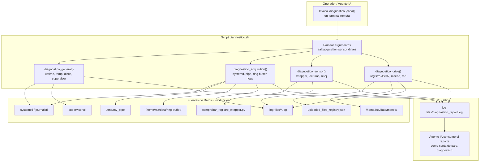

# Plan de Implementación: Script de Diagnóstico Automatizado de Telemetría

**Fecha**: 2026-09-15  
**Proyecto**: `acelerografo-DEV00`  
**Objetivo**: Crear un task-script Bash (`diagnostico.sh`) que, invocado manualmente o por un agente de IA, ejecute automáticamente las rutinas de inspección pertinentes a cada canal de telemetría de estado (`status/acquisition`, `status/sensor`, `status/drive`) y genere un reporte consolidado en `$PROJECT_LOCAL_ROOT/log-files/diagnostico_report.log`. Este archivo servirá como contexto estructurado para que un agente de IA pueda identificar la causa raíz de un error o advertencia y asistir en su resolución.

---

## Inventario de Condiciones Diagnosticables

Antes de diseñar el script, es necesario catalogar exhaustivamente todos los estados posibles que emiten los watchdogs de telemetría. Las condiciones se agrupan por canal (`status/*`).

### Canal: `status/acquisition` (AcquisitionWatchdog)

| status | reason | Significado | Gravedad |
|--------|--------|-------------|----------|
| `ok` | *(ausente)* | Última trama del Ring Buffer dentro del umbral de 300 s | Nominal |
| `warning` | `stale_data` | `age_seconds > 300`: sin tramas nuevas en el Ring Buffer | Media |
| `error` | `ring_buffer_dir_not_found` | Directorio `/home/rsa/data/ring-buffer/` no existe o inaccesible | Crítica |
| `error` | `no_data_available` | Directorio existe pero no contiene archivos `ring_*.bin` | Crítica |

### Canal: `status/sensor` (SensorWatchdog)

| status | reason | Significado | Gravedad |
|--------|--------|-------------|----------|
| `ok` | `nominal` | Aceleraciones en tolerancia y reloj sincronizado | Nominal |
| `error` | `wrapper_not_found` | Script `comprobar_registro_wrapper.py` no encontrado en ruta esperada | Crítica |
| `error` | `execution_failed` | El wrapper retornó `returncode != 0` | Crítica |
| `error` | `sensor_check_error` | El wrapper reportó un campo `error` en su JSON de salida | Crítica |
| `error` | `null_readings` | Alguno de `ax`, `ay`, `az` retornó `null` | Crítica |
| `error` | `accelerometer_anomaly` | Lecturas fuera de tolerancia física (`|ax|>0.5`, `|ay|>0.5`, `|az-9.81|>0.8`) o error de reloj | Alta |
| `error` | `timeout` | El wrapper no respondió en 12 segundos | Alta |
| `error` | `exception` | Excepción inesperada al invocar el subproceso | Crítica |

### Canal: `status/drive` (DriveWatchdog)

| status | reason | Significado | Gravedad |
|--------|--------|-------------|----------|
| `ok` | `all_synced` | Sin archivos pendientes ni protegidos; disco sano | Nominal |
| `warning` | `upload_retry_retained` | Existen archivos fallidos retenidos en disco (`failed_uploads_protected > 0`) | Media |
| `warning` | `pending_backlog` | Más de 3 archivos MiniSEED pendientes de subida (`pending_mseed > 3`) | Media |

---

## Prerequisitos

1. **Variable de entorno `PROJECT_LOCAL_ROOT`**: Debe estar definida en el entorno (inyectada por `source /usr/local/bin/project_paths`).
2. **Acceso al entorno virtual**: `$PROJECT_LOCAL_ROOT/.venv/bin/python3` disponible.
3. **Permisos**: El script no requiere `sudo` para la recolección de logs. Los comandos que consultan `systemctl` y `supervisorctl` sí requieren privilegios elevados, pero solo para lectura de estado (no modifican servicios).
4. **Directorio de salida**: `$PROJECT_LOCAL_ROOT/log-files/` ya existe en el flujo estándar del proyecto.

---

## Fase 1: Diseño del Script de Diagnóstico (`diagnostico.sh`)

**Objetivo**: Crear un script Bash autocontenido que reciba opcionalmente un canal específico (`acquisition`, `sensor`, `drive`, `all`) y ejecute la batería de inspecciones correspondiente.

### Estructura del Reporte

El archivo de salida `$PROJECT_LOCAL_ROOT/log-files/diagnostico_report.log` se sobrescribe en cada ejecución con un formato de secciones delimitadas legible tanto por humanos como por un LLM:

```
===================================================================
REPORTE DE DIAGNÓSTICO AUTOMATIZADO - ESTACIÓN ACELEROGRÁFICA RSA
===================================================================
Fecha de generación : 2026-09-15T16:45:00-05:00
Estación            : DEV0
Canal diagnosticado : all
===================================================================

--- SECCIÓN: ESTADO GENERAL DEL SISTEMA ---
[contenido de df -h, uptime, temperatura CPU, estado Supervisor]

--- SECCIÓN: DIAGNÓSTICO ADQUISICIÓN ---
[contenido de systemctl status, logs del Ring Buffer, inspección pipe]

--- SECCIÓN: DIAGNÓSTICO SENSOR ---
[contenido de comprobar_registro_wrapper, últimas líneas de log]

--- SECCIÓN: DIAGNÓSTICO DRIVE ---
[contenido de registro de subidas, espacio en disco, logs de gestor]

===================================================================
FIN DEL REPORTE
===================================================================
```

### Interfaz de Uso

```bash
# Diagnóstico completo (todos los canales)
diagnostico

# Diagnóstico de un canal específico
diagnostico acquisition
diagnostico sensor
diagnostico drive

# Modo silencioso (no imprime a stdout, solo escribe el archivo)
diagnostico --quiet
diagnostico --quiet acquisition
```

### Acciones

1. **Crear archivo** `scripts/task/diagnostico.sh` con las siguientes funciones:

   #### Función `diagnostico_general()`
   Recolecta información de contexto del sistema que es relevante para cualquier diagnóstico:
   ```bash
   # Información del sistema
   date --iso-8601=seconds
   hostname
   uptime
   
   # Hardware (Raspberry Pi)
   vcgencmd measure_temp
   vcgencmd get_throttled
   
   # Espacio en disco
   df -h
   
   # Estado de todos los servicios gestionados
   sudo supervisorctl status
   sudo systemctl status rsa-acelerografo.service --no-pager -l
   ```

   #### Función `diagnostico_acquisition()`
   Inspecciona el pipeline de adquisición continua:
   ```bash
   # 1. Estado del servicio systemd (registro_continuo en C)
   sudo systemctl status rsa-acelerografo.service --no-pager -l
   sudo journalctl -u rsa-acelerografo.service --no-pager -n 30
   
   # 2. Estado del proceso stream_processor (Supervisor)
   sudo supervisorctl status stream_processor
   tail -n 50 $PROJECT_LOCAL_ROOT/log-files/supervisor_stream_processor.log
   tail -n 20 $PROJECT_LOCAL_ROOT/log-files/supervisor_stream_processor.err
   
   # 3. Inspección del named pipe
   ls -la /tmp/my_pipe 2>&1
   stat /tmp/my_pipe 2>&1
   
   # 4. Estado del Ring Buffer
   ls -lt /home/rsa/data/ring-buffer/ 2>&1 | head -10
   find /home/rsa/data/ring-buffer/ -name "ring_*.bin" -printf "%T+ %p\n" 2>/dev/null | sort -r | head -5
   
   # 5. Verificar si stream_processor está leyendo activamente (PID y fd)
   pgrep -f stream_processor.py
   ls -la /proc/$(pgrep -f stream_processor.py)/fd/ 2>/dev/null | grep pipe
   
   # 6. Últimas líneas del log del coordinador MQTT (entradas de adquisición)
   grep -i "ACQUISITION\|STALE\|PIPE_RECONNECT\|PIPE_RECONNECTED" $PROJECT_LOCAL_ROOT/log-files/mqtt_coordinator.log | tail -20
   ```

   #### Función `diagnostico_sensor()`
   Inspecciona la integridad del acelerómetro y la sincronización de reloj:
   ```bash
   # 1. Ejecución directa del wrapper de comprobación
   $PROJECT_LOCAL_ROOT/.venv/bin/python3 $PROJECT_LOCAL_ROOT/scripts/acelerografo/comprobar_registro_wrapper.py 2>&1
   
   # 2. Verificar que el wrapper existe en la ruta esperada
   ls -la $PROJECT_LOCAL_ROOT/scripts/acelerografo/comprobar_registro_wrapper.py 2>&1
   
   # 3. Últimas líneas del log con entradas de sensor
   grep -i "SENSOR\|ANOMALY\|clock\|wrapper" $PROJECT_LOCAL_ROOT/log-files/mqtt_coordinator.log | tail -20
   
   # 4. Estado del servicio de adquisición (el sensor depende de que esté activo)
   sudo systemctl is-active rsa-acelerografo.service
   ```

   #### Función `diagnostico_drive()`
   Inspecciona el estado de sincronización con Google Drive y el almacenamiento en disco:
   ```bash
   # 1. Registro de subidas (JSON completo para análisis del agente)
   cat $PROJECT_LOCAL_ROOT/log-files/uploaded_files_registry.json 2>/dev/null || \
   cat $PROJECT_LOCAL_ROOT/log-files/drive_status.json 2>/dev/null || \
   echo "No se encontró archivo de registro de subidas"
   
   # 2. Archivos MiniSEED pendientes en disco
   ls -la /home/rsa/data/mseed/*.mseed 2>/dev/null | wc -l
   ls -lt /home/rsa/data/mseed/*.mseed 2>/dev/null | head -10
   
   # 3. Espacio en disco de la partición de datos
   df -h /home/rsa/data/
   
   # 4. Últimas líneas del log del gestor de archivos
   tail -n 30 $PROJECT_LOCAL_ROOT/log-files/gestor_acq.log 2>/dev/null || echo "Log del gestor no encontrado"
   
   # 5. Últimas entradas MQTT de Drive
   grep -i "DRIVE\|UPLOAD\|SYNC\|upload_retry\|pending_backlog" $PROJECT_LOCAL_ROOT/log-files/mqtt_coordinator.log | tail -20
   
   # 6. Conectividad de red (verificar acceso a internet para Drive)
   ping -c 2 -W 3 www.googleapis.com 2>&1 || echo "Sin acceso a googleapis.com"
   ```

### Comprobación (Checkpoint)

Tras crear el script, el usuario deberá:
1. Desplegar ejecutando la Opción 3 del `menu.sh` (que invoca `update_task_scripts` y copia `.sh` a `/usr/local/bin`).
2. Ejecutar manualmente en la estación:
   ```bash
   diagnostico
   ```
3. Verificar que se generó el archivo de reporte:
   ```bash
   cat $PROJECT_LOCAL_ROOT/log-files/diagnostico_report.log
   ```

---

## Fase 2: Integración con el Flujo de Despliegue

**Objetivo**: Garantizar que el script se despliega automáticamente a producción sin modificaciones adicionales.

### Acciones

1. **Verificar la función `update_task_scripts` en `update.sh`**: Ya recorre `scripts/task/*.sh` y los copia a `/usr/local/bin` sin extensión. No se requieren cambios en `update.sh`.

   Flujo de despliegue existente (sin modificaciones):
   ```
   scripts/task/diagnostico.sh  →  /usr/local/bin/diagnostico  (chmod +x)
   ```

2. **Verificar que el directorio de salida `log-files/` existe**: Ya es creado por `StructuredLogger` al iniciar `mqtt_coordinator`. No se requiere creación explícita.

### Comprobación (Checkpoint)

```bash
# En la estación, tras ejecutar Opción 3 de menu.sh:
which diagnostico
# Debe retornar: /usr/local/bin/diagnostico
```

---

## Fase 3: Actualización de Documentación

**Objetivo**: Registrar la nueva herramienta en `ayuda.sh` para que el operador la descubra fácilmente.

### Acciones

1. **Agregar sección en `scripts/task/ayuda.sh`**: Insertar una nueva sección de "Diagnóstico Automatizado" antes de la sección de "Información del Sistema":

   ```bash
   echo "Diagnóstico Automatizado (Reporte para Agente IA):"
   echo "  Diagnóstico completo:  diagnostico"
   echo "  Solo adquisición:      diagnostico acquisition"
   echo "  Solo sensor:           diagnostico sensor"
   echo "  Solo Drive:            diagnostico drive"
   echo "  Modo silencioso:       diagnostico --quiet"
   echo "  Ver último reporte:    cat \$PROJECT_LOCAL_ROOT/log-files/diagnostico_report.log"
   echo " "
   ```

### Comprobación (Checkpoint)

```bash
# En la estación, tras desplegar:
ayuda
# Debe mostrar la nueva sección de Diagnóstico Automatizado
```

---

## Fase 4: Generación del Contexto Técnico

**Objetivo**: Crear el documento de contexto técnico `docs/context/diagnostico_context.md` para futuros agentes.

### Acciones

1. **Crear** `docs/context/diagnostico_context.md` con:
   - Descripción del propósito y flujo del script.
   - Mapa de `reason` → rutinas de inspección ejecutadas.
   - Formato del reporte de salida.
   - Instrucciones para un agente de IA sobre cómo interpretar cada sección.

### Comprobación (Checkpoint)

Verificar que el archivo existe y es coherente con el script implementado.

---

## Diagrama de Arquitectura



---

## Decisiones de Diseño

1. **Bash en lugar de Python**: El script es Bash puro (como todos los task-scripts del proyecto: `ayuda.sh`, `comprobar.sh`, `registrocontinuo.sh`, `informacion.sh`). Esto garantiza compatibilidad con el flujo de despliegue `update_task_scripts` que copia `.sh` a `/usr/local/bin` sin extensión.

2. **Sobrescritura del reporte**: Cada ejecución sobrescribe `diagnostico_report.log` en lugar de acumular. Razón: el agente de IA necesita un snapshot limpio del estado actual, no un historial. Los logs históricos ya existen en los archivos individuales (`mqtt_coordinator.log`, `supervisor_*.log`, etc.).

3. **Sin dependencias externas**: El script usa únicamente herramientas estándar de Linux (`grep`, `tail`, `cat`, `ls`, `stat`, `find`, `ping`, `df`, `uptime`), `systemctl`, `supervisorctl`, y el intérprete Python del `.venv` para ejecutar el wrapper del sensor. No introduce paquetes ni binarios nuevos.

4. **Formato de texto plano con delimitadores**: El reporte usa secciones marcadas con `--- SECCIÓN: ... ---` en lugar de JSON o YAML. Esto facilita tanto la lectura humana como el parsing por un LLM sin necesidad de deserialización. La única excepción es la salida del wrapper del sensor, que es JSON nativo y se vuelca tal cual para preservar la estructura.

5. **Argumento de canal opcional**: El valor por defecto es `all` (diagnóstico completo). El operador o el agente pueden limitar el alcance para reducir el tiempo de ejecución y el ruido en el reporte.

---

## Resumen de Archivos a Crear/Modificar

| Archivo | Acción | Descripción |
|---------|--------|-------------|
| `scripts/task/diagnostico.sh` | **CREAR** | Script principal de diagnóstico automatizado |
| `scripts/task/ayuda.sh` | **MODIFICAR** | Agregar sección de Diagnóstico Automatizado |
| `docs/context/diagnostico_context.md` | **CREAR** | Contexto técnico para futuros agentes |
