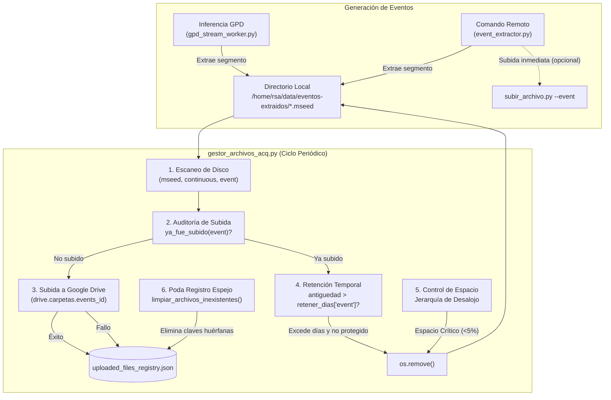

# Blueprint: Administración Integral de Eventos Extraídos en Gestor de Archivos

**Fecha**: 2026-09-17  
**Proyecto**: `acelerografo-DEV00`  
**Autor**: Antigravity (AI Assistant) & Milton Muñoz  
**Estado**: Propuesta para Revisión  

---

## 🎯 Objetivo General

Extender [`scripts/operation/drive/gestor_archivos_acq.py`](file:///home/rsa/git/montajes/acelerografo-DEV00/scripts/operation/drive/gestor_archivos_acq.py) para que asuma la gobernanza completa del ciclo de vida de los archivos generados en `/home/rsa/data/eventos-extraidos/` (tipo `event`). Esto resolverá la acumulación indefinida de archivos de eventos en disco local (actualmente 2.496 archivos en `DEV00`), garantizará reintentos automáticos desatendidos ante fallos de conectividad en tiempo real (arquitectura *Store & Forward*) y aplicará políticas controladas de retención temporal y espacio crítico respetando el principio de Registro Espejo formalizado en el ADR-021.

---

## 🏛️ Arquitectura y Flujo de Datos



---

## 📋 Fases de Implementación

---

### Fase 1: Extensión de Esquemas y Configuración

**Objetivo**: Habilitar el tipo `event` dentro de la configuración de gestión de almacenamiento con valores por defecto seguros y sin romper retrocompatibilidad.

#### 1.1 Esquema de Configuración (`configuracion_dispositivo.json`)

Se incorporará `event` en las secciones `subir` y `retener_dias`:

```json
{
  "gestion_almacenamiento": {
    "umbrales": {
      "minimo": 10,
      "critico": 5
    },
    "politicas": {
      "online": {
        "subir": ["mseed", "event"],
        "retener_dias": {
          "continuous": 30,
          "mseed": 30,
          "event": 30
        }
      },
      "offline": {
        "subir": [],
        "retener_dias": {
          "continuous": 7,
          "event": 30
        }
      }
    }
  }
}
```

#### 1.2 Fallbacks Seguros en Código
Si una estación no tiene explícitamente `"event"` en su JSON, el gestor adoptará por defecto:
* En modo `online`: incluir `"event"` en `subir` (si `directorios.eventos_extraidos` existe) y retener 30 días.
* En modo `offline`: retener 30 días.

#### 1.3 Acciones
1. Modificar `scripts/operation/drive/gestor_archivos_acq.py`:
   - Cargar `eventos_directory = config_dispositivo.get("directorios", {}).get("eventos_extraidos", "")`.
   - Inicializar lista de archivos:
     ```python
     archivos_eventos = []
     if eventos_directory and os.path.isdir(eventos_directory):
         archivos_eventos = [f for f in os.listdir(eventos_directory) if f.endswith(".mseed")]
     ```
   - Ajustar el log inicial para reportar el conteo de eventos:
     ```python
     logger.info(f"Archivos encontrados: {len(archivos_mseed)} mseed, {len(archivos_binarios)} continuous, {len(archivos_eventos)} event")
     ```

---

### Fase 2: Subida Desatendida de Eventos Pendientes a Google Drive

**Objetivo**: Garantizar que todo evento generado que no haya sido subido (o cuya subida inmediata falló por corte de red) sea detectado y subido a su carpeta correspondiente en Google Drive.

#### 2.1 Lógica de Detección y Encolamiento
En modo `online` (con conectividad confirmada):
```python
if "event" in tipos_a_subir and eventos_directory:
    archivos_eventos_paths = [os.path.join(eventos_directory, f) for f in archivos_eventos]
    archivos_eventos_ordenados = sorted(archivos_eventos_paths, key=os.path.getmtime)
    for path in archivos_eventos_ordenados:
        nombre_archivo = os.path.basename(path)
        if ya_fue_subido(log_directory, nombre_archivo, "event"):
            archivos_ya_subidos_count += 1
            logger.skip("event", nombre_archivo, "already_uploaded")
        else:
            archivos_para_subir.append((path, "event"))
```

#### 2.2 Resolución de Carpeta en Google Drive
Dentro del ciclo de subida con `subir_archivo_con_reintentos`:
```python
elif tipo_archivo == "event":
    drive_id = config_dispositivo.get("drive", {}).get("carpetas", {}).get("events_id", "")
```

> [!IMPORTANT]
> Se mantiene `borrar_despues=False` al invocar `subir_archivo_con_reintentos`. El archivo se registra como exitoso en `uploaded_files_registry.json`, pero su permanencia física en disco es gobernada por la política de retención temporal (Fase 3).

---

### Fase 3: Retención Temporal y Jerarquía de Desalojo por Espacio Crítico

**Objetivo**: Purgar eventos antiguos que ya fueron respaldados en la nube y proteger la operatividad de la microSD ante saturación de disco, priorizando el valor científico de los eventos.

#### 3.1 Retención Temporal por Antigüedad
Al evaluar `retener_dias`:
```python
if "event" in retener_dias and eventos_directory:
    dias_event = retener_dias["event"]
    archivos_event_paths = [os.path.join(eventos_directory, f) for f in archivos_eventos]
    for ruta_archivo in archivos_event_paths:
        antiguedad = calcular_antiguedad_dias(ruta_archivo)
        if antiguedad > dias_event:
            # eliminar_archivo_con_verificacion comprueba si está en archivos_fallidos
            eliminado = eliminar_archivo_con_verificacion(
                ruta_archivo, "event", log_directory, logger, dry_run
            )
            if eliminado and not dry_run:
                logger.delete_age("event", os.path.basename(ruta_archivo), antiguedad)
```

#### 3.2 Jerarquía de Desalojo ante Espacio Crítico
Cuando el espacio libre es inferior a `umbral_critico` (< 5%):
1. **Nivel 1 (Continuo Binario)**: Eliminar archivos `.dat` de `registro-continuo/` (excepto el activo en escritura).
2. **Nivel 2 (Continuo MiniSEED)**: Eliminar archivos `.mseed` de `mseed/` más antiguos (FIFO), verificando que no estén protegidos por fallo.
3. **Nivel 3 (Eventos Extraídos - Último Recurso)**: Solo si tras purgar el continuo el espacio libre sigue en estado crítico (< `umbral_critico`):
   - Ordenar archivos de `eventos_extraidos` por fecha de modificación (los más antiguos primero).
   - Eliminar mediante `eliminar_archivo_con_verificacion(ruta, "event", ...)` hasta recuperar el umbral crítico o agotar eventos antiguos.
   - Si un evento falló en su subida previa, la función lo protege y pasa al siguiente.

---

### Fase 4: Suite de Pruebas Unitarias y Simulación Segura

**Objetivo**: Certificar la nueva funcionalidad con pruebas automatizadas aisladas sin tocar el disco de producción.

#### 4.1 Creación de `scripts/operation/drive/test_gestor_eventos.py`
Suite con `unittest` y directorios temporales (`tempfile`):
* `test_escaneo_eventos_pendientes()`: Detecta eventos `.mseed` y los encola si no están en `archivos_exitosos`.
* `test_omision_eventos_ya_subidos()`: Omite eventos que ya figuran en `archivos_exitosos.event`.
* `test_retencion_temporal_eventos()`: Elimina eventos con antigüedad > 30 días y preserva eventos recientes (< 30 días).
* `test_proteccion_evento_fallido()`: Impide que un evento con fallo de subida registrado en `archivos_fallidos.event` sea eliminado por retención.
* `test_simulacion_dry_run()`: Verifica que en `--dry-run` se reporten las acciones sin eliminar archivos físicos ni modificar el registro JSON.

#### 4.2 Checkpoint de Verificación en Producción
```bash
# 1. Ejecutar la suite de pruebas unitarias
$PROJECT_LOCAL_ROOT/.venv/bin/python3 scripts/operation/drive/test_gestor_eventos.py

# 2. Ejecutar simulación en seco sobre DEV00
$PROJECT_LOCAL_ROOT/.venv/bin/python3 scripts/operation/drive/gestor_archivos_acq.py --dry-run
```
*Criterio de Aceptación*:
- En DEV00, al haber 2.496 eventos de más de 30 días que ya están subidos a Google Drive, el `--dry-run` debe reportar con total exactitud que dichos archivos calificarían para eliminación por retención temporal sin alterar el disco.

---

### Fase 5: Documentación y Sincronización

**Objetivo**: Actualizar la memoria técnica del proyecto.

#### 5.1 Acciones
1. Actualizar `docs/context/gestor_archivos_acq_context.md` con el nuevo flujo de eventos.
2. Actualizar `docs/context/ayuda_context.md` si aplica.
3. Documentar la sesión en `docs/progress/`.

---

## 🔒 Matriz de Riesgos y Mitigaciones

| Riesgo | Impacto | Mitigación |
|---|---|---|
| Borrado accidental de un evento que no se subió a Drive | Crítico (pérdida de registro sísmico) | `eliminar_archivo_con_verificacion` consulta `esta_protegido()`. Si el archivo falló o no ha sido confirmado, no se borra. |
| Colisión entre subida inmediata de `event_extractor.py` y el gestor periódico | Bajo (intento de subida concurrente) | `drive_status_manager.py` usa `_file_lock` y escrituras atómicas. Si `event_extractor` ya lo subió, el gestor lo encuentra en `archivos_exitosos` y lo omite. |
| Purga masiva abrupta de los 2.496 eventos en DEV00 | Medio (I/O intensivo) | El proceso es secuencial con log estructurado por cada archivo eliminado. Se valida primero con `--dry-run`. |
| Falta de `events_id` en `configuracion_dispositivo.json` | Alto (fallo de subida) | Validación preventiva: si `not drive_id`, se emite error y no se interrumpe la subida de los demás tipos (`mseed`, `continuous`). |
