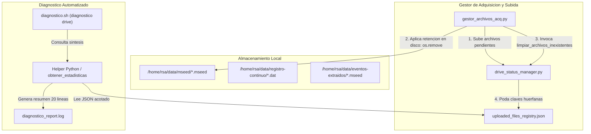

# Blueprint: Optimización del Registro de Google Drive y Síntesis de Diagnóstico

**Fecha**: 2026-09-17  
**Proyecto**: `acelerografo-DEV00`  
**Autor**: Antigravity (AI Assistant) & Milton Muñoz  
**Estado**: Implementado y Validado  

---

## 🎯 Objetivo General

Resolver el crecimiento desmedido del registro de sincronización de Google Drive (`uploaded_files_registry.json`) y optimizar la inspección operativa en la herramienta CLI `diagnostico.sh`.

### Justificación Técnica
En estaciones operativas como `TEST`, el archivo `uploaded_files_registry.json` almacena acumulativamente más de 4.700 entradas históricas (desde febrero de 2026 bajo distintos identificadores: `DEV00`, `DEV01`, `TEST`), a pesar de que en disco únicamente residen **749 archivos MiniSEED activos**.
1. **Asimetría del Ciclo de Vida**: Los archivos subidos se incorporan al JSON con `marcar_como_exitoso()`, pero al ser purgados físicamente de disco por políticas de retención temporal o espacio, nunca se eliminan del JSON.
2. **Función Huérfana**: En `drive_status_manager.py` ya existía `limpiar_archivos_inexistentes()`, pero ningún proceso del sistema la invocaba periódicamente.
3. **Inundación de Diagnóstico**: `diagnostico.sh` ejecutaba un `cat` ciego del JSON completo, generando reportes de miles de líneas que saturan la terminal, consumen I/O y agotan el contexto de tokens en auditorías de IA.

---

## 🏛️ Arquitectura de la Solución



---

## 📋 Fases de Implementación

---

### Fase 1: Robustecimiento y Suite de Tests de `drive_status_manager.py`

**Objetivo**: Fortalecer las rutinas de saneamiento y métricas en `drive_status_manager.py` contra rutas inválidas o directorios no montados, y crear una batería de tests unitarios que certifique su comportamiento.

#### 1.1 Esquemas y Estructuras de Datos

* **Retorno enriquecido de `limpiar_archivos_inexistentes()`**:
  ```python
  {
      "exitosos_removidos": int,   # Cantidad total de claves purgadas en archivos_exitosos
      "fallidos_removidos": int,    # Cantidad total de claves purgadas en archivos_fallidos
      "por_tipo": {
          "mseed": {"exitosos": int, "fallidos": int},
          "continuous": {"exitosos": int, "fallidos": int},
          "event": {"exitosos": int, "fallidos": int}
      }
  }
  ```

* **Salida de `obtener_resumen_diagnostico(log_directory, max_ultimos=5)`**:
  Nueva función que retorna el estado compacto requerido para auditoría:
  ```python
  {
      "totales": {
          "exitosos": int,
          "fallidos": int
      },
      "detalle_por_tipo": {
          "mseed": {"exitosos": int, "fallidos": int, "ultimos": [("archivo.mseed", "YYYY-MM-DD HH:MM:SS")]},
          "continuous": {"exitosos": int, "fallidos": int, "ultimos": []},
          "event": {"exitosos": int, "fallidos": int, "ultimos": []}
      },
      "fallidos_activos": [
          {"tipo": "mseed", "archivo": "DEV01_20260617_160000.mseed", "fecha": "2026-06-17 16:15:58"}
      ]
  }
  ```

#### 1.2 Acciones Concretas

1. **Modificar `scripts/operation/drive/drive_status_manager.py`**:
   - Agregar validación de seguridad de directorios en `limpiar_archivos_inexistentes`:
     ```python
     if not directorio or not os.path.isdir(directorio):
         if logger:
             logger.warning(f"Directorio omitido en limpieza (no existe o inválido): {directorio} para tipo {tipo}")
         continue
     ```
     > [!IMPORTANT]
     > Esta validación evita que si un directorio no está montado temporalmente, se asuma que todos sus archivos fueron borrados y se vacíe erróneamente el registro.
   - Retornar diccionario de métricas con el conteo detallado de archivos depurados.
   - Implementar `obtener_resumen_diagnostico(log_directory, max_ultimos=5)` para proveer la información estructurada que consumirá `diagnostico.sh`.

2. **Crear `scripts/operation/drive/test_drive_status_manager.py`**:
   - Crear suite de tests independientes con `tempfile`:
     - `test_marcar_exitoso_y_fallido()`: Verifica adición y remoción cruzada.
     - `test_limpiar_archivos_inexistentes_poda_correctamente()`: Crea archivos físicos temporales, registra algunos como subidos/fallidos, borra algunos físicamente y comprueba que la poda elimine solo los inexistentes.
     - `test_limpiar_archivos_inexistentes_ignora_directorio_invalido()`: Confirma que si el directorio no existe, no se purgan las claves del JSON.
     - `test_obtener_resumen_diagnostico_formato()`: Valida la estructura de métricas y los últimos $N$ registros.

#### 1.3 Comprobación (Checkpoint 1)
```bash
# Ejecutar la suite de pruebas unitarias de drive_status_manager
python3 scripts/operation/drive/test_drive_status_manager.py
```
*Criterio de Aceptación*: Todos los tests unitarios pasan sin advertencias (7/7 superados).

---

### Fase 2: Integración del Ciclo de Vida en `gestor_archivos_acq.py`

**Objetivo**: Automatizar la poda de archivos inexistentes dentro del flujo periódico de gestión de archivos, asegurando soporte para `--dry-run` y trazabilidad en los logs.

#### 2.1 Acciones Concretas

1. **Modificar `scripts/operation/drive/gestor_archivos_acq.py`**:
   - Importar `limpiar_archivos_inexistentes` desde `drive_status_manager`.
   - Construir el diccionario de directorios a partir de `configuracion_dispositivo.json`:
     ```python
     directorios_por_tipo = {
         "mseed": mseed_directory,
         "continuous": binary_directory
     }
     eventos_directory = config_dispositivo.get("directorios", {}).get("eventos_extraidos", "")
     if eventos_directory and os.path.isdir(eventos_directory):
         directorios_por_tipo["event"] = eventos_directory
     ```
   - Invocar la limpieza al finalizar las políticas de retención y control de espacio:
     - Si `dry_run=True`: calcular qué archivos se podarían e imprimir en log sin modificar el JSON en disco.
     - Si `dry_run=False`: invocar `limpiar_archivos_inexistentes(log_directory, directorios_por_tipo, logger)`.
   - Emitir registro estructurado en `gestor_acq.log`.

#### 2.2 Comprobación (Checkpoint 2)
```bash
# Simular ejecución con dry-run (no altera archivos ni JSON)
python3 scripts/operation/drive/gestor_archivos_acq.py --dry-run

# Validar que los tests de integración y regresión no se hayan roto
python3 scripts/operation/mqtt/test_drive_watchdog.py
```
*Criterio de Aceptación*: `test_drive_watchdog.py` pasa al 100% (8/8 superados).

---

### Fase 3: Optimización y Síntesis de Salida en `diagnostico.sh`

**Objetivo**: Transformar la sección `[1. Registro de subidas a Google Drive]` de `diagnostico.sh` para que presente un informe ejecutivo de 20 a 30 líneas en lugar del volcado masivo de miles de líneas JSON.

#### 3.1 Esquema de Salida en Consola / Reporte

```text
--- SECCIÓN: DIAGNÓSTICO DRIVE ---
[1. Resumen Ejecutivo de Sincronización Google Drive]
Archivo de estado      : /home/rsa/projects/acelerografo/log-files/uploaded_files_registry.json
Tamaño de registro     : 2903 archivos activos indexados (0 huérfanos)

Métricas por Tipo:
  • mseed      : 407 subidos exitosamente | 0 fallidos
  • continuous : 0 subidos exitosamente   | 0 fallidos
  • event      : 2496 subidos exitosamente| 0 fallidos

Últimos Archivos Subidos:
  [mseed]
    - DEV00_20260917_150000.mseed (2026-09-17 15:20:00)
    ...
```

#### 3.2 Acciones Concretas

1. **Modificar `scripts/task/diagnostico.sh`**:
   - Reemplazar el `cat` directo por ejecución de `$VENV_PYTHON` consumiendo `drive_status_manager.obtener_resumen_diagnostico()`.
   - Incorporar soporte para flag `--raw` para volcado crudo si el operador lo requiere.
   - Sincronizar con `scripts/task/ayuda.sh`.

#### 3.3 Comprobación (Checkpoint 3)
```bash
diagnostico drive
```
*Criterio de Aceptación*: Reporte ejecutivo conciso de ~25 líneas.

---

### Fase 4: Saneamiento de Registro bajo Demanda y Actualización de Documentación

**Objetivo**: Proveer mecanismo explícito `--purge-registry` en `gestor_archivos_acq.py` y actualizar toda la documentación federada y de contexto.

#### 4.1 Acciones Concretas
1. Incorporar `--purge-registry` (con soporte `--dry-run`) en `gestor_archivos_acq.py`.
2. Actualizar `ayuda.sh` y documentar opciones CLI.
3. Actualizar contextos técnicos (`drive_status_manager_context.md`, `gestor_archivos_acq_context.md`, `diagnostico_context.md`, `ayuda_context.md`).
4. Extraer ADR-021 e indexar en repositorio federado `RSA-Metodologias`.
5. Generar archivo de transición técnica.

---

## 🔒 Matriz de Riesgos y Mitigaciones

| Riesgo | Impacto | Mitigación |
|---|---|---|
| Purgar del JSON un archivo que sí está en disco | Medio (re-subida duplicada a Drive) | Validación estricta con `os.path.exists()` y chequeo previo de existencia del directorio base antes de podar. |
| Directorio temporalmente desmontado | Alto (borrado masivo de claves válidas) | Si `os.path.isdir(directorio)` es `False`, se aborta la poda de ese tipo específico y se emite una advertencia. |
| Incompatibilidad con `drive_watchdog.py` | Crítico (falsas alertas MQTT) | Ambos convergen en el mismo principio de verificación física en disco. |
| Interrupción durante la escritura del JSON | Alto (corrupción del archivo JSON) | `drive_status_manager.py` utiliza escritura atómica (`.tmp` + `os.replace`) y `_file_lock`. |
