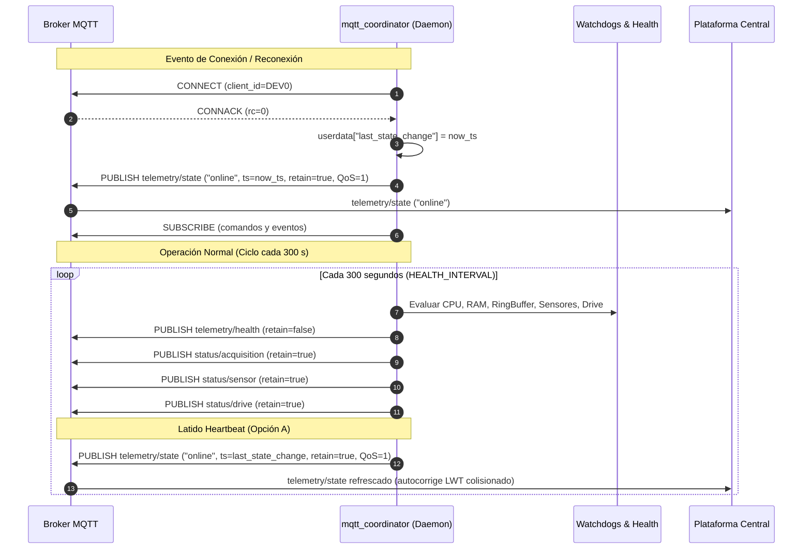

# Plan de Implementación: Heartbeat Periódico (300 s) para `telemetry/state` con Preservación de Timestamp de Conexión (Opción A)

**Fecha**: 2026-09-18  
**Proyecto**: `acelerografo-DEV00`  
**Objetivo**: Implementar un mecanismo de latido periódico (*heartbeat*) cada 300 segundos en el daemon [`scripts/operation/mqtt/mqtt_coordinator.py`](file:///home/rsa/git/montajes/acelerografo-DEV00/scripts/operation/mqtt/mqtt_coordinator.py) que retransmita el estado operacional `"online"` en el tópico `telemetry/state` con QoS 1 y `retain=True`, reutilizando el timestamp original del inicio de la sesión activa (`last_state_change`). Esta solución (Opción A) erradica la permanencia de estados falsos `"offline"` provocados por condiciones de carrera del LWT del broker durante reconexiones de red, garantizando que el estado retenido se autocorrija en un tiempo máximo de 5 minutos preservando la semántica de tiempo de actividad (*uptime*).

---

## Prerequisitos

1. **Entorno de ejecución**: Raspberry Pi con entorno virtual activo en `/home/rsa/projects/acelerografo/.venv/` (Python 3.9+).
2. **Dependencias**: No requiere dependencias nuevas; utiliza la biblioteca estándar y `paho-mqtt` ya instalada.
3. **Control de procesos**: Supervisor gestionando `mqtt_coordinator` (`sudo supervisorctl`).
4. **Verificación inicial**: Asegurar que la suite actual de tests en [`scripts/operation/mqtt/test_mqtt_coordinator_integration.py`](file:///home/rsa/git/montajes/acelerografo-DEV00/scripts/operation/mqtt/test_mqtt_coordinator_integration.py) se encuentre 100% aprobada antes de iniciar.

---

## Fase 1: Refactorización y Blindaje del Flujo de Conexión y Heartbeat en `mqtt_coordinator.py`

**Objetivo**: 
1. Reordenar el callback `on_connect()` para emitir el estado `"online"` de forma inmediata tras la autenticación exitosa, minimizando la ventana de carrera con el broker.
2. Rastrear de forma determinista el estado de conexión del cliente (`is_connected`) y el timestamp exacto de inicio de la sesión online (`last_state_change`).
3. Integrar la retransmisión periódica de `"online"` (Heartbeat) dentro del bloque temporal de 300 s en el bucle principal `main()`, asegurando que solo se transmita si el cliente está efectivamente conectado.

### Estructura del Payload y Tópico MQTT (Definición Explícita)

* **Tópico MQTT**: `{org}/{app}/{cap}/{id}/telemetry/state`  
  *(Ejemplo resuelto: `rsa/seismic/smart/DEV0/telemetry/state`)*
* **Parámetros de Publicación**: `qos = 1`, `retain = True`
* **Estructura JSON (Opción A)**:
  ```json
  {
    "status": "online",
    "timestamp": "2026-09-18T10:30:00Z"
  }
  ```
  *(El campo `timestamp` corresponde estrictamente a la marca de tiempo ISO8601 UTC en la que la sesión online se estableció, manteniéndose idéntico en cada latido de 300 s para reflejar el inicio ininterrumpido de la sesión).*

### Acciones Concretas

1. **Modificar `userdata` inicial en `iniciar_cliente()`** en [`scripts/operation/mqtt/mqtt_coordinator.py`](file:///home/rsa/git/montajes/acelerografo-DEV00/scripts/operation/mqtt/mqtt_coordinator.py#L927-L939):
   - Asegurar la inicialización explícita del flag de conexión: `"is_connected": False`.

2. **Reordenar y optimizar `on_connect()`** en [`scripts/operation/mqtt/mqtt_coordinator.py`](file:///home/rsa/git/montajes/acelerografo-DEV00/scripts/operation/mqtt/mqtt_coordinator.py#L543-L585):
   - Al validar `rc == 0`, marcar inmediatamente `userdata["is_connected"] = True`.
   - Capturar `now_ts = timestamp_iso()` y fijar `userdata["last_state_change"] = now_ts`.
   - Emitir `publicar_state(client, config, "online", logger, timestamp_override=now_ts)` **inmediatamente**, *antes* de iterar sobre el bucle de suscripciones a los 5 tópicos de comandos y eventos.
   - Procesar las suscripciones (`client.subscribe(...)`) con la conexión y el estado ya establecidos.
   - Mantener la publicación diferida de arranque (`boot_ts`) si corresponde al primer boot.

3. **Actualizar `on_disconnect()`** en [`scripts/operation/mqtt/mqtt_coordinator.py`](file:///home/rsa/git/montajes/acelerografo-DEV00/scripts/operation/mqtt/mqtt_coordinator.py#L587-L602):
   - Actualizar el flag de conexión interna: `userdata["is_connected"] = False`.
   - Conservar la lógica existente de persistencia local en `mqtt_state.json` del evento `"offline"`.

4. **Integrar Heartbeat Periódico en el Bucle Principal `main()`** en [`scripts/operation/mqtt/mqtt_coordinator.py`](file:///home/rsa/git/montajes/acelerografo-DEV00/scripts/operation/mqtt/mqtt_coordinator.py#L950-L971):
   - Dentro del bloque `if now - last_health >= HEALTH_INTERVAL:` (cada 300 segundos):
     ```python
     # Heartbeat periódico de estado (Opción A: refresca retained en broker con timestamp original)
     if client.is_connected() or userdata.get("is_connected", False):
         online_ts = userdata.get("last_state_change")
         if online_ts:
             logger.info(f"[HEARTBEAT_STATE] Refrescando telemetry_state (online desde {online_ts})")
             publicar_state(client, config, "online", logger, timestamp_override=online_ts)
     ```

### Comprobación (Checkpoint 1)
* **Comando de compilación sintáctica**:
  ```bash
  $PROJECT_LOCAL_ROOT/.venv/bin/python3 -m py_compile $PROJECT_LOCAL_ROOT/scripts/mqtt/mqtt_coordinator.py
  ```
  *(Criterio de éxito: código de retorno 0, sin errores de sintaxis).*

---

## Fase 2: Actualización y Expansión de la Suite de Pruebas Automatizadas

**Objetivo**: Garantizar mediante pruebas unitarias/integración mockeadas que:
1. `publicar_state` emite con QoS 1, `retain=True`, tópico correcto y payload esperado.
2. El heartbeat periódico invoca `publicar_state("online")` con el timestamp de sesión fijado en `last_state_change`.
3. Si el cliente no está conectado, el heartbeat no emite publicaciones espurias.

### Acciones Concretas

1. **Editar [`scripts/operation/mqtt/test_mqtt_coordinator_integration.py`](file:///home/rsa/git/montajes/acelerografo-DEV00/scripts/operation/mqtt/test_mqtt_coordinator_integration.py)**:
   - Importar `publicar_state` desde `mqtt.mqtt_coordinator` (con fallback a `mqtt_coordinator`).
   - Agregar test `test_publicacion_state_online_qos_y_retain()`:
     - Valida que al invocar `publicar_state(mock_client, config, "online", mock_logger, timestamp_override="2026-09-18T10:00:00Z")`, se envíe al tópico `rsa/seismic/smart/DEV0/telemetry/state` con QoS 1 y `retain=True`.
   - Agregar test `test_heartbeat_state_preserva_timestamp_ultimo_cambio()`:
     - Simula el ciclo periódico comprobando que se utilice el timestamp registrado en `userdata["last_state_change"]`.
   - Agregar test `test_heartbeat_state_no_publica_si_desconectado()`:
     - Certifica que si el cliente está desconectado (`is_connected == False`), no se publique ningún mensaje.
   - Incorporar los nuevos tests a la lista `tests` del runner de prueba.

### Comprobación (Checkpoint 2)
* **Comando de ejecución de la suite**:
  ```bash
  $PROJECT_LOCAL_ROOT/.venv/bin/python3 $PROJECT_LOCAL_ROOT/scripts/mqtt/test_mqtt_coordinator_integration.py
  ```
  *(Criterio de éxito: 10/10 tests pasados — Todo OK ✅).*

---

## Fase 3: Actualización de la Documentación Técnica y Contexto

**Objetivo**: Alinear la documentación técnica del repositorio con el nuevo comportamiento de latido periódico.

### Acciones Concretas

1. **Actualizar [`docs/context/mqtt_coordinator_context.md`](file:///home/rsa/git/montajes/acelerografo-DEV00/docs/context/mqtt_coordinator_context.md)**:
   - Modificar la fila de la tabla de tópicos:
     `| telemetry_state | …/{id}/telemetry/state | 1 | ✅ | Pub (conexión + Heartbeat cada 300s) |`
   - Actualizar la sección `### State (telemetry/state)` explicando que se emite en la conexión inicial, en shutdown, como LWT, y **periódicamente cada 300 segundos como heartbeat** manteniendo el timestamp del inicio de la sesión online (Opción A).
   - Actualizar el diccionario `userdata` documentando `"is_connected": False`.

### Comprobación (Checkpoint 3)
* **Revisión de consistencia**: Confirmar que los diagramas y tablas en `mqtt_coordinator_context.md` concuerden 100% con la implementación.

---

## Fase 4: Despliegue y Validación en Vivo en Estación `DEV00`

**Objetivo**: Desplegar el cambio en el servicio activo bajo Supervisor y verificar la recepción en el broker y los logs.

### Acciones Concretas (Delegadas al Usuario vía SSH en Raspberry Pi)

1. Reiniciar el daemon coordinador:
   ```bash
   sudo supervisorctl restart mqtt_coordinator
   ```
2. Monitorear los logs en tiempo real para verificar la primera emisión y el primer ciclo de 300 s:
   ```bash
   tail -f $PROJECT_LOCAL_ROOT/log-files/mqtt_coordinator.log
   ```
   *(Verificar la presencia de `[CONNECT_SENT] Publish 'online'` y tras 300 segundos `[HEARTBEAT_STATE] Refrescando telemetry_state (online desde ...)`).*

### Comprobación (Checkpoint 4)
* **Inspección de salida en `logs.tmp`**:
  - Verificar que el reporte de diagnóstico de `diagnostico.sh` o el log de `mqtt_coordinator.log` registre la sincronización nominal sin excepciones.

---

## Diagrama de Flujo del Heartbeat de Telemetría (Opción A)



---

## Checklist de Calidad del Blueprint

- [x] ¿Leí el código fuente de todos los archivos afectados (`mqtt_coordinator.py`, tests, contextos)?
- [x] ¿La estructura del payload JSON y tópicos está definida explícitamente con campos y tipos?
- [x] ¿Se respetan las decisiones previas y directrices de arquitectura de la RSA?
- [x] ¿Los comandos de validación y checkpoints son ejecutables y exactos?
- [x] ¿Se garantiza la ausencia de dependencias externas nuevas?
- [x] ¿Se aborda la causa raíz identificada en el diagnóstico?
