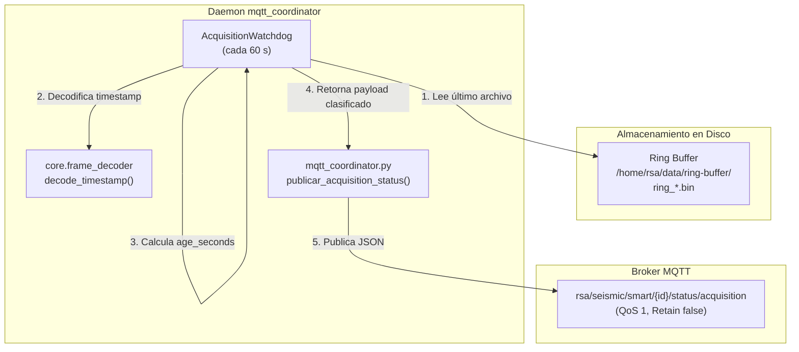

# acquisition_watchdog.py — Contexto para Agentes IA

> Monitor de latencia y salud de adquisición que audita periódicamente el Ring Buffer en disco y emite alertas estructuradas a través del broker MQTT ante estancamiento de tramas.

**Ruta**: `scripts/operation/mqtt/acquisition_watchdog.py`  
**LOC**: ~180 | **Lenguaje**: Python 3 | **Dependencias**: `core.frame_decoder` (stdlib: `os`, `glob`, `datetime`, `logging`)  
**Proceso**: Instanciado y ejecutado como timer periódico (60 s) dentro de `mqtt_coordinator.py` bajo Supervisor.

---

## Arquitectura



---

## Constantes y Umbrales

| Constante | Valor por Defecto | Descripción |
|---|---|---|
| `DEFAULT_RING_DIR` | `/home/rsa/data/ring-buffer/` | Directorio con archivos rotativos `ring_*.bin` |
| `DEFAULT_CHECK_INTERVAL_S` | `60` | Intervalo en segundos entre evaluaciones periódicas |
| `DEFAULT_STALE_THRESHOLD_S` | `300` (5 minutos) | Umbral de antigüedad a partir del cual se emite `warning` |

---

## Clasificación de Estados y Payloads JSON

### 1. Estado Nominal (`status: "ok"`)
Emitido cuando `age_seconds <= 300 s`.

```json
{
  "status": "ok",
  "last_frame_utc": "2026-09-02T21:51:09Z",
  "age_seconds": 1.6,
  "station_id": "DEV0",
  "timestamp": "2026-09-02T21:51:10Z"
}
```

### 2. Estado de Alerta (`status: "warning"`, `reason: "stale_data"`)
Emitido cuando la adquisición se congeló o desfasó más allá del umbral (`age_seconds > 300 s`).

```json
{
  "status": "warning",
  "reason": "stale_data",
  "last_frame_utc": "2026-08-27T19:46:03Z",
  "age_seconds": 432000.0,
  "threshold_seconds": 300,
  "station_id": "DEV0",
  "timestamp": "2026-09-01T10:48:00Z"
}
```

### 3. Estado de Error (`status: "error"`)
Emitido ante ausencia de archivos o inaccesibilidad del directorio.

```json
{
  "status": "error",
  "reason": "no_data_available",
  "station_id": "DEV0",
  "timestamp": "2026-09-02T21:51:10Z"
}
```

---

## Componentes Clave

| Elemento | Tipo | Descripción |
|---|---|---|
| `AcquisitionWatchdog` | Clase | Evaluador principal de frescura del Ring Buffer. |
| `obtener_ultima_trama_timestamp()` | Método | Escanea archivos `ring_*.bin` en orden inverso y extrae el timestamp de la última trama de 2506 bytes. |
| `evaluar_salud(station_id, now_utc)` | Método | Calcula `age_seconds` respecto a `now_utc` y genera el diccionario JSON formateado. |

---

## Manejo Defensivo y Tolerancia a Fallos

1. **Archivos Parciales o Corruptos**: Si el archivo más reciente tiene menos de `2506` bytes o un timestamp dañado, la búsqueda retrocede automáticamente al archivo inmediatamente anterior.
2. **Mitigación de Fecha dsPIC**: Utiliza `decode_timestamp(usar_fecha_filename=True)` para evitar distorsiones causadas por el cruce de medianoche en el firmware del dsPIC.
3. **Timezone Awareness**: Normaliza todos los timestamps a objetos `datetime` conscientes de UTC (`timezone.utc`).

---

## Tests Unitarios

**Archivo:** `scripts/operation/mqtt/test_acquisition_watchdog.py`

```bash
cd /home/rsa/projects/acelerografo/
.venv/bin/python3 scripts/mqtt/test_acquisition_watchdog.py
```
- Cobertura: Directorio inexistente, directorio vacío, flujo nominal (`ok`), datos estancados (`warning`), y retroceso ante archivo corrupto (5/5 tests).
