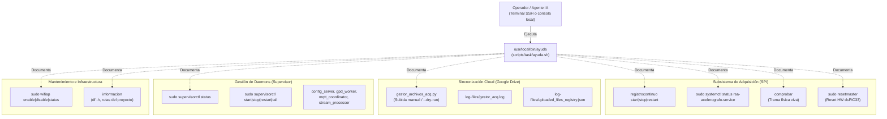

# ayuda.sh — Contexto para Agentes IA

> Guía interactiva de línea de comandos en terminal que documenta de forma centralizada las utilidades de operación, control de adquisición continua, gestión de daemons en Supervisor, sincronización con Google Drive y diagnóstico de hardware de la estación.

**Ruta**: `scripts/task/ayuda.sh` (instalado globalmente como `/usr/local/bin/ayuda`)  
**LOC**: ~45 | **Lenguaje**: Bash | **Dependencias**: Entorno del sistema (`systemd`, `supervisorctl`, scripts de `scripts/task/`)  
**Proceso**: Script de ejecución interactiva bajo demanda por el operador local o remoto.

---

## Arquitectura de Comandos

---

## Secciones y Comandos Documentados

| Sección | Comando / Acción | Propósito Operativo |
|---|---|---|
| **Registro Continuo y Adquisición** | `registrocontinuo start` | Inicia el servicio systemd, ejecuta la conversión horaria a MiniSEED y sincroniza con Google Drive. |
| | `registrocontinuo stop` | Detiene ordenadamente el servicio systemd, finaliza conversiones y resetea el microcontrolador dsPIC33. |
| | `registrocontinuo restart` | Ejecuta stop seguido de start para reanudar el pipeline completo. |
| | `sudo systemctl status rsa-acelerografo.service` | Muestra estado del proceso compilado en C (`registro_continuo`) y logs en journald. |
| | `comprobar` | Muestra en tiempo real la última aceleración triaxial capturada, el archivo `.dat` en escritura y la sincronización horaria (RPi/GPS). |
| | `sudo resetmaster` | Dispara el pulso físico de reseteo del microcontrolador dsPIC33 maestro ante bloqueos de hardware. |
| **Google Drive y Sincronización** | `$PROJECT_LOCAL_ROOT/.venv/bin/python3 .../gestor_archivos_acq.py` | Fuerza la ejecución manual inmediata de la sincronización de archivos MiniSEED acumulados. |
| | `.../gestor_archivos_acq.py --dry-run` | Simula la subida sin modificar Google Drive ni alterar los registros locales. |
| | `.../gestor_archivos_acq.py --purge-registry` | Poda inmediata del registro JSON de archivos que ya no existen en disco. |
| | `.../gestor_archivos_acq.py --purge-registry --dry-run` | Simula la poda de huérfanos mostrando el inventario completo sin alterar el JSON. |
| | `tail -f $PROJECT_LOCAL_ROOT/log-files/gestor_acq.log` | Monitorea en vivo el resultado de las subidas horarias o manuales. |
| | `cat $PROJECT_LOCAL_ROOT/log-files/uploaded_files_registry.json` | Inspecciona el estado de archivos subidos exitosamente y retenidos/protegidos por error. |
| **Supervisor (Daemons)** | `sudo supervisorctl status` | Muestra el estado operativo, PID y uptime de los procesos de fondo. |
| | `sudo supervisorctl start\|stop\|restart <servicio>` | Control granular de daemons individuales. |
| | `sudo supervisorctl restart all` | Reinicia todos los procesos en Supervisor de forma ordenada. |
| | `sudo supervisorctl tail -f <servicio>` | Despliega los logs stdout/stderr en caliente de cualquier daemon. |
| | `sudo supervisorctl reread && sudo supervisorctl update` | Recarga cambios en `/etc/supervisor/conf.d/` sin reiniciar daemons no afectados. |
| **Punto de Acceso WiFi** | `sudo wifiap install\|enable\|disable\|status` | Administra la red inalámbrica de mantenimiento local (`hostapd`/`dnsmasq`). |
| **Información del Sistema** | `informacion` | Despliega la ocupación de particiones de almacenamiento (`df -h`) y rutas del entorno. |

---

## Entorno y Despliegue

* **Instalación**: El script se despliega mediante `deploy.sh` o `update.sh` copiándose a `/usr/local/bin/ayuda` con permisos de ejecución (`chmod +x`), quedando disponible en el `PATH` global de cualquier sesión interactiva.
* **Variables Clave**: Hace referencia a `$PROJECT_LOCAL_ROOT` (provista por `/usr/local/bin/project_paths`), correspondiente al directorio `/home/rsa/projects/acelerografo` en producción.

---

## Limitaciones Conocidas

* `ayuda.sh` es puramente informativo (emite texto explicativo); no ejecuta automáticamente las tareas que describe.
* Las rutas de Python referencian `$PROJECT_LOCAL_ROOT/.venv/bin/python3`, requiriendo que el entorno virtual de producción esté debidamente aprovisionado.
