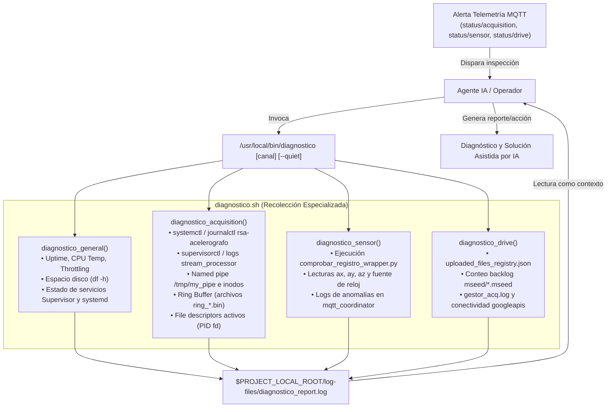

# diagnostico.sh — Contexto Técnico para Agentes IA

> Script Bash de diagnóstico automatizado que recopila evidencia exhaustiva del sistema, pipeline de adquisición SPI, integridad física del acelerómetro y sincronización con Google Drive ante alertas o consultas sobre los canales de telemetría MQTT `rsa/seismic/smart/*/status/*`.

**Ruta fuente**: `scripts/task/diagnostico.sh` (instalado en producción como `/usr/local/bin/diagnostico`)  
**Archivo de salida**: `$PROJECT_LOCAL_ROOT/log-files/diagnostico_report.log`  
**Lenguaje**: Bash (sin dependencias adicionales más allá de herramientas estándar de Linux y el `.venv` local)  
**Consumidores**: Agentes de IA (soporte y resolución guiada), operadores humanos en consola local o remota.

---

## 1. Propósito y Flujo Operativo

El script `diagnostico.sh` se diseñó para cerrar la brecha entre la **alerta ligera** emitida vía MQTT por los watchdogs (`status/acquisition`, `status/sensor`, `status/drive`) y la **investigación profunda** requerida para diagnosticar la causa raíz.

Cuando un operador o un agente de IA detecta un cambio de estado en la telemetría, invoca `diagnostico [canal]`. El script ejecuta inspecciones especializadas y consolida un reporte estructurado y autocontenido en `$PROJECT_LOCAL_ROOT/log-files/diagnostico_report.log`, listo para ser consumido como contexto de análisis.



---

## 2. Interfaz de Línea de Comandos

```bash
# Diagnóstico completo (todos los canales + estado general)
diagnostico

# Diagnóstico acotado por canal específico (+ estado general)
diagnostico acquisition
diagnostico sensor
diagnostico drive

# Modo silencioso (solo escribe a archivo sin imprimir a stdout)
diagnostico --quiet
diagnostico -q sensor

# Ayuda y sintaxis
diagnostico --help
```

---

## 3. Matriz de Telemetría: `reason` → Diagnóstico y Análisis

| Canal MQTT | `status` | `reason` | Sección del Reporte | Elementos Críticos a Inspeccionar | Causa Raíz Probable y Acción |
|---|---|---|---|---|---|
| **`status/acquisition`** | `warning` | `stale_data` | `DIAGNÓSTICO ADQUISICIÓN` | • Timestamp de última modificación de `/tmp/my_pipe`<br>• Descriptores de archivo de `stream_processor`<br>• Modificación de archivos en `ring-buffer/` | El proceso `registro_continuo` dejó de escribir tramas en el pipe, o `stream_processor` perdió la lectura. Reiniciar `registrocontinuo restart`. |
| **`status/acquisition`** | `error` | `ring_buffer_dir_not_found` | `DIAGNÓSTICO ADQUISICIÓN` | • Salida de `Estado del Ring Buffer`<br>• Directorio `/home/rsa/data/ring-buffer` | Partición de datos no montada o directorio borrado. Crear directorio o verificar `/etc/fstab`. |
| **`status/acquisition`** | `error` | `no_data_available` | `DIAGNÓSTICO ADQUISICIÓN` | • Listado de `ring_*.bin`<br>• Logs de `supervisor_stream_processor.err` | `stream_processor` está activo pero no ha podido crear ningún archivo binario (permisos o disco lleno). |
| **`status/sensor`** | `error` | `wrapper_not_found` | `DIAGNÓSTICO SENSOR` | • `Detalle de archivo del wrapper`<br>• Ruta en `$PROJECT_LOCAL_ROOT/scripts/acelerografo/` | Despliegue incompleto. Ejecutar opción 3 de `menu.sh` para actualizar scripts. |
| **`status/sensor`** | `error` | `execution_failed` | `DIAGNÓSTICO SENSOR` | • Ejecución directa del wrapper<br>• Permisos de ejecución del ejecutable en C `comprobar_registro` | Fallo de hardware en bus I2C/SPI o ejecutable compilado incompatible. |
| **`status/sensor`** | `error` | `null_readings` | `DIAGNÓSTICO SENSOR` | • JSON retornado por el wrapper (`aceleracion_x`, `y`, `z`) | Fallo en la lectura del archivo `.dat` actual o microcontrolador desincronizado. |
| **`status/sensor`** | `error` | `accelerometer_anomaly` | `DIAGNÓSTICO SENSOR` | • Valores numéricos de aceleración en el JSON<br>• Campo `error_reloj` o `fuente_reloj` | Sensor descalibrado, desnivelado (`\|az - 9.81\| > 0.8`) o reloj RTC/NTP desfasado. |
| **`status/sensor`** | `error` | `timeout` | `DIAGNÓSTICO SENSOR` | • Uptime y carga de CPU en `ESTADO GENERAL`<br>• Estado de `rsa-acelerografo.service` | El wrapper tardó más de 12 s en responder; posible bloqueo por contienda de bus o CPU al 100%. |
| **`status/drive`** | `warning` | `pending_backlog` | `DIAGNÓSTICO DRIVE` | • `Cantidad de archivos MiniSEED en disco`<br>• Conectividad con Google APIs (`ping`)<br>• Logs en `gestor_acq.log` | Pérdida de conexión a internet o cuota de API excedida. Los archivos se retienen de forma segura. |
| **`status/drive`** | `warning` | `upload_retry_retained` | `DIAGNÓSTICO DRIVE` | • `uploaded_files_registry.json`<br>• Logs `gestor_acq.log` buscando `status=retry` | Fallo temporal de subida en archivos específicos protegidos por política de retención. |

---

## 4. Guía para el Agente de IA al Interpretar el Reporte

Al analizar `$PROJECT_LOCAL_ROOT/log-files/diagnostico_report.log`, el agente debe seguir estas directrices:

1. **Distinguir errores históricos de errores activos:**
   - Archivos como `supervisor_stream_processor.err` acumulan trazas históricas (por ejemplo, excepciones durante el arranque antes de que el pipe estuviera creado).
   - **Regla de oro**: Si el proceso muestra estado `RUNNING` con uptime superior a varios minutos, el descriptor `/tmp/my_pipe` está abierto (`5 -> /tmp/my_pipe`) y los archivos del Ring Buffer se modifican cada 5 minutos, **los tracebacks en el log de error corresponden al arranque y no representan un fallo actual**.

2. **Validar la cadena física de adquisición:**
   - `rsa-acelerografo.service` (systemd) debe estar `active (running)`.
   - `/tmp/my_pipe` debe ser de tipo FIFO (`prw-rw-rw-`) y su fecha de modificación debe coincidir con el minuto actual.
   - `/home/rsa/data/ring-buffer/` debe contener archivos `ring_YYYYMMDD_HHMMSS.bin` ordenados secuencialmente cada 300 segundos.

3. **Interpretar la lectura del acelerómetro:**
   - La respuesta del wrapper es un JSON con campos físicos:
     - `aceleracion_x` y `aceleracion_y`: deben estar en el rango `[-0.5, 0.5]` m/s².
     - `aceleracion_z`: debe estar cercana a la gravedad terrestre `[9.01, 10.61]` m/s².
     - `fuente_reloj`: típicamente `RPi` o `GPS`.
     - `error_reloj`: debe ser `null`.

4. **Verificar el subsistema de red y Google Drive:**
   - Si `Cantidad de archivos MiniSEED en disco` es 0 o pequeña (<= 3), el backlog es nominal.
   - Si `ping www.googleapis.com` falla (100% loss), la causa raíz de un fallo de subida es indiscutiblemente la red externa de la estación, no el software.
