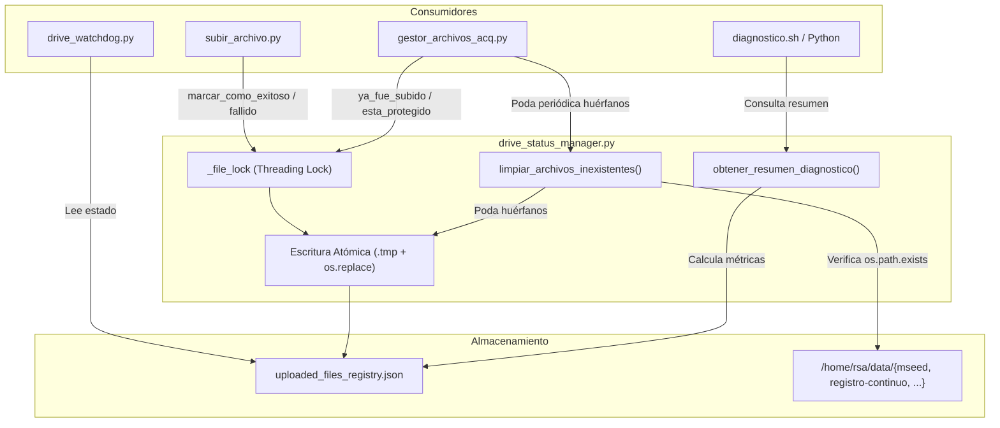

# drive_status_manager.py — Contexto para Agentes IA

> Módulo central de persistencia y sincronización thread-safe que gestiona el registro JSON de archivos subidos y fallidos en Google Drive (`uploaded_files_registry.json`), garantizando operaciones atómicas, protección contra duplicados y poda automática de archivos inexistentes en disco.

**Ruta**: `scripts/operation/drive/drive_status_manager.py` (en producción: `scripts/drive/drive_status_manager.py`)  
**Suite de Tests**: `scripts/operation/drive/test_drive_status_manager.py` (7 tests unitarios)  
**LOC**: ~420 | **Lenguaje**: Python 3 (librería estándar: `json`, `os`, `threading`, `datetime`)  
**Dependencias**: Ninguna externa. Utilizado por `gestor_archivos_acq.py`, `subir_archivo.py`, `drive_watchdog.py` y `diagnostico.sh`.

---

## 1. Arquitectura y Ciclo de Vida del Registro

El módulo abstrae el acceso al archivo `$PROJECT_LOCAL_ROOT/log-files/uploaded_files_registry.json`. Utiliza un cerrojo en memoria (`threading.Lock`) y escrituras atómicas en disco (`.tmp` + `os.replace`) para prevenir corrupciones concurrentes entre hilos o procesos.



---

## 2. Estructura de Datos (`uploaded_files_registry.json`)

El archivo JSON categoriza los registros por el tipo de archivo operativo (`TIPOS_ARCHIVO = ["continuous", "mseed", "event", "tmp", "log"]`):

```json
{
  "archivos_exitosos": {
    "continuous": {},
    "mseed": {
      "DEV0_20260917_150001.mseed": "2026-09-17 16:00:42",
      "DEV0_20260917_160001.mseed": "2026-09-17 17:00:38"
    },
    "event": {
      "DEV0_20260916_195326.mseed": "2026-09-16 19:55:32"
    },
    "tmp": {},
    "log": {}
  },
  "archivos_fallidos": {
    "continuous": {},
    "mseed": {},
    "event": {},
    "tmp": {},
    "log": {}
  }
}
```

---

## 3. Funciones Clave

| Función | Parámetros | Retorno | Propósito Operativo |
|---|---|---|---|
| `marcar_como_exitoso` | `log_dir, nombre, tipo, ...` | `None` | Registra el archivo con timestamp actual en `archivos_exitosos` y lo remueve automáticamente de `archivos_fallidos`. |
| `marcar_como_fallido` | `log_dir, nombre, tipo, intentos, ...` | `None` | Registra el archivo en `archivos_fallidos` para activar protección contra borrado en disco. |
| `ya_fue_subido` | `log_dir, nombre, tipo` | `bool` | Retorna `True` si el archivo ya fue subido exitosamente a Google Drive. |
| `esta_protegido` | `log_dir, nombre, tipo` | `bool` | Retorna `True` si el archivo falló en la subida y no debe ser purgado por políticas de retención. |
| `limpiar_archivos_inexistentes` | `log_dir, directorios_por_tipo, logger` | `dict` (balance) | Compara el JSON con el disco físico; poda del JSON archivos inexistentes. Valida `os.path.isdir()` por seguridad. |
| `obtener_estadisticas` | `log_dir` | `dict` | Retorna conteo de exitosos y fallidos por categoría y totales. |
| `obtener_resumen_diagnostico` | `log_dir, max_ultimos=5` | `dict` | Genera resumen ejecutivo con totales, desglose, últimos $N$ archivos ordenados cronológicamente y fallidos activos para CLI `diagnostico`. |

---

## 4. Política de Saneamiento y Resguardo

1. **Protección ante Directorios Desmontados**:
   Si un directorio provisto en `directorios_por_tipo` no existe (`not os.path.isdir(d)`), `limpiar_archivos_inexistentes()` omite la categoría emitiendo una advertencia. Esto previene el borrado erróneo de registros si un almacenamiento externo se desconecta.
2. **Sincronía Espejo con Disco**:
   Un archivo solo debe existir en el registro JSON si reside físicamente en disco. Una vez que la política de retención o un operador elimina el archivo local, el registro poda su clave, evitando acumulación infinita de metadatos.
3. **Métricas de Balance**:
   Retorna la cantidad exacta de claves purgadas:
   ```python
   {
       "exitosos_removidos": int,
       "fallidos_removidos": int,
       "total_removidos": int,
       "por_tipo": {"mseed": {"exitosos": X, "fallidos": Y}, ...}
   }
   ```

---

## 5. Limitaciones Conocidas

* **Mono-instancia por máquina**: `_file_lock` es un `threading.Lock` que protege la concurrencia entre hilos de un mismo intérprete Python. Para procesos externos simultáneos, la protección reside en la atomicidad de `os.replace`.
* **Ruta estándar de registro**: El archivo se ubica estrictamente bajo `uploaded_files_registry.json` dentro del directorio de logs configurado.
