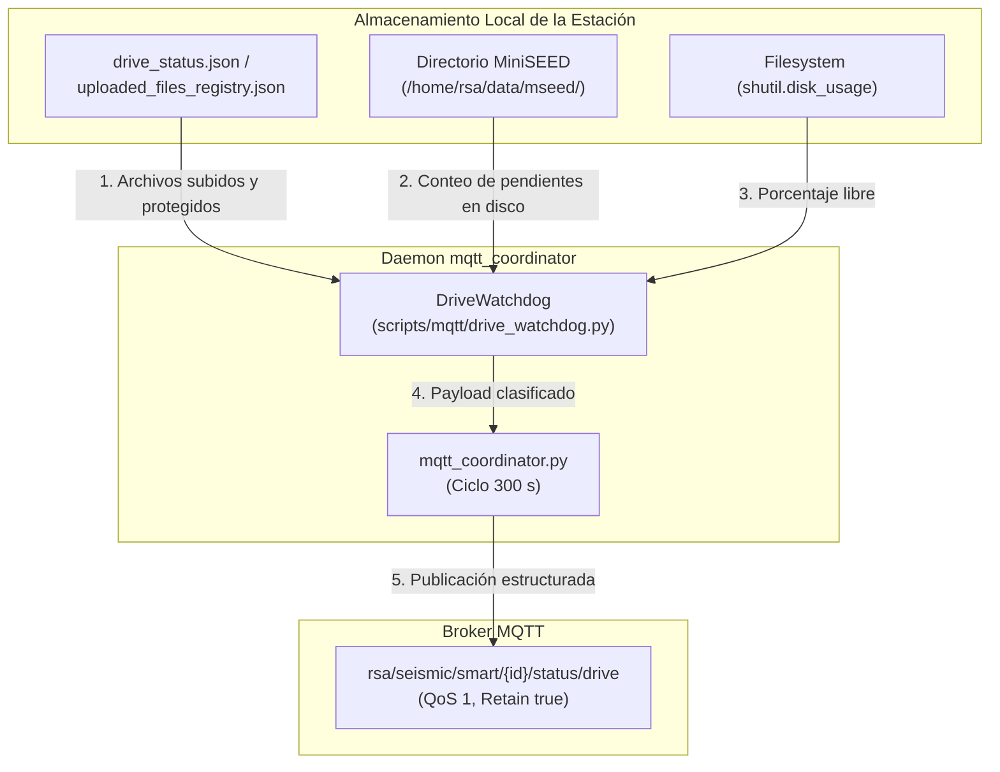

# drive_watchdog.py — Contexto para Agentes IA

> Auditor de sincronización con Google Drive y espacio en disco que inspecciona periódicamente los registros de subida y el directorio de almacenamiento MiniSEED, emitiendo alertas MQTT ante acumulación de archivos pendientes o fallos repetidos retenidos.

**Ruta**: `scripts/operation/mqtt/drive_watchdog.py`  
**LOC**: ~140 | **Lenguaje**: Python 3 | **Dependencias**: stdlib (`json`, `os`, `shutil`, `datetime`)  
**Proceso**: Instanciado y ejecutado cada 300 segundos (5 minutos) dentro de `mqtt_coordinator.py` bajo Supervisor.

---

## Arquitectura



---

## Umbrales y Criterios de Clasificación

| Métrica / Condición | Umbral Nominal | Condición de Alerta (`status: warning`) |
|---|---|---|
| Archivos Protegidos (`failed_uploads_protected`) | `0` | $> 0$ (`reason: upload_retry_retained`) |
| Archivos Pendientes en Disco (`pending_mseed`) | $\le 3$ archivos | $> 3$ archivos (`reason: pending_backlog`) |
| Espacio en Disco (`free_disk_percent`) | Informativo continuo | Derivado directamente de `shutil.disk_usage` |

---

## Clasificación de Estados y Payloads JSON

### 1. Estado Nominal (`status: "ok"`)
Emitido cuando no hay archivos retenidos por error y la cola en disco es $\le 3$:

```json
{
  "status": "ok",
  "pending_mseed": 0,
  "failed_uploads_protected": 0,
  "free_disk_percent": 82.5,
  "last_upload_utc": "2026-09-14 18:00:45",
  "reason": "all_synced",
  "station_id": "DEV0",
  "timestamp": "2026-09-14T18:03:58Z"
}
```

### 2. Estado de Advertencia por Fallo Protegido (`status: "warning"`)
Emitido si existen archivos que fallaron repetidamente al subir y quedaron protegidos contra eliminación:

```json
{
  "status": "warning",
  "pending_mseed": 0,
  "failed_uploads_protected": 1,
  "free_disk_percent": 20.8,
  "last_upload_utc": "2026-09-14 18:00:45",
  "reason": "upload_retry_retained",
  "station_id": "DEV0",
  "timestamp": "2026-09-14T18:03:58Z"
}
```

### 3. Estado de Advertencia por Backlog (`status: "warning"`)
Emitido si hay más de 3 archivos en disco que no han sido subidos aún:

```json
{
  "status": "warning",
  "pending_mseed": 5,
  "failed_uploads_protected": 0,
  "free_disk_percent": 45.2,
  "last_upload_utc": "2026-09-14 16:30:10",
  "reason": "pending_backlog",
  "station_id": "DEV0",
  "timestamp": "2026-09-14T18:03:58Z"
}
```

---

## Componentes Clave

| Elemento | Tipo | Descripción |
|---|---|---|
| `DriveWatchdog` | Clase | Evaluador de sincronización de subidas y disponibilidad de disco. |
| `__init__(mseed_dir, status_file)` | Constructor | Resuelve defensivamente las rutas de datos y archivos de registro. |
| `evaluar_sincronizacion(station_id)` | Método | Calcula porcentaje de disco libre, lee los registros de subida, cuenta archivos no sincronizados y genera el payload JSON. |

---

## Compatibilidad Dual y Manejo Defensivo

1. **Compatibilidad Dual de Formatos JSON**:
   * Soporta el formato estándar de telemetría TIG (`mseed.uploaded`, `mseed.protected`, `last_upload_utc`).
   * Soporta la estructura nativa de `drive_status_manager.py` (`archivos_exitosos.mseed`, `archivos_fallidos.mseed`), permitiendo interoperabilidad transparente.
2. **Resiliencia ante Inexistencia o Corrupción**:
   * Si el archivo de estado no existe o contiene JSON inválido, el módulo no aborta; maneja la excepción internamente y asume listas vacías para evaluar el directorio en disco de forma segura.
3. **Resolución de Rutas Agnóstica**:
   * Si no se especifica `mseed_dir`, consulta prioritariamente la configuración de la estación o `$PROJECT_LOCAL_ROOT/datos/MSEED` sin depender de rutas rígidas.

---

## Tests Unitarios

**Archivo**: `scripts/operation/mqtt/test_drive_watchdog.py`

```bash
cd /home/rsa/projects/acelerografo
.venv/bin/python3 scripts/mqtt/test_drive_watchdog.py
```
* Cobertura: 7 pruebas unitarias validando sincronización nominal, alerta por backlog (>3 archivos), alerta por archivos protegidos, compatibilidad con `uploaded_files_registry.json`, directorios inexistentes, JSON corrupto y tolerancia de cola hasta 3 archivos.
