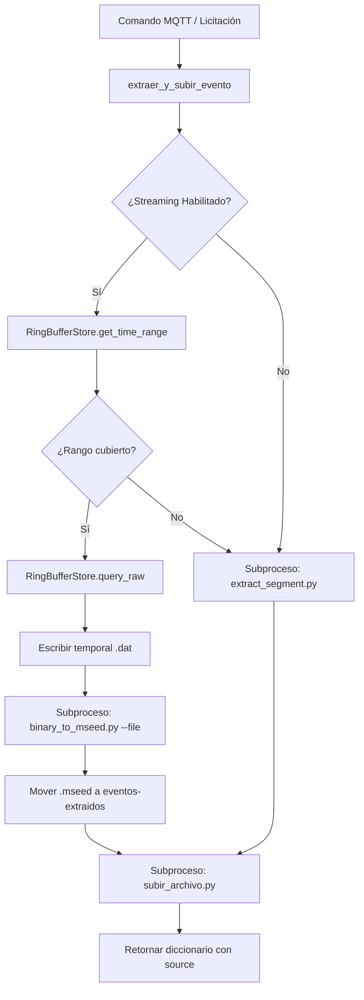

# event_extractor.py — Contexto para Agentes IA

> Módulo orquestador para la extracción de segmentos miniSEED bajo demanda y su subida opcional a Google Drive.

**Ruta**: `scripts/operation/mqtt/event_extractor.py`  
**LOC**: 490 | **Lenguaje**: Python | **Dependencias**: `json`, `shutil`, `subprocess`, `datetime`, `streaming.ring_buffer_store`  
**Proceso**: Se importa y ejecuta como servicio secundario del coordinador MQTT (`mqtt_coordinator.py`) para responder a comandos de extracción de eventos.

---

## Arquitectura

El módulo actúa como un despachador dual que decide de forma dinámica e inteligente la ruta óptima para la extracción de datos sísmicos:

1. **Ruta Prioritaria (Ring Buffer)**: Si la sección `streaming` está habilitada en la configuración, consulta en el buffer circular de tramas crudas en disco (`RingBufferStore`). Si los datos solicitados están cubiertos por las últimas horas del buffer, extrae las tramas binarias, escribe un archivo temporal `.dat` y llama a `binary_to_mseed.py` para la conversión rápida.
2. **Ruta Fallback (Histórica)**: Si el rango está fuera del ring buffer, invoca de forma transparente al script `extract_segment.py` para buscar en los archivos horarios `.mseed` consolidados en el disco.

---

## Configuraciones / Variables de Entorno

El módulo requiere la definición de la siguiente variable de entorno:
- `PROJECT_LOCAL_ROOT`: Ruta absoluta de la raíz local del proyecto (ej: `/home/rsa/projects/acelerografo-rsa`).

Además, consume los siguientes archivos JSON en la carpeta `$PROJECT_LOCAL_ROOT/configuracion/`:
- `configuracion_dispositivo.json`: Define las rutas de eventos extraídos y el directorio del ring buffer, así como el estado de habilitación de `streaming`.
- `configuracion_mseed.json`: Define el código de estación (`CODIGO(1)`) y la política de extracción de fechas.

---

## Componentes / Funciones / Servicios Clave

| Elemento | Descripción |
|----------|-------------|
| `extraer_y_subir_evento()` | Función pública de entrada. Orquesta todo el pipeline de extracción y subida a Drive. |
| `_intentar_extraer_desde_ring_buffer()` | Consulta el rango en `RingBufferStore`, escribe el binario temporal, ejecuta `binary_to_mseed.py` y traslada el resultado. |
| `_resolver_rutas()` | Resuelve dinámicamente las rutas absolutas para el entorno virtual, script de extracción y subida. |
| `_parsear_archivo_generado()` | Regex para extraer el nombre del archivo `.mseed` desde la salida estándar del subproceso `extract_segment.py`. |
| `_leer_config_dispositivo()` | Lee y parsea a JSON el archivo de configuración del dispositivo. |
| `_obtener_codigo_estacion()` | Recupera el ID de estación configurado en `configuracion_mseed.json`. |

---

## Limitaciones Conocidas / TODOs

- **Aislamiento de Entorno Virtual**: `event_extractor.py` no importa `ObsPy` ni realiza conversiones a miniSEED en su propio proceso para no romper el aislamiento de dependencias entre el Python del sistema y el del `.venv`. Toda la conversión se delega por subproceso a `binary_to_mseed.py`.
- **Race Conditions**: Al ser el único proceso lector (consulta) del buffer concurrente con `stream_processor.py` (el único escritor), el módulo delega la consistencia del archivo activo al sistema operativo, recuperando solo tramas completamente consolidadas (múltiplos de 2506 bytes).
- **Archivos Temporales**: Los archivos `.dat` temporales generados para la conversión se eliminan de forma inmediata después de que `binary_to_mseed.py` termina su trabajo.
