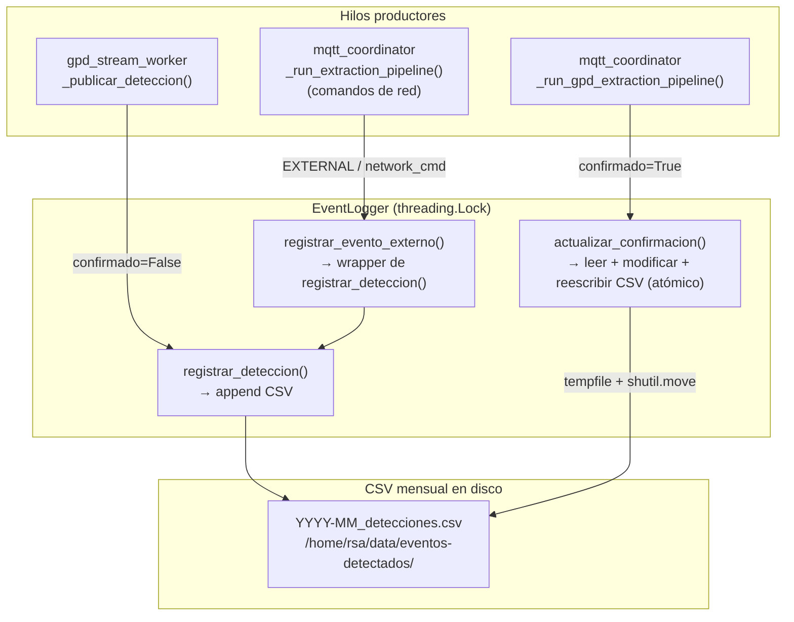
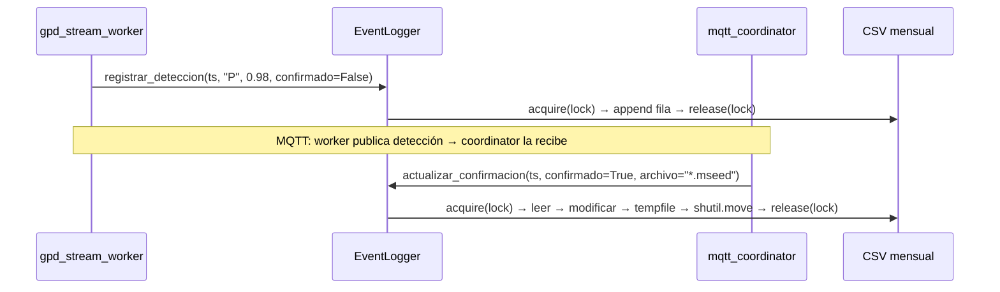

# event_logger.py — Contexto para Agentes IA

> Módulo thread-safe de registro CSV mensual para detecciones sísmicas GPD, compartido entre `gpd_stream_worker.py` y `mqtt_coordinator.py`. Mantiene el estado de confirmación de cada detección (pendiente / extraída).

**Ruta**: `scripts/operation/core/event_logger.py`  
**LOC**: 338 | **Lenguaje**: Python 3 | **Dependencias**: stdlib únicamente (`csv`, `os`, `shutil`, `tempfile`, `threading`, `datetime`)  
**Proceso**: Importado como módulo por `gpd_stream_worker.py` y `mqtt_coordinator.py`. No se ejecuta de forma autónoma.

---

## Arquitectura

El módulo resuelve el problema de escritura concurrente desde dos procesos independientes (el worker GPD y el coordinador MQTT) al mismo archivo CSV mensual. El acceso está serializado mediante un `threading.Lock` único por instancia de `EventLogger`.

**Ciclo de vida de un registro** (modo online):

---

## Estructura del CSV Mensual

**Nombre de archivo**: `YYYY-MM_detecciones.csv`  
**Directorio**: `/home/rsa/data/eventos-detectados/` (configurable vía `csv_dir`)

| Columna | Tipo | Valores posibles | Descripción |
|---|---|---|---|
| `timestamp_centro` | str ISO8601 | `"2026-07-06T15:30:00.000Z"` | Centro de la ventana evaluada por GPD |
| `fase` | str | `"P"`, `"S"`, `"EXTERNAL"`, `"N/A"` | Tipo de fase detectada |
| `probabilidad` | float (4 dec.) | `[0.0, 1.0]` | Probabilidad del modelo (0.0 para externos) |
| `timestamp_local` | str ISO8601 | UTC ahora | Momento de escritura en el sistema |
| `confirmado` | str bool | `"True"`, `"False"` | True si el evento fue extraído |
| `archivo_mseed` | str | `"DEV00_260706-153000.mseed"` o `""` | Archivo MiniSEED generado |
| `metodo` | str | `"local_gpd"`, `"network_cmd"` | Origen del registro |

---

## Componentes / Funciones Clave

| Elemento | Tipo | Descripción |
|---|---|---|
| `EventLogger` | Clase | Clase principal. Constructor: `EventLogger(csv_dir, logger)`. |
| `registrar_deteccion()` | Método público | Append thread-safe al CSV mensual. Crea directorio y archivo (con headers) si no existen. Silencia `OSError` y loguea. |
| `actualizar_confirmacion()` | Método público | Lee CSV completo, modifica primera coincidencia de `timestamp_centro`, reescribe atómicamente con `tempfile.mkstemp` + `shutil.move`. Retorna `True`/`False`. |
| `registrar_evento_externo()` | Método público | Wrapper: llama `registrar_deteccion()` con `fase="EXTERNAL"`, `probabilidad=0.0`, `confirmado=True`, `metodo="network_cmd"`. |
| `_csv_path(dt)` | Método privado | Retorna ruta `csv_dir/YYYY-MM_detecciones.csv` para la fecha dada (default: UTC ahora). |
| `_csv_path_from_iso(timestamp_iso)` | Método privado | Parsea solo `YYYY-MM` del string ISO8601. Si el formato es inválido, usa el mes UTC actual (degradado gracioso). |
| `_iso_now()` | Función de módulo | UTC actual en ISO8601 con milisegundos: `"2026-07-06T15:30:00.000Z"`. |
| `DEFAULT_CSV_DIR` | Constante | `"/home/rsa/data/eventos-detectados"` |
| `CSV_HEADERS` | Constante | Lista de 7 columnas en orden de escritura. |

---

## Configuraciones / Variables de Entorno

| Parámetro | Fuente | Valor por defecto | Descripción |
|---|---|---|---|
| `csv_dir` | Constructor `EventLogger(csv_dir=...)` | `"/home/rsa/data/eventos-detectados"` | Directorio de almacenamiento de CSVs mensuales |
| `logger` | Constructor `EventLogger(logger=...)` | `None` | Instancia de `StructuredLogger`. Si es `None`, los mensajes internos se silencian |

Los llamadores (`gpd_stream_worker.py` y `mqtt_coordinator.py`) obtienen `csv_dir` de:
- `configuracion_dispositivo.json` → `streaming.gpd.csv_dir` (si existe)
- O el valor por defecto.

---

## Garantías de Seguridad Concurrente

| Operación | Mecanismo | Riesgo cubierto |
|---|---|---|
| `registrar_deteccion()` | `threading.Lock` en modo `append` | Dos hilos escriben simultáneamente → datos intercalados |
| `actualizar_confirmacion()` | `threading.Lock` + `tempfile.mkstemp` + `shutil.move` | Crash durante reescritura → archivo truncado |
| Rotación mensual | Derivación desde `timestamp_centro` | Registros de meses distintos → archivos separados sin colisión |

---

## Tests Unitarios

**Archivo**: `scripts/operation/core/test_event_logger.py` (13 tests, stdlib `unittest`)

| Test | Criterio |
|---|---|
| `test_crear_csv_nuevo` | CSV creado con 7 headers correctos al primer registro |
| `test_registrar_deteccion` | Todos los campos escritos con valores y tipos correctos |
| `test_registrar_multiples` | 3 registros acumulados sin sobrescritura |
| `test_actualizar_confirmacion` | `confirmado` y `archivo_mseed` actualizados correctamente |
| `test_actualizar_solo_primera_ocurrencia` | Solo el primer match es modificado |
| `test_actualizar_no_encontrado` | Retorna `False` sin crash |
| `test_actualizar_csv_no_existe` | Retorna `False` sin crash |
| `test_registrar_evento_externo` | `fase=EXTERNAL`, `prob=0.0`, `metodo=network_cmd`, `confirmado=True` |
| `test_concurrencia` | 10 hilos simultáneos (5 registros c/u) → 50 filas sin corrupción |
| `test_rotacion_mensual` | Julio y agosto → archivos CSV separados |
| `test_timestamp_iso_invalido` | No lanza excepción, usa mes actual como fallback |
| `test_directorio_se_crea_automaticamente` | `csv_dir` inexistente se crea automáticamente |
| `test_probabilidad_se_redondea` | Almacena 4 decimales (`0.9854`) |

---

## Limitaciones Conocidas / TODOs

- **Búsqueda lineal en `actualizar_confirmacion()`**: Lee el CSV completo para encontrar el registro. Despreciable con volúmenes bajos (< 3000 registros/mes con cooldown de 30 s), pero no escala a frecuencias altas de detección.
- **`confirmado` almacenado como string**: El campo se guarda como `"True"`/`"False"` (str), no como booleano nativo de CSV, para compatibilidad con `csv.DictWriter`. Al leer, convertir con `fila["confirmado"] == "True"`.
- **Una instancia por proceso**: No existe un singleton global. Si `gpd_stream_worker` y `mqtt_coordinator` usan `csv_dir` diferente, los CSVs no se cruzan. Deben compartir el mismo `csv_dir`.
- **Sin índice**: No hay índice por `timestamp_centro`. La búsqueda en `actualizar_confirmacion()` es O(n).
