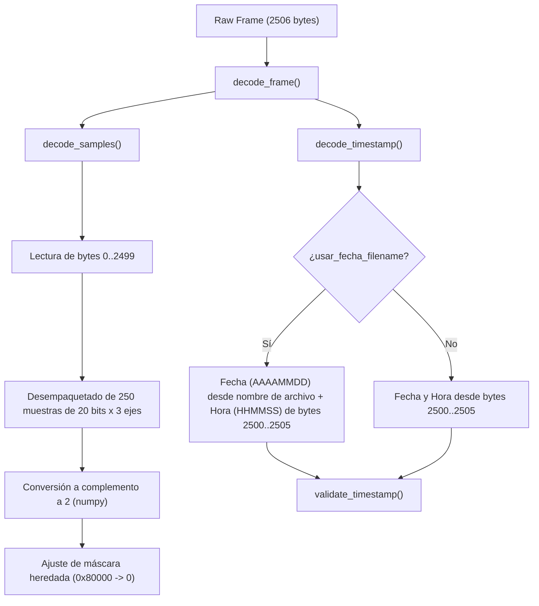

# frame_decoder.py — Contexto para Agentes IA

> Módulo de decodificación y validación de tramas binarias de 2506 bytes del acelerógrafo RSA.

**Ruta**: `scripts/operation/core/frame_decoder.py`  
**LOC**: 463 | **Lenguaje**: Python | **Dependencias**: `numpy`, `datetime`  
**Proceso**: Importado como biblioteca utilitaria por los componentes de adquisición, streaming y extracción (`ring_buffer_store.py`, `stream_processor.py` y futuros extractores).

---

## Arquitectura

El decodificador toma una trama binaria cruda de 2506 bytes y la separa en muestras sísmicas de 20 bits (tres ejes) y metadatos de sincronización de tiempo.

---

## Estructura de la Trama de 2506 Bytes

El formato binario transferido desde el dsPIC a través del pipe se estructura de la siguiente manera:

| Offset (Bytes) | Tamaño | Descripción |
|----------------|--------|-------------|
| **0..2499**    | 2500 B | **Muestras sísmicas**: 250 muestras de 3 ejes (X, Y, Z). Cada muestra ocupa 10 bytes (80 bits = 3 ejes × 20 bits + 20 bits de alineación/control). |
| **2500..2505** | 6 B    | **Timestamp hardware**: 6 bytes estructurados como `[año-2000, mes, día, hora, minuto, segundo]`. |

### ⚠️ El Bug del dsPIC y la fuente de reloj
Teóricamente, el byte `0` de la trama debía almacenar el `clock_source` (fuente de reloj: RPi, GPS, RTC). Sin embargo, el firmware del dsPIC tiene un bug de indexación que hace que el bucle de envío de muestras comience en el offset `0` del buffer de transmisión, sobreescribiendo el `clock_source` con el ID de la muestra `0` (el cual es siempre `0`). 

Por lo tanto:
*   Las muestras de los acelerómetros comienzan estrictamente desde el byte `0`.
*   El campo `clock_source` siempre decodificará como `0` (RPi) en los datos leídos de disco o pipe. Esto es un comportamiento normal y esperado debido al bug del firmware del hardware.

---

## Componentes / Funciones Clave

| Elemento | Tipo | Descripción |
|----------|------|-------------|
| `FrameData` | `dataclass` | Contenedor de datos decodificados: `samples` (numpy.ndarray de 250x3), `timestamp` (datetime), `clock_source` (int). |
| `decode_frame()` | Función | Interfaz pública principal. Retorna un objeto `FrameData` a partir de una trama de 2506 bytes. |
| `decode_samples()` | Función | Extrae y decodifica las 250 muestras en los tres ejes utilizando operaciones de máscara y desplazamiento de bits en numpy. |
| `decode_timestamp()` | Función | Extrae los bytes de tiempo. Si `usar_fecha_filename=True`, recupera la fecha (año, mes, día) desde el nombre de archivo provisto para mitigar fallas del RTC del dsPIC. |
| `validate_timestamp()` | Función | Valida semánticamente que la hora sea `< 24`, minutos `< 60` y segundos `< 60`. |

---

## Limitaciones Conocidas / TODOs

- **Máscara de 20 bits heredada (Compatibilidad)**: El algoritmo original en `binary_to_mseed.py` posee una máscara de complemento a 2 donde el valor negativo más extremo en 20 bits (`-524288` o `0x80000`) se decodifica como `0`. El decodificador mantiene esta limitación de manera intencional para asegurar que el output miniSEED sea exactamente idéntico al decodificador histórico. El valor negativo funcional más grande soportado es `-524287` (`0x80001`).
- **Dependencia de la hora de la trama**: Aunque `usar_fecha_filename` mitiga los desajustes de fecha (año/mes/día), la hora (hora/minuto/segundo) sigue dependiendo exclusivamente de los bytes de la trama generada por el dsPIC.
