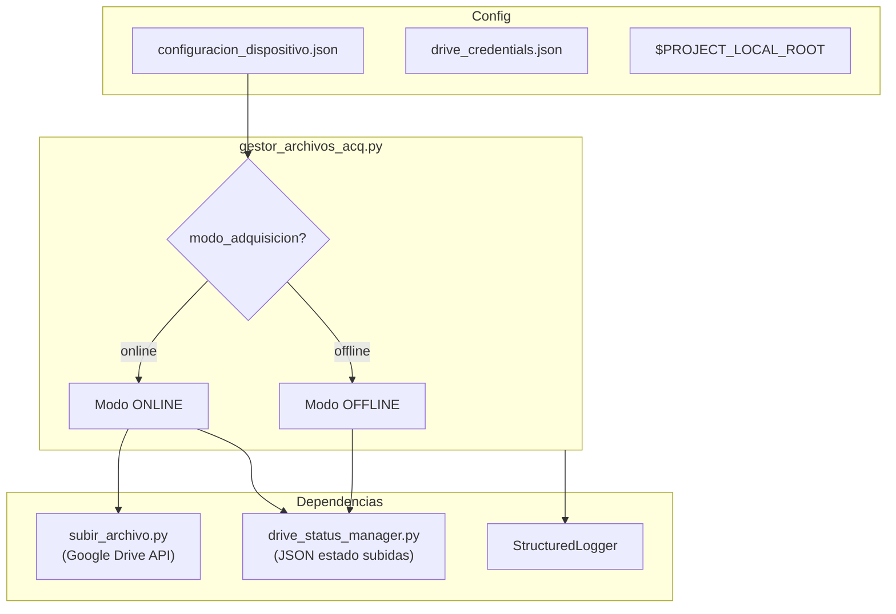
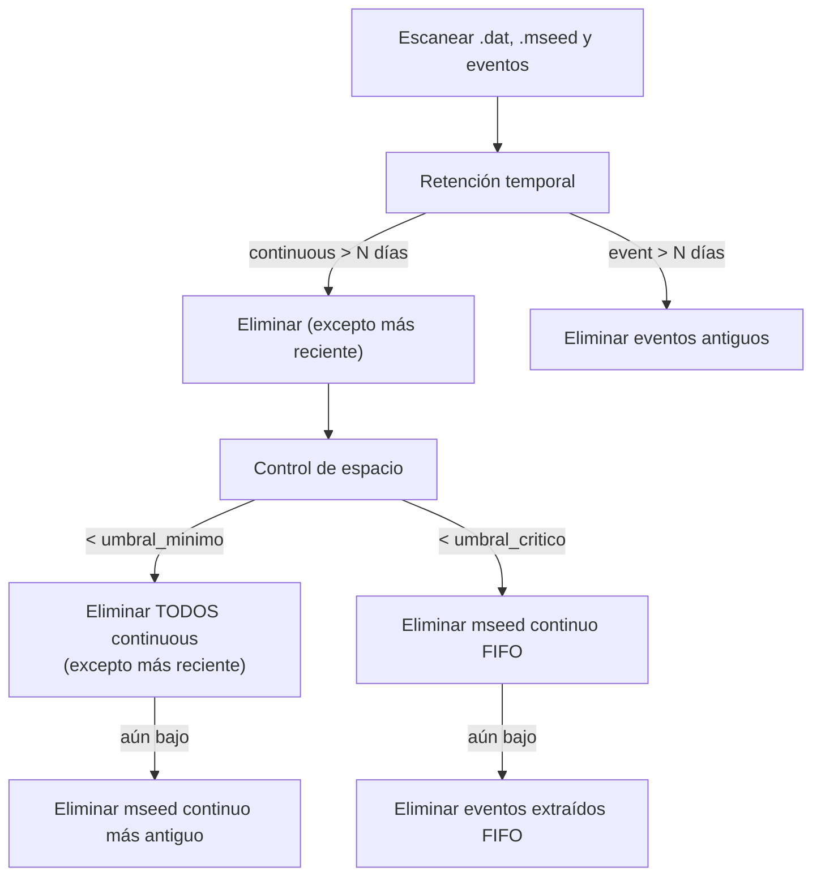
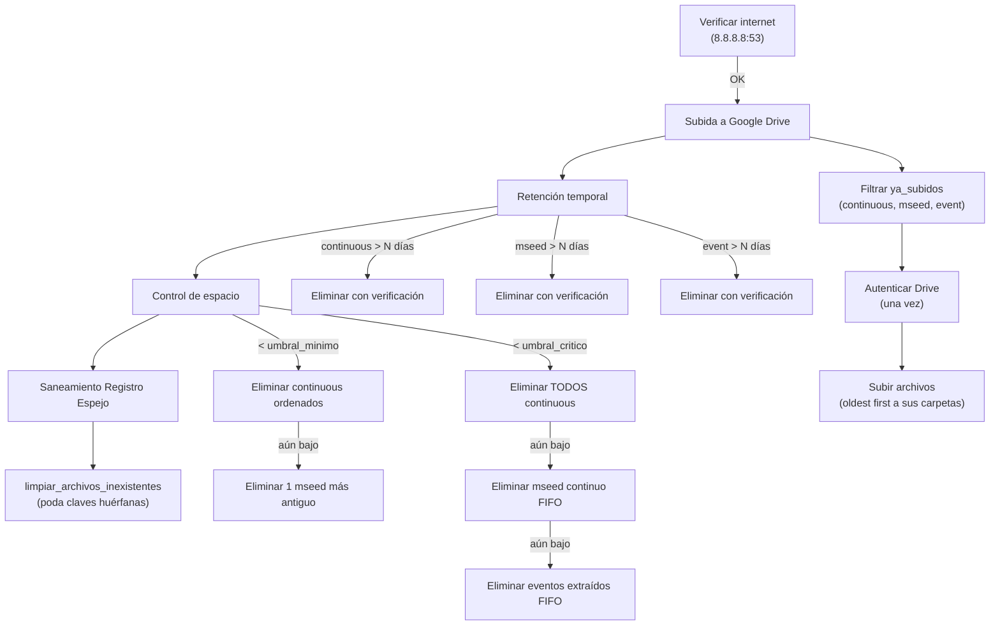

# gestor_archivos_acq.py — Contexto para Agentes IA

> Script Python que gestiona el almacenamiento, sincronización con Google Drive y políticas de retención de archivos binarios (`.dat`), miniSEED continuo (`.mseed`) y eventos extraídos (`.mseed`) en el sistema de adquisición sísmica. Opera en dos modos: **online** (subida a Google Drive + retención temporal + control de espacio + saneamiento del registro JSON) y **offline** (maximiza almacenamiento local). Soporta modo dry-run para simulación.

**Ruta**: `scripts/operation/drive/gestor_archivos_acq.py`
**LOC**: ~850 | **Lenguaje**: Python 3 | **Ejecución**: Periódica (cron/supervisor)

---

## Arquitectura



---

## Modos de Operación

### Modo OFFLINE



**Política default offline**: retener continuous 7 días, event 30 días, sin subida.

---

### Modo ONLINE (con conexión)



**Política default online**: subir `["mseed", "event"]`, retener continuous 30 días, mseed 30 días, event 30 días.

### Modo ONLINE (sin conexión)

Solo aplica control de espacio (sin subida, sin retención temporal).

---

## Sistema de Protección de Archivos

Tres niveles de protección antes de eliminar:

| Protección | Aplica a | Mecánica |
|-----------|----------|----------|
| **Archivo activo** | `.dat` más reciente | `obtener_archivo_mas_reciente()` → nunca se borra |
| **Fallo de subida** | Cualquiera | `drive_status_manager.esta_protegido()` → no se borra |
| **Ya subido** | Online → subida | `drive_status_manager.ya_fue_subido()` → se omite subida |

---

## Funciones

| Función | Descripción |
|---------|-------------|
| `read_fileJSON(nameFile)` | Lee JSON, retorna `dict` o `None` |
| `get_free_space_percentage(path)` | `shutil.disk_usage()` → `% libre` |
| `check_internet_connection(logger)` | Socket TCP a `8.8.8.8:53` con timeout 3s |
| `delete_oldest_file(directory, extension, logger, dry_run)` | Elimina archivo más antiguo por mtime |
| `obtener_archivo_mas_reciente(directorio, extension)` | Retorna path del más reciente por mtime |
| `calcular_antiguedad_dias(ruta_archivo)` | `(now - mtime).days` |
| `esta_protegido_por_fallo(nombre, tipo, log_dir)` | Wrapper de `drive_status_manager.esta_protegido()` |
| `eliminar_archivo_con_verificacion(ruta, tipo, log_dir, logger, dry_run)` | Verifica protección → elimina → log |
| `limpiar_archivos_inexistentes(log_dir, directorios, logger)` | Compara registro JSON contra disco físico y poda archivos huérfanos |
| `obtener_logger_estructurado(...)` | Factory de `StructuredLogger` (dry-run usa log separado) |

---

## Dependencias Internas

### `subir_archivo.py` (mismo directorio)

| Import | Uso |
|--------|-----|
| `Try_Autenticar_Drive(SCOPES, cred, token, logger)` | Autenticación OAuth2 Google Drive |
| `subir_archivo_con_reintentos(service, nombre, path, drive_id, ...)` | Upload con reintentos + registro en status manager |
| `SCOPES` | Permisos Google Drive API |

### `drive_status_manager.py` (mismo directorio)

JSON persistente en `$PROJECT_LOCAL_ROOT/log-files/uploaded_files_registry.json`:

| Función | Uso en gestor |
|---------|---------------|
| `ya_fue_subido(log_dir, nombre, tipo)` | Evitar subidas duplicadas |
| `esta_protegido(log_dir, nombre, tipo)` | Proteger archivos con subida fallida |
| `limpiar_archivos_inexistentes(log_dir, dirs, logger)` | Sincronización y poda de huérfanos tras retención |
| `obtener_estadisticas(log_dir)` | Métricas de balance y control de inventario |

---

## Configuración

### `configuracion_dispositivo.json` — campos relevantes

```json
{
  "dispositivo": {
    "id": "NOM00",
    "modo_adquisicion": "online",
    "umbral_espacio_minimo": 10
  },
  "directorios": {
    "registro_continuo": "/ruta/datos/RC/",
    "archivos_mseed": "/ruta/datos/MSEED/",
    "eventos_extraidos": "/ruta/datos/ED/",
    "archivos_temporales": "/ruta/datos/tmp/"
  },
  "gestion_almacenamiento": {
    "umbrales": { "minimo": 10, "critico": 5 },
    "politicas": {
      "online": {
        "subir": ["mseed", "event"],
        "retener_dias": { "continuous": 30, "mseed": 30, "event": 30 }
      },
      "offline": {
        "subir": [],
        "retener_dias": { "continuous": 7, "event": 30 }
      }
    }
  },
  "drive": {
    "carpetas": { "continuos_id": "...", "mseed_id": "...", "events_id": "..." },
    "config": { "max_reintentos": 3, "tiempo_espera": 2 }
  }
}
```

---

## CLI

```bash
# Ejecución periódica regular (subida + retención + saneamiento)
python3 gestor_archivos_acq.py

# Simulación completa (no sube, no borra de disco ni altera JSON)
python3 gestor_archivos_acq.py --dry-run

# Depuración inmediata del registro de subidas bajo demanda
python3 gestor_archivos_acq.py --purge-registry

# Simulación de depuración del registro (muestra inventario sin modificar)
python3 gestor_archivos_acq.py --purge-registry --dry-run

# Autenticación remota OAuth2 via SSH
python3 gestor_archivos_acq.py --noauth_local_webserver
```

---

## Logging

**Archivo**: `$PROJECT_LOCAL_ROOT/log-files/gestor_acq.log`
**Motor**: `StructuredLogger` (5 MB × 3 backups, verbosidad `SUMMARY`)

| Tag | Cuándo |
|-----|--------|
| `INIT` | Inicio con modo e ID |
| `PROTECTED` | Archivo protegido (activo o fallo) |
| `SKIP` | Archivo omitido (ya subido) |
| `DELETE_AGE` | Eliminado por retención temporal |
| `DELETE_SPACE` | Eliminado por espacio |
| `UPLOAD_OK` / `UPLOAD_FAIL` | Via `subir_archivo.py` |
| `SUMMARY` | Resumen final (incluye métricas `registry_cleanup` o `dry_run_cleanup`) |

---

## Orden de Prioridad de Eliminación

1. **continuous** antiguos (> retención días) — excepto más reciente activo
2. **mseed continuo** antiguos (> retención días) — excepto protegidos por fallo
3. **eventos extraídos** antiguos (> retención días) — excepto protegidos por fallo
4. **continuous** por espacio mínimo (< 10%) — ordenados por fecha
5. **mseed continuo** por espacio mínimo/crítico (< 10% / < 5%) — FIFO, verificando protección
6. **eventos extraídos** por espacio crítico (< 5%, último recurso) — FIFO, verificando protección

---

## Limitaciones Conocidas

- Eliminación de archivos es irreversible (sin papelera)
- Conexión a internet verificada una sola vez al inicio (no re-chequea)
- `calcular_antiguedad_dias()` usa `mtime` local, no timestamp del nombre del archivo
- En modo offline no hay protección por fallo de subida (no aplica)
- Sin paralelismo en subidas (secuencial archivo por archivo)
- El archivo continuous más reciente se identifica por `mtime`, no por nombre
