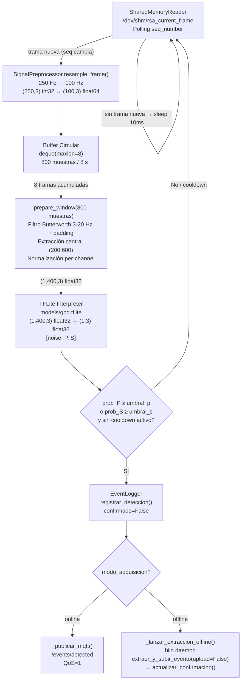
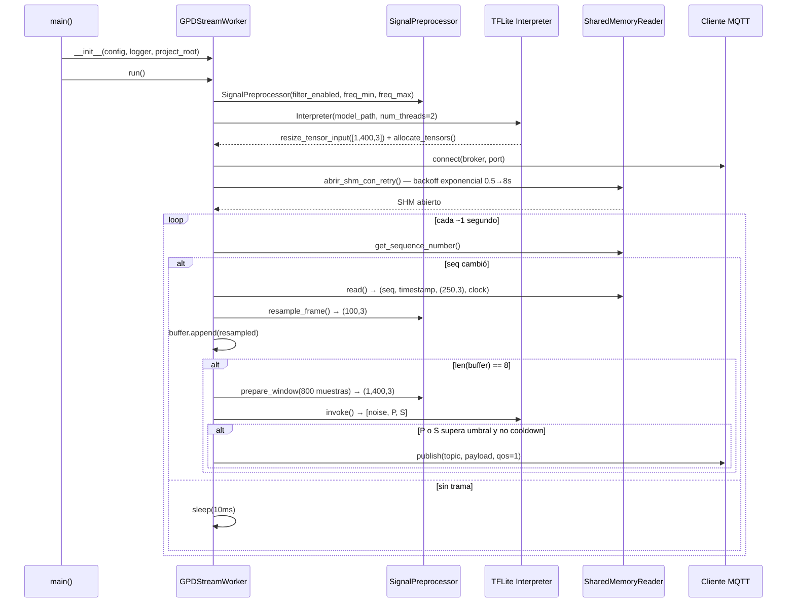

# gpd_stream_worker.py — Contexto para Agentes IA

> Daemon de inferencia GPD en tiempo real: consume tramas de memoria compartida, acumula un buffer deslizante de 8 s, ejecuta el modelo TFLite y publica detecciones de fases P/S vía MQTT con cooldown anti-spam configurable.

**Ruta**: `scripts/operation/streaming/gpd_stream_worker.py`
**LOC**: ~856 | **Lenguaje**: Python 3 | **Dependencias**: `numpy`, `tflite_runtime`, `paho-mqtt` (condicionales), `streaming.shared_memory_publisher.SharedMemoryReader`, `core.signal_preprocessor.SignalPreprocessor`, `core.event_logger.EventLogger`, `mqtt.event_extractor.extraer_y_subir_evento` (condicional, solo modo offline)
**Proceso**: Se ejecuta como daemon Supervisor (`gpd_worker.conf`). Arranca como `python3 gpd_stream_worker.py` con variables de entorno `PROJECT_LOCAL_ROOT`.

---

## Arquitectura

El worker implementa el pipeline de inferencia en tiempo real como un bucle de polling sobre la memoria compartida. El stride de 1 segundo (coincide con la tasa de publicación del `stream_processor`) garantiza 1 inferencia/segundo con un consumo de CPU estable en la RPi 3B+.

**Estrategia de buffer (Opción A — Padding)**:
Se acumulan **8 tramas resampleadas** (= 800 muestras a 100 Hz = 8 s) en un `deque(maxlen=8)`. Cada ciclo, `SignalPreprocessor.prepare_window()` filtra las 800 muestras y extrae las **400 muestras centrales** (segundos 2–6), eliminando los transitorios de borde del filtro Butterworth en los extremos del buffer.



**Secuencia de arranque**:



---

## Configuraciones / Variables de Entorno

| Fuente | Clave | Valor por defecto | Descripción |
|--------|-------|-------------------|-------------|
| `configuracion_dispositivo.json` | `streaming.gpd.modelo_ruta` | `models/gpd.tflite` | Ruta relativa al modelo TFLite desde `PROJECT_LOCAL_ROOT` |
| `configuracion_dispositivo.json` | `streaming.gpd.umbral_p` | `0.95` | Umbral de probabilidad para detección de fase P |
| `configuracion_dispositivo.json` | `streaming.gpd.umbral_s` | `0.95` | Umbral de probabilidad para detección de fase S |
| `configuracion_dispositivo.json` | `streaming.gpd.cooldown_s` | `30` | Segundos mínimos entre detecciones publicadas (anti-spam) |
| `configuracion_dispositivo.json` | `streaming.gpd.filtro.habilitado` | `true` | Activa el filtro Butterworth pasabanda |
| `configuracion_dispositivo.json` | `streaming.gpd.filtro.freq_min_hz` | `3.0` | Frecuencia mínima del pasabanda (Hz) |
| `configuracion_dispositivo.json` | `streaming.gpd.filtro.freq_max_hz` | `20.0` | Frecuencia máxima del pasabanda (Hz) |
| `configuracion_dispositivo.json` | `streaming.gpd.ventana_pre_evento_s` | `60` | Segundos previos al evento para extracción |
| `configuracion_dispositivo.json` | `streaming.gpd.ventana_post_evento_s` | `60` | Segundos posteriores al evento para extracción |
| `configuracion_dispositivo.json` | `streaming.gpd.auto_extract` | `true` | Activa extracción automática al detectar |
| `configuracion_dispositivo.json` | `streaming.gpd.auto_upload` | `true` | Activa subida a Drive tras extracción |
| `configuracion_dispositivo.json` | `dispositivo.modo_adquisicion` | `"online"` | Bifurca el flujo post-detección: `"online"` publica MQTT, `"offline"` extrae directamente |
| `configuracion_dispositivo.json` | `streaming.gpd.csv_dir` | `/home/rsa/data/eventos-detectados` | Directorio del CSV mensual de detecciones |
| Variable de entorno | `PROJECT_LOCAL_ROOT` | `""` | Directorio raíz del proyecto en producción. Se usa para resolver rutas relativas del modelo y logs |
| CLI arg | `--config <ruta>` | Auto-detectada | Ruta explícita al JSON de configuración |
| CLI arg | `--station <id>` | Del JSON | Sobreescribe el ID de estación |
| CLI arg | `--log-dir <dir>` | `PROJECT_LOCAL_ROOT/log-files/` | Directorio de logs del worker |

**Constantes internas del pipeline** (no configurables desde JSON):

| Constante | Valor | Descripción |
|-----------|-------|-------------|
| `_GPD_WINDOW_SAMPLES` | `400` | Muestras de la ventana de inferencia (4 s a 100 Hz) |
| `_GPD_BUFFER_SAMPLES` | `800` | Muestras del buffer con padding (8 s a 100 Hz) |
| `_GPD_SAMPLES_PER_FRAME` | `100` | Muestras por trama resampleada (1 s a 100 Hz) |
| `_DEFAULT_TFLITE_THREADS` | `2` | Hilos para el intérprete TFLite |
| `_DEFAULT_SHM_RETRY_MAX` | `30` | Segundos máximos de espera al SHM en el arranque |
| `_DEFAULT_POLL_SLEEP_S` | `0.010` | Sleep (s) cuando no hay trama nueva |
| `_DEFAULT_STATS_INTERVAL` | `100` | Intervalo de inferencias para log de estadísticas |

---

## Componentes / Funciones / Servicios Clave

| Elemento | Tipo | Descripción |
|----------|------|-------------|
| `GPDStreamWorker` | Clase | Clase principal del daemon. Se instancia con `config` (sección `gpd` del JSON) y `logger`. |
| `run()` | Método público | Punto de entrada del bucle principal. Registra señales POSIX, inicializa todos los subsistemas y ejecuta el bucle de polling. Siempre termina limpiamente (no propaga excepciones al exterior). |
| `stop()` | Método público | Solicita parada ordenada estableciendo `_running = False`. |
| `_cargar_modelo()` | Método privado | Carga `gpd.tflite` con `tflite_runtime.Interpreter`. Redimensiona el tensor de entrada a `[1, 400, 3]` y cachea `input_details`/`output_details`. Tiempo de carga: ~5-8 s en RPi 3B+. |
| `_conectar_mqtt()` | Método privado | Conecta `paho.mqtt.client` al broker. Si falla, el worker continúa en modo degradado (solo log local). |
| `_abrir_shm_con_retry()` | Método privado | Abre `SharedMemoryReader` con backoff exponencial (0.5 → 8 s, máx. 30 s). Reinicia `_last_seq = -1` para no perder la primera trama disponible. |
| `_ciclo_inferencia()` | Método privado | Corazón del bucle: compara `sequence_number`, lee trama, resamplea, acumula en buffer, invoca preprocesador e inferencia. |
| `_ejecutar_inferencia(ventana)` | Método privado | Ejecuta `interpreter.invoke()` y retorna `(3,) float32` — `[noise, P, S]`. |
| `_evaluar_deteccion(...)` | Método privado | Evalúa umbrales y cooldown. Retorna `dict` de detección o `None`. Prioridad: fase con mayor probabilidad entre P y S si ambas superan su umbral. |
| `_publicar_deteccion(deteccion)` | Método privado | **[Fase 4]** Bifurca por `_modo_adquisicion`: registra siempre en CSV (confirmado=False), luego llama a `_publicar_mqtt()` (online) o `_lanzar_extraccion_offline()` (offline). |
| `_publicar_mqtt(deteccion)` | Método privado | Serializa el dict a JSON y publica en `<station_id>/events/detected` (QoS=1). Extraído de `_publicar_deteccion()` en Fase 4. |
| `_lanzar_extraccion_offline(deteccion)` | Método privado | **[Fase 4]** Calcula ventana pre/post, parsea timestamp, lanza hilo daemon con `_run_extraccion_offline()`. |
| `_run_extraccion_offline(...)` | Método privado | **[Fase 4]** Hilo: invoca `extraer_y_subir_evento(upload=False)` y actualiza CSV a `confirmado=True` si exitoso. |
| `_cerrar_recursos()` | Método privado | Cierre ordenado de MQTT (`loop_stop` + `disconnect`) y SHM reader. Siempre se ejecuta en el bloque `finally` de `run()`. |
| `main()` | Función | Entry point del script. Parsea CLI, carga el JSON de configuración, extrae la sección `streaming.gpd` y propaga `station_id`, `modo_adquisicion` y parámetros MQTT. |

**Payload MQTT de detección** (`<station_id>/events/detected`, QoS=1):
```json
{
    "type": "P",
    "probability": 0.9723,
    "timestamp": "2026-07-02T15:30:00.000Z",
    "window_start": "2026-07-02T15:29:58.000Z",
    "window_end": "2026-07-02T15:30:02.000Z",
    "station_id": "DEV00",
    "model": "gpd.tflite",
    "source": "streaming"
}
```

> [!NOTE]
> El campo `timestamp` corresponde al **centro de la ventana de inferencia de 4 s** (no al momento de publicación). Se calcula como `timestamp_trama - 2.0 s`. Los campos `window_start` y `window_end` delimitan los 4 s inferidos. Esto facilita el cálculo de las ventanas de extracción en la Fase 4.

**Tags de log estructurado**:

| Tag | Nivel | Descripción |
|-----|-------|-------------|
| `[GPD_INIT]` | INFO | Inicialización del worker y del preprocesador |
| `[GPD_LOAD]` | INFO | Modelo TFLite cargado (incluye tiempo de carga) |
| `[GPD_MQTT]` | INFO/WARNING | Estado de la conexión MQTT |
| `[GPD_SHM_OK]` | INFO | SHM abierto exitosamente |
| `[GPD_SHM_WAIT]` | WARNING | Esperando a que `stream_processor` cree el SHM |
| `[GPD_SHM_FAIL]` | ERROR | Timeout de SHM o fallo irrecuperable |
| `[GPD_SHM_LOST]` | WARNING | SHM desapareció en mitad del bucle (reinicio de stream_processor) |
| `[GPD_START]` | INFO | Bucle de inferencia iniciado |
| `[GPD_BUF]` | INFO | Estado de llenado del buffer (solo al primer append) |
| `[GPD_INFER]` | DEBUG | Probabilidades de cada inferencia (`noise`, `P`, `S`) |
| `[GPD_STATS]` | INFO | Estadísticas periódicas cada 100 inferencias |
| `[GPD_DETECTION]` | INFO | Detección de fase sísmica confirmada |
| `[GPD_COOLDOWN]` | DEBUG | Detección ignorada por cooldown activo |
| `[GPD_MQTT_PUB]` | DEBUG | Publicación MQTT exitosa |
| `[GPD_STATS_FINAL]` | INFO | Estadísticas acumuladas al cierre |
| `[GPD_SIGNAL]` | INFO | Señal POSIX recibida (SIGTERM/SIGINT) |
| `[GPD_STOP]` | INFO | Worker detenido |

---

## Limitaciones Conocidas / TODOs

- **Cooldown no persiste entre reinicios**: `_last_detection_time` es en memoria. Si el worker se reinicia (por Supervisor), el cooldown se reinicia a 0. Esto podría generar una publicación inmediata al volver a arrancar.
- **Modelo estático**: No hay mecanismo de recarga en caliente del modelo. Si se actualiza `gpd.tflite`, se debe reiniciar el servicio.
- **`tflite_runtime` y `paho-mqtt` opcionales**: Las importaciones son condicionales. Si no están disponibles, el worker falla en `_cargar_modelo()` (RuntimeError) o continúa sin MQTT respectivamente. En tests unitarios se mockean.
- **`event_extractor` opcional en modo offline**: Si el módulo `mqtt.event_extractor` no está en el path al iniciar, `_EXTRACTOR_AVAILABLE = False` y el modo offline degrada con un warning, sin crash.
- **Timestamp de trama**: El `timestamp` leído desde el SHM es el timestamp del hardware (reloj del dsPIC). Si la deriva del reloj es significativa, los campos de ventana en el payload podrían estar desplazados respecto al tiempo UTC real.
