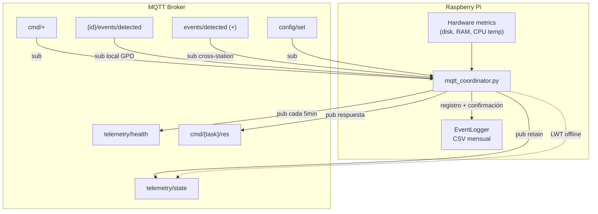
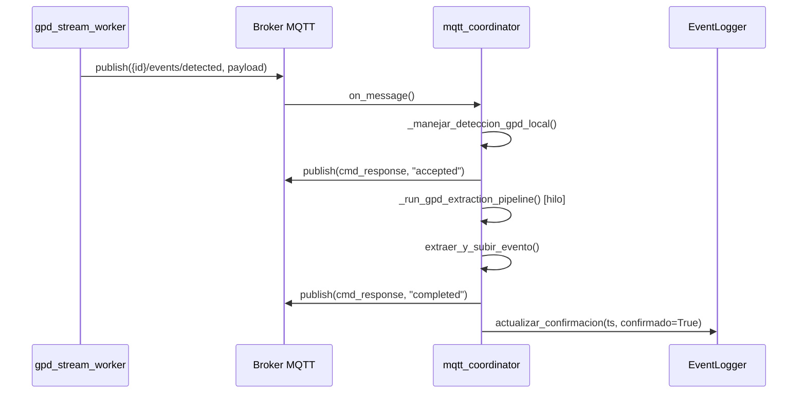

# mqtt_coordinator.py — Contexto para Agentes IA

> Agente reactivo MQTT que corre como daemon en Raspberry Pi. Publica telemetría (estado operacional + métricas de hardware), recibe comandos remotos, y a partir de la Fase 4 maneja detecciones GPD locales disparando extracción automática y registrando en CSV mensual.

**Ruta**: `scripts/operation/mqtt/mqtt_coordinator.py`  
**LOC**: ~763 | **Lenguaje**: Python 3 | **Dependencias**: `paho-mqtt`, `python-dotenv`, `core.event_logger.EventLogger`, `event_extractor.extraer_y_subir_evento`  
**Proceso**: Daemon gestionado por Supervisor

---

## Arquitectura



### Flujo de detección GPD local (modo online)



---

## Tópicos MQTT

Template: `{org}/{app}/{cap}/{id}/...`  
Default: `rsa/seismic/smart/{id}/...`

| Topic key | Template completo | QoS | Retain | Dirección |
|---|---|---|---|---|
| `telemetry_state` | `…/{id}/telemetry/state` | 1 | ✅ | Pub |
| `telemetry_health` | `…/{id}/telemetry/health` | 1 | ❌ | Pub |
| `cmd_execute` | `…/{id}/cmd/+` | 1 | — | Sub |
| `cmd_broadcast` | `…/broadcast/cmd/+` | 1 | — | Sub |
| `cmd_response` | `…/{id}/cmd/{task_name}/res` | 1 | ❌ | Pub |
| `events_local` | `…/{id}/events/detected` | 1 | — | Sub (GPD local) |
| `events_regional` | `…/+/events/detected` | 1 | — | Sub (wildcard `+`) |
| `config_set` | `…/{id}/config/set` | 1 | — | Sub |

---

## Telemetría

### State (`telemetry/state`)

Publicado en: conexión (`"online"`), inicio (`"on"`), shutdown (`"offline"`), y como LWT.

```json
{"status": "online", "timestamp": "2024-01-15T19:30:45Z"}
```

### Health (`telemetry/health`) — cada 300 segundos

```json
{
  "disk_percent": 45.2,
  "ram_percent": 32.1,
  "load_avg_15m": 0.85,
  "cpu_temp_c": 52.3,
  "throttled": "0x0",
  "uptime_s": 3600,
  "timestamp": "2024-01-15T19:30:45Z"
}
```

| Métrica | Fuente | Fallback |
|---|---|---|
| `disk_percent` | `os.statvfs('/')` | `-1` |
| `ram_percent` | `/proc/meminfo` (MemTotal - MemAvailable) | `-1` |
| `load_avg_15m` | `os.getloadavg()[2]` | `-1` |
| `cpu_temp_c` | `vcgencmd measure_temp` | `-1` |
| `throttled` | `vcgencmd get_throttled` | `"unknown"` |

---

## Comandos (Dispatcher)

Recibidos vía `cmd/+`, procesados por `CommandDispatcher`:

| Comando | Handler | Estado |
|---|---|---|
| `restart_acquisition` | `_cmd_restart_acquisition()` | ❌ TODO |
| `cleanup_files` | `_cmd_cleanup_files()` | ❌ TODO |
| `get_status` | `_cmd_get_status()` | ✅ Funcional |
| `extract_event` | `_cmd_extract_event()` | ✅ Funcional (Asíncrono + CSV) |

**Flujo de comando regular**:
1. Mensaje llega a `…/{id}/cmd/{task_name}`
2. `on_message()` detecta `/cmd/` en tópico, extrae `task_name`
3. `dispatcher.dispatch(task_name, payload, client)` → ejecuta handler
4. Respuesta publicada en `…/{id}/cmd/{task_name}/res` (si el handler no retorna `None`)

**Flujo de extracción asíncrono (`extract_event`)** (Fase 4 actualizado):
1. El handler responde inmediatamente un ACK (`"status": "accepted"`).
2. Se lanza un hilo (`threading.Thread`) que invoca al orquestador `event_extractor.py`.
3. El orquestador ejecuta `extract_segment.py` (.venv) y `subir_archivo.py` (sistema) como subprocesos aislados.
4. Si exitoso, el hilo intenta `event_logger.actualizar_confirmacion(start, ...)`.  
   Si no hay registro previo → `event_logger.registrar_evento_externo(start, archivo)`.
5. El hilo publica el resultado (`"completed"` o `"error"`) de forma asíncrona.

---

## Handler de Detección GPD Local (Fase 4)

### `_manejar_deteccion_gpd_local(client, userdata, payload)`

Invocado por `on_message()` cuando llega un mensaje en el tópico propio (`{id}/events/detected`). Solo actúa en modo `online`; en modo `offline` el worker ya extrajo directamente.

**Checks antes de extraer:**
1. Payload contiene `timestamp` y `type` → si falta, warning y return.
2. `dispositivo.modo_adquisicion == "offline"` → log info y return.
3. `streaming.gpd.auto_extract == False` → log info y return.

**Si pasa los checks:**
- Calcula `start = timestamp_centro - ventana_pre_evento_s`
- Calcula `duration = ventana_pre + ventana_post`
- Publica ACK inmediato con `request_id = "gpd-auto-{timestamp}"`
- Lanza `_run_gpd_extraction_pipeline()` en hilo daemon

### `_run_gpd_extraction_pipeline(...)` — hilo separado

```
extraer_y_subir_evento(upload=auto_upload) → publicar resultado → actualizar CSV
```

Si `actualizar_confirmacion()` retorna `False` (condición de carrera improbable):  
→ `registrar_deteccion(ts, fase, confirmado=True, archivo)` como fallback.

**Payload de respuesta publicado** (campo `source: "gpd_auto"`):
```json
{
    "status": "completed",
    "request_id": "gpd-auto-2026-07-06T15:30:00.000Z",
    "timestamp": "2026-07-06T15:30:07.123Z",
    "source": "gpd_auto",
    "output_file": "DEV00_260706-152900.mseed"
}
```

---

## Correlación Regional (Placeholder)

`EventCorrelator` escucha eventos de **otras estaciones** vía wildcard `+/events/detected`:
- Filtra eventos propios (`config["id"] not in topic`)
- Acumula en `recent_events[]`
- **TODO**: Integrar con módulo externo de correlación

---

## Clases y Funciones

| Elemento | Descripción |
|---|---|
| `cargar_configuracion(config_path, env_path)` | Merge JSON config + `.env` credentials → `dict` con key `"broker"` |
| `resolver_topico(config, topic_key, **kwargs)` | Resuelve template `{org}/{app}/{cap}/{id}/...` |
| `timestamp_iso()` | UTC ISO8601 string |
| `CommandDispatcher` | Registry pattern: `handlers[task_name] → method`. Constructor acepta `event_logger=None`. |
| `EventCorrelator` | Buffer de eventos regionales (placeholder) |
| `_manejar_deteccion_gpd_local(client, userdata, payload)` | **[Fase 4]** Handler de detecciones GPD propias. Valida, calcula ventana, publica ACK, lanza hilo. |
| `_run_gpd_extraction_pipeline(...)` | **[Fase 4]** Hilo de extracción GPD automática. Extrae, actualiza CSV, publica resultado. |
| `iniciar_cliente(config, logger, userdata)` | Crea `mqtt.Client`, configura LWT, callbacks, conecta. Pasa `event_logger` al dispatcher. |
| `publicar_state(client, config, estado, logger)` | Publica estado con retain |
| `publicar_health(client, config, logger)` | Publica métricas hardware |
| `obtener_metricas_hardware()` | Lee disk/RAM/CPU/throttled de la RPi |

---

## Callbacks MQTT

| Callback | Función |
|---|---|
| `on_connect` | Suscribe a tópicos configurados (incluyendo `events_local`), publica `"online"` |
| `on_disconnect` | Loguea desconexión inesperada (una sola vez) |
| `on_message` | Rutea por tipo: `/cmd/` → dispatcher, `events/detected` + propio → GPD local, `events/detected` + otro → correlator, `/config/set` → log |

### Ramas de `on_message()` en orden de evaluación:

```python
if "/cmd/" in topic:
    dispatcher.dispatch(...)
elif "/events/detected" in topic and config["id"] not in topic:  # otro ID
    correlator.on_regional_event(...)
elif "/events/detected" in topic and config["id"] in topic:      # propio ID
    _manejar_deteccion_gpd_local(...)
elif "/config/set" in topic:
    logger.info(...)
```

---

## Configuración

### `configuracion_mqtt.json` (subscriptions actualizadas en Fase 4)

```json
{
  "id": "DEV00", "org": "rsa", "app": "seismic", "cap": "smart",
  "topics": {
    "events_local": "{org}/{app}/{cap}/{id}/events/detected",
    "events_regional": "{org}/{app}/{cap}/+/events/detected"
  },
  "subscriptions": ["events_regional", "cmd_execute", "cmd_broadcast", "config_set", "events_local"]
}
```

### Userdata del cliente MQTT

```python
userdata = {
    "config": config,              # configuracion_mqtt.json
    "logger": logger,              # StructuredLogger
    "device_config": device_config, # configuracion_dispositivo.json (para GPD params)
    "event_logger": event_logger,  # EventLogger para CSV de detecciones
    "state_file_path": ...,
    "boot_published": False,
    "last_state_change": None,
    "is_disconnected_logged": False,
    "dispatcher": ...,
    "correlator": ...,
}
```

### `.env` (credenciales)

```
MQTT_BROKER=<broker_address>
MQTT_PORT=1883
MQTT_USERNAME=<user>
MQTT_PASSWORD=<pass>
```

**Rutas**:
- Config MQTT: `$PROJECT_LOCAL_ROOT/configuracion/configuracion_mqtt.json`
- Config dispositivo: `$PROJECT_LOCAL_ROOT/configuracion/configuracion_dispositivo.json`
- Env: `$PROJECT_LOCAL_ROOT/configuracion/.env`
- Log: `$PROJECT_LOCAL_ROOT/log-files/mqtt_coordinator.log`

---

## Compatibilidad paho-mqtt v1/v2

```python
try:
    client = mqtt.Client(mqtt.CallbackAPIVersion.VERSION2, userdata=userdata)  # v2.x
except AttributeError:
    client = mqtt.Client(userdata=userdata)  # v1.x
```

Callbacks usan firma compatible con ambas versiones: `(client, userdata, flags, rc, properties=None)`.

---

## Limitaciones Conocidas

- Comandos `restart_acquisition` y `cleanup_files` no implementados (TODO)
- `EventCorrelator` solo acumula eventos sin procesarlos
- Sin reconexión automática explícita (depende del `loop_start()` de paho)
- Health metrics asumen Raspberry Pi (`vcgencmd`, `/proc/meminfo`)
- Sin TLS/SSL configurado
- `HEALTH_INTERVAL` hardcoded (300s), no configurable desde JSON
- `actualizar_confirmacion()` usa `start` (inicio de ventana) como `timestamp_centro` en comandos de red; si no hay registro previo, registra como `EXTERNAL` (comportamiento esperado)
