# ring_buffer_store.py — Contexto para Agentes IA

> Almacén de tramas binarias en disco con rotación FIFO y consulta por rangos de tiempo.

**Ruta**: `scripts/operation/streaming/ring_buffer_store.py`  
**LOC**: 651 | **Lenguaje**: Python | **Dependencias**: `numpy`, `datetime`, `os`, `glob`, `threading`, `time`, `core.frame_decoder`  
**Proceso**: Instanciado por el daemon de adquisición continua (`stream_processor.py`) para registrar tramas y consultado por agentes de telemetría/extracción (`event_extractor.py`) para recuperar datos.

---

## Arquitectura

El `RingBufferStore` gestiona una serie de archivos binarios rotativos en un directorio específico, indexándolos en memoria para búsquedas eficientes sin necesidad de una base de datos externa.

```mermaid
graph TD
    subgraph Inicialización
        A["__init__()"] --> B["_init_directorio()"]
        A --> C["_rebuild_index()"]
        C --> C1["Escanear archivos ring_*.bin en disco"]
        C1 --> C2["Leer primera y última trama de cada uno"]
        C2 --> C3["Poblar index: List[RingFileEntry] ordenado"]
    end

    subgraph Escritura concurrentes
        D["write_frame(raw_frame, ts)"] --> E["Lock()"]
        E --> F{"¿Debe rotar archivo?"}
        F -- Sí --> G["_rotate_file()"]
        F -- No --> H["Escribir bytes en archivo activo"]
        G --> H
        H --> I["Actualizar índice y desbloquear"]
        I --> J["_enforce_retention()"]
        J --> J1{"¿Tamaño total > max_size_mb?"}
        J1 -- Sí --> J2["Eliminar archivo más antiguo (FIFO)"]
        J1 -- No --> J3["Fin"]
    end

    subgraph Consulta
        K["query / query_raw(start, end)"] --> L["Lock()"]
        L --> M["Filtrar archivos solapados en el índice"]
        M --> N["Leer tramas secuencialmente y filtrar por timestamp exacto"]
    end
```



---

## Estructura del Índice en Memoria

Para evitar escaneos pesados del disco durante las consultas y la retención, se mantiene una lista ordenada en memoria de objetos `RingFileEntry`:

```python
@dataclass
class RingFileEntry:
    filepath: str                 # Ruta absoluta del archivo .bin
    start_time: datetime.datetime # Timestamp de la primera trama escrita
    end_time: datetime.datetime   # Timestamp de la última trama escrita
    frame_count: int              # Número de tramas en el archivo
    size_bytes: int               # Tamaño del archivo en bytes
```

El acceso a esta estructura y a los descriptores de archivos de escritura está protegido en todo momento por un semáforo de exclusión mutua (`threading.Lock()`), lo que hace que el componente sea completamente **thread-safe** ante lecturas y escrituras concurrentes.

---

## Organización y Formato en Disco

- **Directorio de Almacenamiento**: Configurado en `/home/rsa/data/ring-buffer/`.
- **Estructura del archivo**: Cada archivo `.bin` es una concatenación cruda de tramas de 2506 bytes, sin metadatos ni headers de contenedor (permitiendo la lectura directa mediante `binary_to_mseed.py`).
- **Nomenclatura**: `ring_YYYYMMDD_HHMMSS.bin`, donde la fecha y hora corresponden al timestamp de la primera trama escrita en dicho archivo (o al tiempo real UTC en caso de correcciones de reloj, ver sección de Rotación).

---

## Políticas del Búfer Circular

### 1. Rotación de Archivos
Un archivo se cierra y se abre uno nuevo bajo tres condiciones evaluadas en `_debe_rotar()`:
*   Al recibir la primera trama de una ejecución (si no hay descriptor activo).
*   **Tiempo Monótono (Criterio Primario)**: Cuando el tiempo de reloj del host transcurrido desde la creación del archivo actual (`time.monotonic() - self._archivo_activo_inicio_mono`) supera la duración configurada (`archivo_duracion_s`, por defecto 300 segundos = 5 minutos). Este criterio asegura robustez e inmunidad frente a desvíos o saltos de reloj en los timestamps de los datos.
*   **Regresión Temporal (Criterio Secundario)**: Si el timestamp de la trama entrante es anterior al tiempo de inicio del archivo activo (`timestamp < self._archivo_activo_inicio`) y el tiempo monótono real transcurrido supera el 90% de la duración del archivo. Esto detecta desfases y previene el bloqueo de la rotación cuando el reloj de datos se desfasa.

### 2. Mitigación del Bug del dsPIC (Cruce de Medianoche)
Durante el cruce de medianoche, el hardware dsPIC puede enviar tramas con la hora actualizada a `00:00:xx` pero manteniendo erróneamente la fecha del día anterior (por ejemplo, `17` de junio en lugar de `18` de junio). 
*   **Rotación**: Sin la mitigación, la resta de timestamps (`00:00:01 - 23:59:44`) daría un delta negativo de `-86383` segundos, impidiendo que el archivo rotara y causando que creciera de forma desmedida (reportado en producción hasta 148 MB en lugar de los 1.2 MB esperados). Al utilizar `time.monotonic()` como criterio primario, la rotación ocurre exactamente al pasar el tiempo real programado (5 min), sin importar el retroceso del timestamp de datos.
*   **Nomenclatura de Archivo**: En `_rotate_file()`, si la diferencia de fecha entre el reloj real UTC del sistema y la trama entrante es exactamente de 1 día (`diff_dias == 1`), el nombre del archivo se genera usando la hora del sistema UTC (`utcnow()`) en lugar de usar la trama retrasada. Esto previene que se sobrescriban o extiendan archivos del día anterior y garantiza nombres coherentes cronológicamente.

### 3. Retención FIFO por Espacio
Cuando el espacio total de los archivos indexados supera el límite configurado (`max_size_mb`):
1.  Se identifica el archivo más antiguo (posición `0` del índice).
2.  Se verifica que no corresponda al archivo que actualmente se está escribiendo (nunca se elimina el archivo activo).
3.  Se elimina físicamente del disco y se remueve del índice.
4.  Se repite el ciclo hasta que el espacio total caiga por debajo del límite.

---

## Componentes / API Pública

| Elemento | Tipo | Descripción |
|----------|------|-------------|
| `write_frame()` | Método | Escribe una trama binaria, evalúa la rotación y aplica la retención FIFO. |
| `query()` | Método | Retorna una lista de objetos `FrameData` decodificados que caigan dentro del rango temporal. |
| `query_raw()` | Método | Retorna una lista de tramas crudas (`bytes`) dentro del rango temporal. |
| `get_time_range()` | Método | Obtiene el rango de tiempo total disponible (fecha inicio del archivo más viejo hasta fecha fin del activo). |
| `get_disk_usage_mb()`| Método | Retorna el tamaño total del ring buffer en Megabytes. |
| `close()` | Método | Vacía los buffers y cierra limpiamente el descriptor activo (debe llamarse al apagar el servicio). |

---

## Pruebas y Validación de Robustez

El comportamiento del almacén se verifica completamente mediante pruebas unitarias en `scripts/operation/streaming/test_ring_buffer_store.py`. Entre los escenarios clave probados se incluyen:
*   `test_rotacion_bug_cambio_dia`: Simula exactamente el bug del dsPIC con una trama de inicio a las 23:59:44 y una trama subsiguiente a las 00:00:01 del mismo día nominal (causando una regresión de timestamps). El test verifica que la rotación se activa por tiempo monótono transcurrido real (`time.sleep(1.1)`) y que se crean al menos 2 archivos distintos.

---

## Limitaciones Conocidas / TODOs

- **Búsqueda secuencial interna**: Durante las consultas (`query_raw`), el script abre cada archivo relevante y lee trama por trama de forma secuencial. Aunque el índice reduce drásticamente el espacio de búsqueda a unos pocos archivos, si el rango de consulta es muy grande (varias horas), el proceso de lectura secuencial puede ser pesado en I/O.
- **Dependencia de la persistencia del proceso**: El cálculo del tiempo monótono del host (`time.monotonic()`) es relativo a la sesión del sistema operativo. Si bien el reinicio del daemon o del sistema operativo inicializa de nuevo la variable (lo que provoca una rotación limpia del archivo activo al iniciar), la persistencia depende de que no haya múltiples instancias del daemon escribiendo concurrentemente en el mismo directorio.
