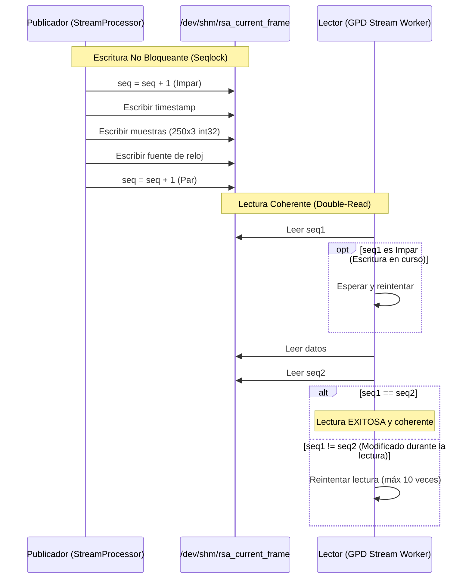

# shared_memory_publisher.py — Contexto para Agentes IA

> Publicación y lectura de tramas decodificadas de forma ultra-rápida y concurrente mediante memoria compartida (/dev/shm) en Linux.

**Ruta**: `scripts/operation/streaming/shared_memory_publisher.py`  
**LOC**: 195 | **Lenguaje**: Python | **Dependencias**: `numpy`, `mmap`, `struct`, `time`  
**Proceso**: Instanciado por `stream_processor.py` (escritor) y consumido por daemons de procesamiento de señal/inferencia como `gpd_stream_worker.py` (lector).

---

## Arquitectura

El módulo utiliza el sistema de archivos en memoria `/dev/shm/` y mapeo de memoria (`mmap`) para lograr comunicación inter-procesos (IPC) con latencia < 1 microsegundo.

Para evitar el uso de semáforos, bloqueos de hilos (locks) o condiciones de carrera entre el productor y el consumidor, se implementa el protocolo **Seqlock**:

---

## Estructura del Segmento de Memoria Compartida

El archivo mapeado tiene un tamaño fijo de **3024 bytes** con el siguiente layout físico:

| Offset (Bytes) | Tamaño (Bytes) | Campo | Tipo de Datos | Descripción |
|----------------|----------------|-------|---------------|-------------|
| 0 | 8 | `sequence_number` | uint64 LE | Contador monótono de transiciones |
| 8 | 8 | `timestamp_epoch` | float64 LE | Timestamp Unix (UTC) |
| 16 | 3000 | `samples` | int32 LE x 750 | 250 muestras x 3 canales (N, E, Z) aplanado |
| 3016 | 1 | `clock_source` | uint8 | Código de fuente de reloj (0-5) |
| 3017 | 7 | `_padding` | reserved | Relleno para alineación a 8 bytes |

---

## Componentes / Clases Clave

| Elemento | Tipo | Descripción |
|----------|------|-------------|
| `SharedMemoryPublisher` | Clase | Crea/abre el segmento en modo escritura y publica tramas incrementando la secuencia (impar/par). Limpia el archivo al cerrarse. |
| `SharedMemoryReader` | Clase | Mapea el segmento en modo solo lectura. Implementa el bucle de doble lectura coherente y auto-reconexión automática si detecta un cambio de *inode* en el archivo. |
| `SharedMemoryReader.get_sequence_number()` | Método | Operación rápida que solo lee los primeros 8 bytes de la secuencia para verificar cambios. |
| `SharedMemoryReader.read()` | Método | Recupera la trama coherente completa reconstruyendo el array `(250, 3)` de NumPy. |

---

## Limitaciones Conocidas / TODOs

- **Compatibilidad con Linux**: Depende directamente de `/dev/shm` (tmpfs), lo cual es nativo de sistemas POSIX/Linux (Raspberry Pi), pero no está disponible de forma idéntica en sistemas macOS o Windows sin adaptaciones.
- **Acceso Concurrente**: Diseñado para una única instancia escritora (`Single-Writer`) y múltiples instancias lectoras (`Multi-Reader`). No soporta escrituras concurrentes simultáneas sobre el mismo archivo.
- **Reconexión por inode**: La detección de reconexión depende de `os.stat()`. Si el archivo es recreado muy rápido con el mismo inodo (extremadamente raro), podría no forzar el re-mapeo.
