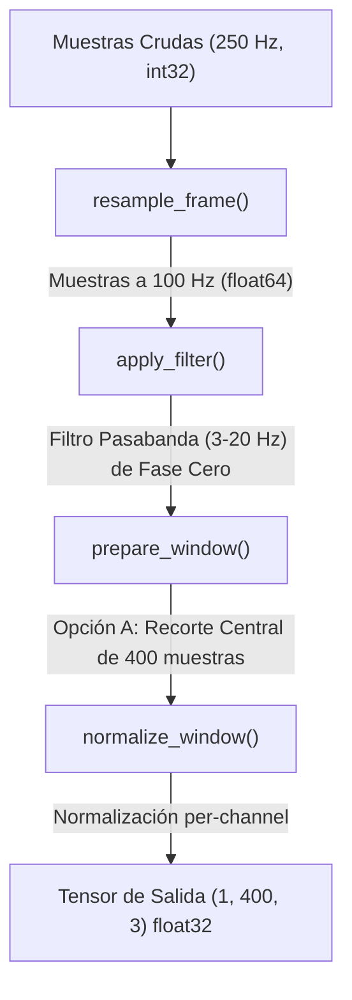

# signal_preprocessor.py — Contexto para Agentes IA

> Módulo de acondicionamiento de señal sísmica para inferencia GPD (Generalized Phase Detection) en tiempo real.

**Ruta**: `scripts/operation/core/signal_preprocessor.py`  
**LOC**: 124 | **Lenguaje**: Python | **Dependencias**: `numpy`, `scipy.signal`  
**Proceso**: Utilizado por el daemon de inferencia `gpd_stream_worker.py` para procesar ventanas de datos antes de inyectarlas en el intérprete de TFLite.

---

## Arquitectura

El preprocesador recibe muestras de datos continuos y realiza tres transformaciones clave requeridas para la inferencia de Machine Learning:

---

## Características de Procesamiento

### 1. Downsampling (250 Hz -> 100 Hz)
Dado que el modelo GPD espera una frecuencia de muestreo de 100 Hz y el acelerógrafo adquiere a 250 Hz, se realiza una reducción de tasa en relación 2.5:1. 
Para ello se utiliza `scipy.signal.resample_poly` con factores `up=2, down=5` (remuestreo polifásico). Esto aplica un filtro FIR anti-aliasing y realiza la interpolación de manera más eficiente y con menos efectos de distorsión espectral que un remuestreo FFT tradicional.

### 2. Filtrado de Fase Cero (`sosfiltfilt`)
El filtrado pasabanda por defecto está configurado de 3 a 20 Hz (Butterworth de 4.º orden). En lugar de aplicar un filtro causal clásico (`sosfilt`) que introduce un retraso de fase (desplazando en el tiempo los arribos de las ondas), se aplica un filtro bidireccional no causal local (`sosfiltfilt`). Esto asegura un desfase de cero grados, manteniendo la precisión exacta de los tiempos de arribo de fase para las picking P y S.

### 3. Mitigación de Efectos de Borde (Opción A: Padding)
El filtrado de señales en ventanas de tiempo cortas genera distorsiones espectrales y efectos transitorios severos en los bordes de la ventana (debido a las condiciones iniciales del filtro).
Para mitigar esto:
- Se alimenta el preprocesador con una ventana más larga de **800 muestras (8 segundos)**.
- Se filtra la ventana completa de 800 muestras.
- Se descartan 200 muestras (2 segundos) en cada extremo, retornando únicamente las **400 muestras centrales (4 segundos)** libres de artefactos.

### 4. Normalización per-channel
Para homogeneizar la amplitud de la señal ante diferentes niveles de ganancia física o distancias de eventos, cada componente de la ventana se divide por su amplitud absoluta máxima:
$$x_{norm} = \frac{x}{\max(|x|) + 10^{-9}}$$

---

## Componentes / API Pública

| Elemento | Tipo | Descripción |
|----------|------|-------------|
| `SignalPreprocessor` | Clase | Configura los coeficientes SOS del filtro Butterworth e inicializa los parámetros de downsampling y filtrado. |
| `resample_frame()` | Método | Transforma un bloque de datos a lo largo del eje del tiempo usando factores fijos `up=2, down=5`. |
| `apply_filter()` | Método | Aplica el filtro Butterworth pasabanda de fase cero a lo largo del eje del tiempo de la matriz `(N, 3)`. |
| `normalize_window()` | Método | Normaliza de forma independiente cada canal de una ventana de `N` muestras al rango `[-1, 1]`. |
| `prepare_window()` | Método | Coordina el pipeline completo: aplica el filtro SOS a la ventana (e.g. 800 muestras), realiza el recorte central (e.g. 400 muestras centrales), normaliza y retorna el tensor expandido `(1, 400, 3)` en `float32`. |

---

## Limitaciones Conocidas / TODOs

- **Consumo de CPU**: `resample_poly` and `sosfiltfilt` realizan operaciones de punto flotante intensivas. En la Raspberry Pi 3B+, el preprocesamiento de una ventana de 8 segundos tarda aproximadamente 3-4 ms, lo cual es perfectamente tolerable para un ciclo de 1 segundo, pero debe ser monitoreado.
- **Transitorios con ventanas cortas**: Si se llama a `prepare_window` con una ventana de solo 400 muestras (sin padding), los efectos transitorios de borde del filtro se inyectarán directamente al modelo GPD, lo cual puede incrementar los falsos positivos en las primeras y últimas muestras. Se debe preferir siempre la alimentación con 800 muestras (Opción A).
