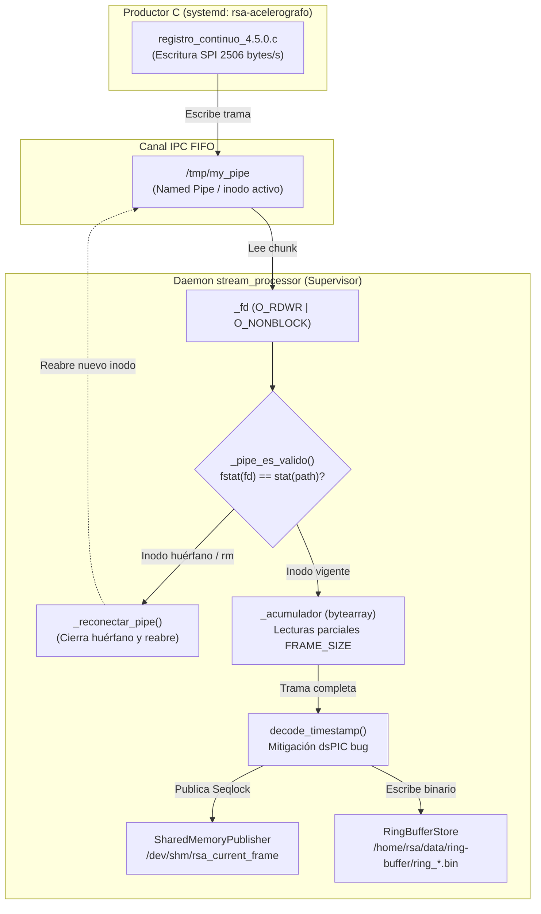

# stream_processor.py — Contexto para Agentes IA

> Daemon de streaming que lee tramas continuas de 2506 bytes desde el FIFO `/tmp/my_pipe` hacia el Ring Buffer en disco y la memoria compartida Seqlock, con arquitectura resiliente auto-recuperable (self-healing) ante recreaciones de pipe o caídas del productor.

**Ruta**: `scripts/operation/streaming/stream_processor.py`  
**LOC**: ~720 | **Lenguaje**: Python 3 | **Dependencias**: `core.frame_decoder`, `streaming.ring_buffer_store`, `streaming.shared_memory_publisher`  
**Proceso**: Daemon gestionado por Supervisor (`stream_processor`).

---

## Arquitectura y Flujo de Procesamiento



---

## Clase Principal: `StreamProcessor`

### Constructor

```python
StreamProcessor(
    pipe_path="/tmp/my_pipe",          # Ruta al FIFO
    buffer_dir="/home/rsa/data/ring-buffer/",
    max_size_mb=500,
    archivo_duracion_s=300,
    usar_fecha_filename=True,          # Mitiga bug de fecha del dsPIC
    dry_run=False,                     # Si True: cuenta tramas sin escribir
    pipe_retry_max_s=120,              # Espera máxima con backoff exponencial al arrancar
    logger=None,
)
```

### Métodos públicos

| Método | Descripción |
|--------|-------------|
| `run()` | Inicia el daemon. Ejecuta `_abrir_pipe_con_retry()` con backoff exponencial y procesa el bucle de lectura. Bloquea hasta SIGTERM/SIGINT o salida controlada por timeout. |
| `stop()` | Solicita parada ordenada. Thread-safe. |

### Métodos internos de apertura del FIFO y Auto-Recuperación (Self-Healing)

| Método | Descripción |
|--------|-------------|
| `_abrir_pipe_con_retry()` | Bucle de reintentos con backoff exponencial (0.5s a 8.0s, máx 120s). Tolera arranques asíncronos de `registro_continuo` y permisos transitorios denegados. |
| `_abrir_pipe()` | Apertura directa y síncrona de `/tmp/my_pipe` (preservada para tests y compatibilidad). |
| `_pipe_es_valido()` | Comprueba si `self._fd` sigue vinculado al mismo inodo en disco (`os.fstat(fd).st_ino == os.stat(path).st_ino`). Detecta inodos huérfanos producidos por `rm -f /tmp/my_pipe` en `ExecStartPre` de systemd. |
| `_reconectar_pipe()` | Cierra el descriptor huérfano y reabre automáticamente el nuevo named pipe cuando reaparece tras un reinicio de `registro_continuo`, sin requerir reinicio de Supervisor. |

### Atributos de estadísticas (solo lectura)

| Atributo | Descripción |
|----------|-------------|
| `frames_procesados` | Tramas escritas exitosamente al ring buffer |
| `frames_invalidos` | Tramas descartadas por timestamp inválido |
| `frames_error` | Tramas con error de escritura al ring buffer |

---

## Manejo de Señales

| Señal | Comportamiento |
|-------|---------------|
| `SIGTERM` | Llama `stop()` → cierre limpio (ring buffer + pipe) |
| `SIGINT` | Ídem que SIGTERM |

---

## Lecturas Parciales (Acumulador)

`os.read()` puede retornar menos bytes que `FRAME_SIZE` en una sola llamada. El `StreamProcessor` mantiene un `bytearray` interno que acumula chunks hasta completar exactamente 2506 bytes antes de procesar una trama.

---

## Modo `--dry-run`

En modo `dry_run=True`, el processor:
- Lee del pipe normalmente.
- Valida el timestamp de cada trama.
- **No** instancia ni escribe al `RingBufferStore`.
- Log de cada trama válida a nivel `DEBUG`.

Útil para verificar que el pipe recibe datos sin afectar el ring buffer de producción.

---

## Punto de Entrada CLI

```bash
# Modo normal (producción):
$PROJECT_LOCAL_ROOT/.venv/bin/python3 \
    scripts/operation/streaming/stream_processor.py

# Con parámetros explícitos:
python3 stream_processor.py \
    --pipe /tmp/my_pipe \
    --buffer-dir /home/rsa/data/ring-buffer/ \
    --max-size-mb 500 \
    --duracion-archivo 300

# Diagnóstico (sin escribir al disco):
python3 stream_processor.py --dry-run --verbose
```

---

## Configuración de Log

| Parámetro | Valor |
|-----------|-------|
| Archivo | `$PROJECT_LOCAL_ROOT/log-files/stream_processor.log` |
| Fallback | `/tmp/rsa-stream_processor.log` |
| Rotación | 5 MB, máx. 3 backups |

### Tags de log

| Tag | Nivel | Descripción |
|-----|-------|-------------|
| `[STREAM_START]` | INFO | Inicio del daemon |
| `[STREAM_LOOP]` | INFO | Inicio/fin del bucle de lectura |
| `[STREAM_PROGRESS]` | INFO | Resumen cada 300 tramas (~5 min) |
| `[STREAM_TIMEOUT]` | WARNING | Sin datos por >10 segundos |
| `[STREAM_SIGNAL]` | INFO | Señal SIGTERM/SIGINT recibida |
| `[STREAM_EXIT]` | INFO | Estadísticas finales al cierre |
| `[PIPE_WAIT]` | WARNING | FIFO ausente; reintentando con backoff exponencial |
| `[PIPE_PERMISSION_RETRY]` | WARNING | Permisos denegados; reintentando con backoff exponencial |
| `[PIPE_OPEN]` | INFO | Pipe abierto con éxito |
| `[PIPE_CLOSE]` | INFO | Pipe cerrado |
| `[PIPE_RECONNECT]` | WARNING | Inodo huérfano detectado; iniciando reconexión |
| `[PIPE_RECONNECTED]` | INFO | Pipe reabierto con éxito tras recreación en disco |
| `[STREAM_PIPE_FAIL]` | ERROR | Timeout de espera alcanzado; salida limpia |
| `[PIPE_READ_ERROR]` | ERROR | Error de lectura del pipe |
| `[FRAME_INVALID]` | WARNING | Trama descartada por timestamp inválido |
| `[FRAME_WRITE_ERROR]` | ERROR | Error escribiendo al ring buffer |
| `[RING_CLOSE]` | INFO | Ring buffer cerrado limpiamente |
| `[DRY_RUN]` | DEBUG | Trama válida en modo dry_run |

---

## Tests

**Archivo:** `scripts/operation/streaming/test_stream_processor.py`

```bash
cd /home/rsa/git/montajes/acelerografo-DEV00
python3 scripts/operation/streaming/test_stream_processor.py
```

### Grupos de tests

| Grupo | Tests |
|-------|-------|
| Inicialización y argumentos | 2 |
| Apertura del pipe (incluye retry y salida limpia) | 4 |
| Procesamiento de tramas individuales | 3 |
| Acumulación de lecturas parciales | 2 |
| Flujo completo con FIFO real (dry_run) | 3 |
| Flujo completo con RingBufferStore real | 1 |
| Señales y cierre limpio | 3 |
| Estadísticas | 2 |
| Auto-recuperación (Self-Healing) del pipe | 3 |

**Total: 23 tests**

---

## Integración con el Sistema

### Relación con otras fases

```
Fase 1: frame_decoder.py    ←── StreamProcessor usa decode_timestamp()
Fase 2: ring_buffer_store.py ←── StreamProcessor usa write_frame()
Fase 3: stream_processor.py  ← ESTE MÓDULO
Fase 4: event_extractor.py   ──→ usará ring_buffer_store.query_raw()
```

### Uso en producción

El daemon debe iniciarse vía `Supervisor` o un script de sistema en la Raspberry Pi. El flujo de despliegue sigue el procedimiento estándar del proyecto:

1. `git pull` en el repositorio
2. `bash menu.sh` → Opción 3 (Actualizar)
3. Reiniciar el servicio stream_processor si estaba corriendo

> ⚠️ **Restricción SSHFS**: No ejecutar el daemon directamente desde la ruta `montajes/`. Los comandos deben ejecutarse en la Raspberry Pi dentro de `$PROJECT_LOCAL_ROOT`.
