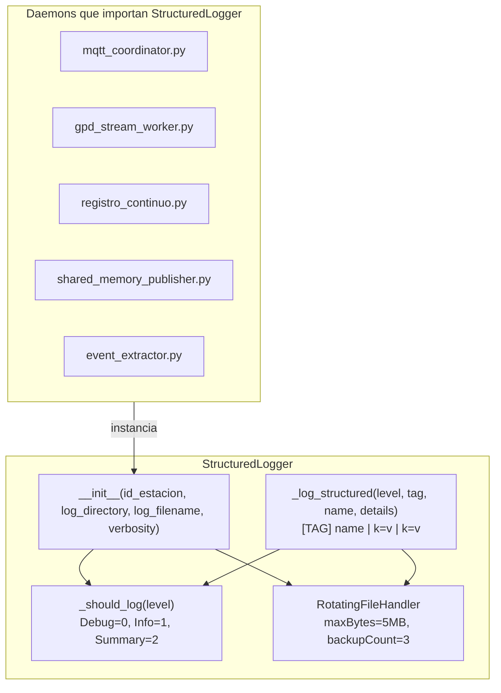

# structured_logger.py — Contexto para Agentes IA

> Logger estructurado con niveles personalizados (DEBUG / INFO / SUMMARY) y métodos semánticos por dominio para estandarizar el formato de log en todos los daemons del acelerógrafo.

**Ruta**: `scripts/operation/structured_logger.py`  
**LOC**: 223 | **Lenguaje**: Python 3 | **Dependencias**: stdlib (`logging`, `os`, `logging.handlers`)  
**Proceso**: Importado como módulo por todos los scripts de operación. No se ejecuta de forma autónoma.

---

## Arquitectura



---

## Sistema de Niveles de Verbosidad

El logger usa un sistema de tres niveles personalizados (no los niveles estándar de Python logging de forma directa):

| Nivel config | Valor numérico | Filtra |
|---|---|---|
| `DEBUG` | 0 | Muestra todo |
| `INFO` | 1 | Oculta DEBUG |
| `SUMMARY` | 2 | Solo muestra INFO y SUMMARY |

La verbosidad se configura en el constructor (`verbosity="INFO"`). Los métodos de cada dominio usan el nivel apropiado.

**Formato de línea de log:**
```
2026-07-06 15:30:00,123 - DEV00_mqtt_coordinator.log - DEBUG - [GPD_DETECTION] P | prob=0.9854 | timestamp=2026-07-06T15:30:00.000Z
```

---

## Grupos de Métodos Semánticos

### Infraestructura (init / shutdown)

| Método | Tag | Nivel |
|---|---|---|
| `init(details)` | `INIT` | SUMMARY |
| `shutdown(details)` | `SHUTDOWN` | SUMMARY |

### MQTT

| Método | Tag | Nivel |
|---|---|---|
| `mqtt_connect(broker, port)` | `MQTT_CONNECT` | SUMMARY |
| `mqtt_disconnect(reason)` | `MQTT_DISCONNECT` | SUMMARY |
| `mqtt_subscribe(topic)` | `MQTT_SUBSCRIBE` | INFO |
| `mqtt_publish(topic)` | `MQTT_PUBLISH` | DEBUG |
| `mqtt_error(operation, error)` | `MQTT_ERROR` | SUMMARY |

### Comandos

| Método | Tag | Nivel |
|---|---|---|
| `cmd_received(task_name, payload)` | `CMD_RECEIVED` | INFO |
| `cmd_response(task_name, status)` | `CMD_RESPONSE` | INFO |

### Telemetría

| Método | Tag | Nivel |
|---|---|---|
| `telemetry_health(metrics)` | `TELEMETRY_HEALTH` | INFO |
| `telemetry_state(state)` | `TELEMETRY_STATE` | SUMMARY |

### Ring Buffer / Archivos

| Método | Tag | Nivel |
|---|---|---|
| `buffer_write(frame_id)` | `BUFFER_WRITE` | DEBUG |
| `buffer_rotate(old_file, new_file)` | `BUFFER_ROTATE` | SUMMARY |
| `buffer_error(operation, error)` | `BUFFER_ERROR` | SUMMARY |

### Pipe / SHM

| Método | Tag | Nivel |
|---|---|---|
| `pipe_read(status, details)` | `PIPE_READ` | DEBUG |
| `pipe_error(error)` | `PIPE_ERROR` | SUMMARY |

### GPD — Inferencia (Fase 4, nuevo)

| Método | Tag | Nivel | Descripción |
|---|---|---|---|
| `gpd_load(model_path, load_time_s)` | `GPD_LOAD` | SUMMARY | Modelo TFLite cargado |
| `gpd_inference(prob_noise, prob_p, prob_s)` | `GPD_INFERENCE` | DEBUG | Resultado por ventana |
| `gpd_detection(phase_type, probability, timestamp)` | `GPD_DETECTION` | SUMMARY | Fase sísmica detectada |
| `gpd_cooldown(remaining_s)` | `GPD_COOLDOWN` | DEBUG | Detección descartada por cooldown |
| `gpd_error(operation, error)` | `GPD_ERROR` | SUMMARY | Error en pipeline GPD |
| `gpd_csv_write(csv_file, timestamp_centro)` | `GPD_CSV_WRITE` | INFO | Registro añadido al CSV mensual |
| `gpd_csv_update(csv_file, timestamp_centro, confirmado)` | `GPD_CSV_UPDATE` | INFO | Confirmación actualizada en CSV |

### Genérico

| Método | Descripción |
|---|---|
| `info(msg)` | Wrapper sobre `logging.info` |
| `warning(msg)` | Wrapper sobre `logging.warning` |
| `error(msg)` | Wrapper sobre `logging.error` |
| `debug(msg)` | Wrapper sobre `logging.debug` |

---

## Componentes / Funciones Clave

| Elemento | Tipo | Descripción |
|---|---|---|
| `StructuredLogger` | Clase | Clase principal. Un logger por daemon (instancia propia). |
| `__init__(id_estacion, log_directory, log_filename, verbosity, max_bytes, backup_count)` | Constructor | Crea `RotatingFileHandler` si no existe. Evita duplicar handlers vía `if not self.logger.handlers`. |
| `_should_log(level)` | Método privado | Filtra mensajes según la verbosidad configurada. Niveles: `DEBUG=0`, `INFO=1`, `SUMMARY=2`. |
| `_log_structured(level, tag, name, details)` | Método privado | Formatea y delega al logger estándar. `details` puede ser `dict` (serializado como `k=v`) o str. |

---

## Configuraciones

| Parámetro | Constructor | Valor por defecto | Descripción |
|---|---|---|---|
| `id_estacion` | `StructuredLogger(id_estacion=...)` | — | ID de la estación (prefija el nombre del logger interno) |
| `log_directory` | `StructuredLogger(log_directory=...)` | — | Directorio de salida del archivo de log |
| `log_filename` | `StructuredLogger(log_filename=...)` | — | Nombre del archivo de log |
| `verbosity` | `StructuredLogger(verbosity=...)` | `"SUMMARY"` | Nivel de verbosidad: `"DEBUG"`, `"INFO"` o `"SUMMARY"` |
| `max_bytes` | `StructuredLogger(max_bytes=...)` | `5 * 1024 * 1024` (5 MB) | Tamaño máximo del archivo antes de rotar |
| `backup_count` | `StructuredLogger(backup_count=...)` | `3` | Número de archivos de backup a mantener |

---

## Limitaciones Conocidas / TODOs

- **`gpd_stream_worker.py` aún usa `logging.Logger` estándar**: Los métodos semánticos GPD están definidos aquí pero no están integrados en el worker. Se requiere refactorizar el worker para aceptar `StructuredLogger` en lugar de `logging.Logger`. Pendiente para Fase 5.
- **Sin salida a stdout/stderr**: Solo escribe en archivo. Para diagnóstico en tiempo real se debe seguir el archivo con `tail -f`.
- **Sin soporte para múltiples destinos**: No hay handler de consola ni integración con sistemas centralizados (syslog, Logstash). Sería necesario agregar handlers adicionales si se requiere telemetría de logs.
- **Nivel SUMMARY no es un nivel nativo de `logging`**: Se implementa como un filtro manual en `_should_log()`. Esto significa que el nivel `logging.WARNING` y `logging.ERROR` siempre se escriben (no pasan por el filtro de nivel personalizado del logger raíz).
