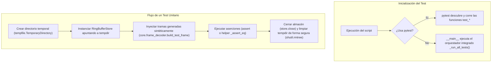

# test_ring_buffer_store.py — Contexto para Agentes IA

> Suite de pruebas unitarias y de integración autónoma para la validación del buffer circular del acelerógrafo.

**Ruta**: `scripts/operation/streaming/test_ring_buffer_store.py`  
**LOC**: 604 | **Lenguaje**: Python | **Dependencias**: `sys`, `os`, `datetime`, `tempfile`, `shutil`, `threading`, `time`, `numpy`, `core.frame_decoder`, `streaming.ring_buffer_store`  
**Proceso**: Ejecutado de forma autónoma (ej. `python3 test_ring_buffer_store.py`) o a través de `pytest` (ej. `python3 -m pytest test_ring_buffer_store.py -v`).

---

## Arquitectura de Pruebas

El script está diseñado para ejecutarse sin necesidad de hardware físico (el acelerógrafo dsPIC) y sin alterar los datos del ring buffer de producción.

---

## Infraestructura Autónoma (Ejecución sin Pytest)

Para soportar entornos embebidos en la Raspberry Pi donde `pytest` no esté instalado, el script cuenta con un motor de ejecución mínimo:
- **Helpers de Aserción**: `_assert_eq(got, expected, msg)` y `_assert_true(cond, msg)` que recolectan fallos detallados sin interrumpir la suite completa si ocurre un error.
- **Orquestador**: `_run_all_tests()` que ejecuta secuencialmente todas las funciones que empiezan por `test_`, imprimiendo el estado (`✅` o `❌`) y reportando al final un resumen de éxitos y la traza de errores detallada de los fallos encontrados.

---

## Cobertura de la Suite de Pruebas (20 Tests)

| Función de Test | Descripción / Escenario Validado |
|-----------------|----------------------------------|
| `test_init_crea_directorio` | Verifica que al inicializar se cree el directorio destino del ring buffer si no existe. |
| `test_init_directorio_vacio` | Comprueba que inicializar en un directorio vacío configure correctamente las variables de control. |
| `test_write_frame_tamanio_invalido` | Valida que `write_frame` lance un `ValueError` si los bytes recibidos no tienen exactamente el tamaño de trama (`2506` bytes). |
| `test_write_y_query_una_trama` | Escribe una trama sintética y realiza una consulta (`query` y `query_raw`) verificando que los bytes coincidan plenamente. |
| `test_write_multiples_tramas_query_rango` | Escribe 4 tramas secuenciales y valida que se puedan filtrar por subrangos horarios específicos. |
| `test_query_rango_fuera_de_buffer` | Evalúa que una consulta temporal fuera de los límites lógicos de las tramas devuelva una lista vacía sin fallar. |
| `test_query_start_mayor_que_end_lanza_valueerror` | Verifica el control de errores si el tiempo de fin es estrictamente menor al tiempo de inicio de consulta. |
| `test_query_retorna_framedata` | Valida que el método de consulta decodificada `query()` devuelva correctamente instancias del objeto parsed `FrameData`. |
| `test_rotacion_crea_nuevo_archivo` | Verifica que al superar `archivo_duracion_s` (configurado en `1` seg y esperando `1.1` seg reales) se cree un nuevo archivo `.bin`. |
| `test_naming_archivos_ring` | Confirma que los nombres de los archivos se apeguen estrictamente al patrón `ring_YYYYMMDD_HHMMSS.bin`. |
| `test_query_abarca_multiples_archivos` | Escribe datos distribuidos en varios archivos y consulta un rango intermedio, verificando la lectura continua a través de ficheros. |
| `test_rotacion_bug_cambio_dia` | **Test de Regresión Crítico**: Simula el bug de cruce de medianoche del dsPIC. Escribe a las 23:59:44, espera un lapso monótono real (`time.sleep(1.1)`), y escribe a las 00:00:01 del mismo día nominal (simulando regresión horaria). Valida que rote adecuadamente y genere el segundo archivo. |
| `test_retencion_elimina_archivos_antiguos` | Escribe datos suficientes para superar el límite de `max_size_mb` y verifica que los archivos antiguos se borren del disco y del índice. |
| `test_retencion_no_elimina_archivo_activo` | Valida que la política FIFO nunca intente eliminar el archivo abierto en el que se está escribiendo actualmente. |
| `test_rebuild_index_recupera_archivos_existentes` | Verifica que al reiniciar el almacén se reconstruya fielmente el índice analizando los archivos `.bin` ya guardados en disco. |
| `test_rebuild_index_ignora_archivos_corruptos` | Evalúa que archivos temporales corruptos o con nombres inválidos no sean agregados al índice. |
| `test_escritura_concurrente_no_corrompe` | Prueba multiproceso que escribe tramas desde múltiples hilos concurrentes para verificar el comportamiento thread-safe de la escritura y el indexado. |
| `test_time_range_vacio` | Obtiene el rango de tiempo de un almacén vacío y verifica que retorne `(None, None)`. |
| `test_time_range_con_datos` | Verifica que `get_time_range()` retorne con precisión la fecha de inicio del primer archivo y de fin del último archivo indexado. |
| `test_disk_usage_mb` | Comprueba que el cálculo del peso total del almacén coincida con la sumatoria del peso en bytes de los archivos registrados. |

---

## Consideraciones y Limitaciones de Test

- **Dependencia de `time.sleep`**: Los tests que validan rotación temporal (`test_rotacion_crea_nuevo_archivo` y `test_rotacion_bug_cambio_dia`) dependen de que el sistema operativo suspenda la ejecución por un lapso real (`time.sleep(1.1)`). En plataformas embebidas de recursos limitados, latencias extremas del planificador de CPU podrían extender el sleep ligeramente, lo cual es tolerable, pero no debería ejecutarse con tiempos sleep inferiores al límite configurado para evitar falsos negativos.
- **Limpieza de recursos**: Todos los tests deben asegurar la llamada a `store.close()` y el uso de gestores de contexto de `tempfile` para evitar fugas de descriptores de archivos en el sistema host.
