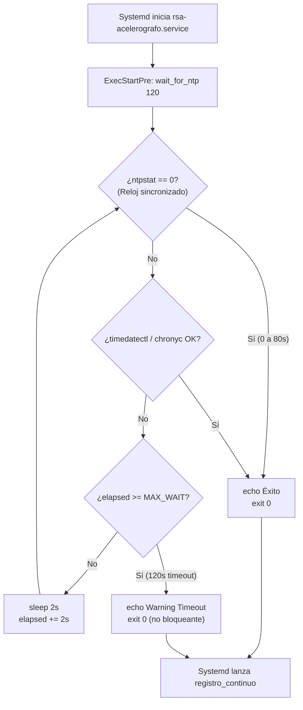

# wait_for_ntp.sh — Contexto para Agentes IA

> Script helper de sincronización temporal activa con timeout dinámico que retiene el arranque de `registro_continuo` en `ExecStartPre` hasta que el reloj del sistema esté sincronizado con NTP, evitando saltos temporales y arranques prematuros en frío.

**Ruta**: `scripts/task/wait_for_ntp.sh` (instalado en `/usr/local/bin/wait_for_ntp`)  
**LOC**: ~40 | **Lenguaje**: Bash | **Dependencias**: `ntpstat` (primario), `timedatectl` / `chronyc` (fallbacks), `sleep` (coreutils)  
**Proceso**: Ejecutado como `ExecStartPre` en la unidad systemd `rsa-acelerografo.service`.

---

## Arquitectura



---

## Parámetros y Constantes

| Parámetro | Valor por Defecto | Descripción |
|---|---|---|
| `$1` (`MAX_WAIT`) | `120` segundos | Tiempo máximo de espera antes de continuar el arranque. |
| `INTERVAL` | `2` segundos | Frecuencia de sondeo a las utilidades de reloj. |

---

## Modos de Operación y Mecanismos de Detección

1. **Sondeo Primario (`ntpstat`)**:
   - Estándar institucional de la RSA para instalaciones con `ntpd`.
   - Código `0`: Sincronizado $\rightarrow$ sale de inmediato.
   - Códigos `1` (unsynchronised) o `2` (inaccesible): continúa sondeando.
2. **Sondeo Secundario (`timedatectl`)**:
   - Fallback para distribuciones modernas o sistemas usando `systemd-timesyncd`.
   - Busca la cadena `synchronized: yes`.
3. **Sondeo Terciario (`chronyc tracking`)**:
   - Fallback para sistemas usando el demonio `chrony`.
   - Busca `Leap status: Normal`.
4. **Comportamiento ante Modo Offline (Sin Conexión)**:
   - Si la estación está en campo sin enlace de red, al llegar a los 120 s emite `[WAIT_NTP] ADVERTENCIA: Timeout alcanzado` y finaliza con `exit 0`.
   - **Garantía crítica**: No aborta ni hace fallar a Systemd, permitiendo que la estación grabe datos sísmicos con el reloj disponible (`fake-hwclock` o RTC/GPS del dsPIC).

---

## Despliegue e Integración en el Sistema

- **Copiado Automático**: Tanto `scripts/setup/deploy.sh` como `scripts/setup/update.sh` copian este script a `/usr/local/bin/wait_for_ntp` con permisos `+x`.
- **Invocación en Systemd**: Declarado en `rsa-acelerografo.service.template`:
  ```ini
  ExecStartPre=/usr/local/bin/wait_for_ntp 120
  ```

---

## Verificación Manual

```bash
# Prueba con timeout corto (ej: 10 segundos)
/usr/local/bin/wait_for_ntp 10

# Salida esperada en sistema sincronizado:
# [WAIT_NTP] Verificando sincronización de reloj NTP (timeout: 10s)...
# [WAIT_NTP] Reloj sincronizado con éxito vía ntpstat (0s transcurridos).
```
